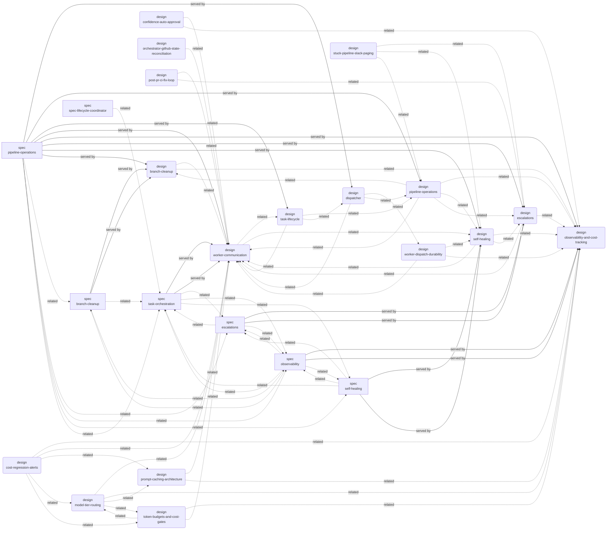
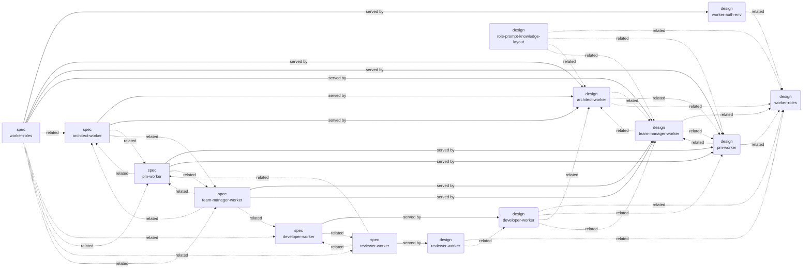
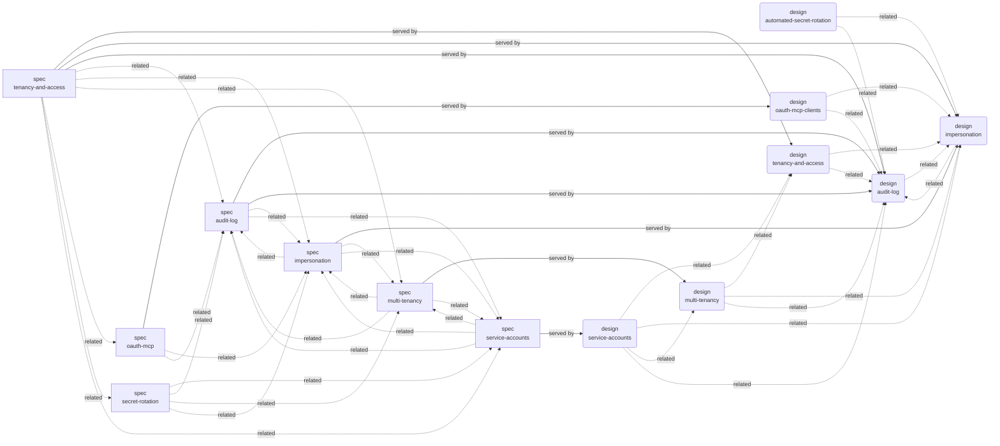
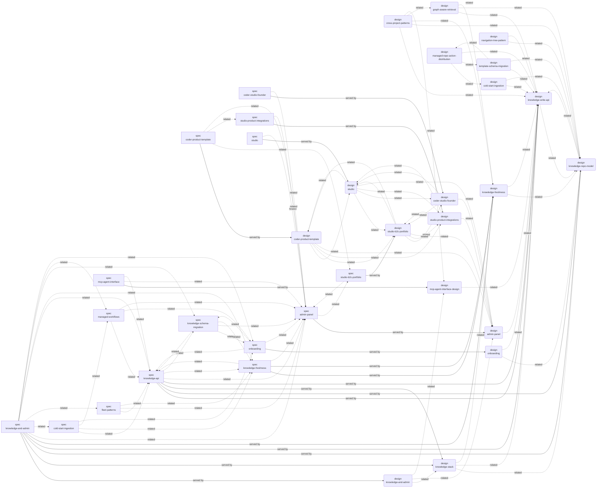
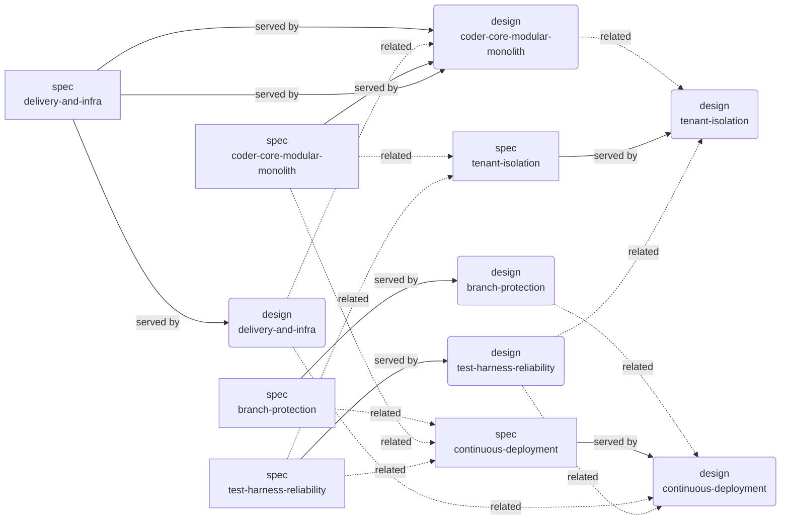
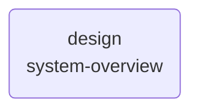

# Coder system — cross-link graph

> Generated from `served_by_designs`, `implements_specs`, `decided_by`, and `related_*` frontmatter on each active artifact. Hand edits are lost on the next `scripts/render_graph.py` run. The taxonomy tree lives in [`INDEX.md`](./INDEX.md); this file shows the **non-tree** relationships.

Mermaid notation: `[spec]` rectangle, `(design)` rounded. Solid `-->` is `served_by_designs` / `implements_specs` (the spec/design pair that realises a contract). Dashed `-.->` is `related_*` (sibling cross-link).

## Pipeline operations

## Worker roles

## Tenancy & access

## Knowledge & admin

## Delivery & infra

## Other

### System Overview

## ADR fan-out

Which active artifacts cite each ADR via `decided_by`. Use this
to spot ADRs whose decisions ripple into multiple components.

| ADR | Cited by |
|---|---|
| [0001](./adrs/0001-*.md) | [design/knowledge-repo-model](./designs/active/knowledge-repo-model.md), [design/system-overview](./designs/active/system-overview.md) |
| [0002](./adrs/0002-*.md) | [design/knowledge-repo-model](./designs/active/knowledge-repo-model.md) |
| [0003](./adrs/0003-*.md) | [design/knowledge-repo-model](./designs/active/knowledge-repo-model.md) |
| [0004](./adrs/0004-*.md) | [design/knowledge-repo-model](./designs/active/knowledge-repo-model.md) |
| [0005](./adrs/0005-*.md) | [design/multi-tenancy](./designs/active/multi-tenancy.md), [design/system-overview](./designs/active/system-overview.md) |
| [0006](./adrs/0006-*.md) | [design/impersonation](./designs/active/impersonation.md), [design/service-accounts](./designs/active/service-accounts.md), [design/system-overview](./designs/active/system-overview.md), [design/worker-roles](./designs/active/worker-roles.md) |
| [0007](./adrs/0007-*.md) | [design/system-overview](./designs/active/system-overview.md), [design/worker-roles](./designs/active/worker-roles.md) |
| [0008](./adrs/0008-*.md) | [design/knowledge-repo-model](./designs/active/knowledge-repo-model.md), [design/system-overview](./designs/active/system-overview.md) |
| [0009](./adrs/0009-*.md) | [design/studio-b2c-portfolio](./designs/active/studio-b2c-portfolio.md), [design/studio-product-integrations](./designs/active/studio-product-integrations.md) |
| [0011](./adrs/0011-*.md) | [design/test-harness-reliability](./designs/active/test-harness-reliability.md) |
| [0014](./adrs/0014-*.md) | [design/knowledge-freshness](./designs/active/knowledge-freshness.md) |
| [0016](./adrs/0016-*.md) | [design/orchestrator-github-state-reconciliation](./designs/active/orchestrator-github-state-reconciliation.md) |
| [0017](./adrs/0017-*.md) | [design/post-pr-ci-fix-loop](./designs/active/post-pr-ci-fix-loop.md) |
| [0018](./adrs/0018-*.md) | [design/managed-repo-action-distribution](./designs/active/managed-repo-action-distribution.md) |
| [0019](./adrs/0019-*.md) | [design/template-schema-migration](./designs/active/template-schema-migration.md) |
| [0020](./adrs/0020-*.md) | [design/template-schema-migration](./designs/active/template-schema-migration.md) |
| [0021](./adrs/0021-*.md) | [design/template-schema-migration](./designs/active/template-schema-migration.md) |
| [0022](./adrs/0022-*.md) | [design/cross-project-patterns](./designs/active/cross-project-patterns.md) |
| [0023](./adrs/0023-*.md) | [design/cross-project-patterns](./designs/active/cross-project-patterns.md) |
| [0024](./adrs/0024-*.md) | [design/cross-project-patterns](./designs/active/cross-project-patterns.md) |
| [0027](./adrs/0027-*.md) | [design/role-prompt-knowledge-layout](./designs/active/role-prompt-knowledge-layout.md) |
| [0029](./adrs/0029-*.md) | [design/navigation-tree-pattern](./designs/active/navigation-tree-pattern.md) |
| [0032](./adrs/0032-*.md) | [design/coder-product-template](./designs/active/coder-product-template.md), [design/studio-b2c-portfolio](./designs/active/studio-b2c-portfolio.md), [design/system-overview](./designs/active/system-overview.md) |
| [0033](./adrs/0033-*.md) | [design/studio-b2c-portfolio](./designs/active/studio-b2c-portfolio.md), [design/system-overview](./designs/active/system-overview.md) |
| [0034](./adrs/0034-*.md) | [design/studio-b2c-portfolio](./designs/active/studio-b2c-portfolio.md) |
| [0035](./adrs/0035-*.md) | [design/coder-studio-founder](./designs/active/coder-studio-founder.md), [design/studio-b2c-portfolio](./designs/active/studio-b2c-portfolio.md) |
| [0036](./adrs/0036-*.md) | [design/coder-product-template](./designs/active/coder-product-template.md) |
| [0038](./adrs/0038-*.md) | [design/developer-worker](./designs/active/developer-worker.md) |
| [0039](./adrs/0039-*.md) | [design/reviewer-worker](./designs/active/reviewer-worker.md) |
| [0041](./adrs/0041-*.md) | [design/admin-panel](./designs/active/admin-panel.md) |
