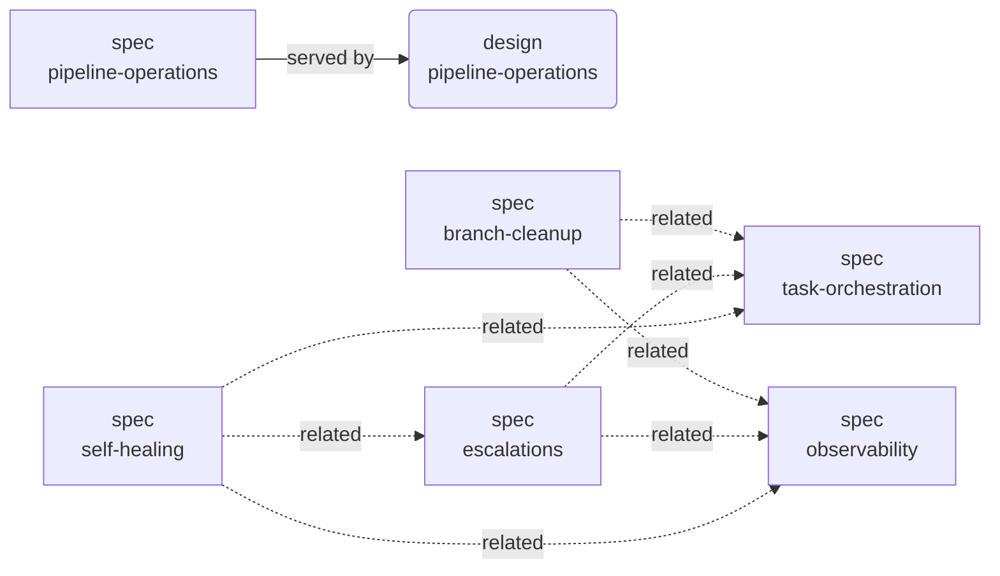
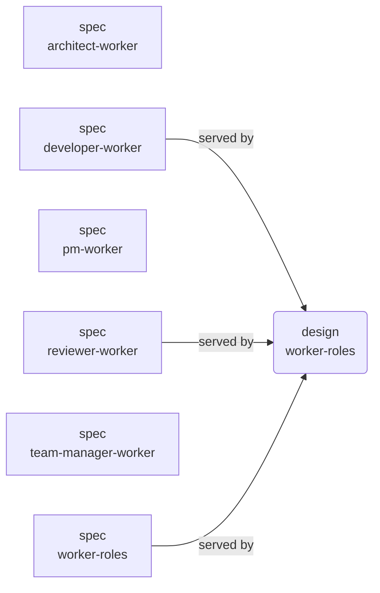
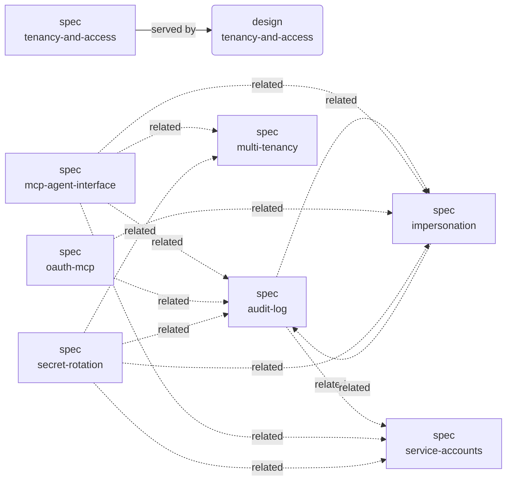
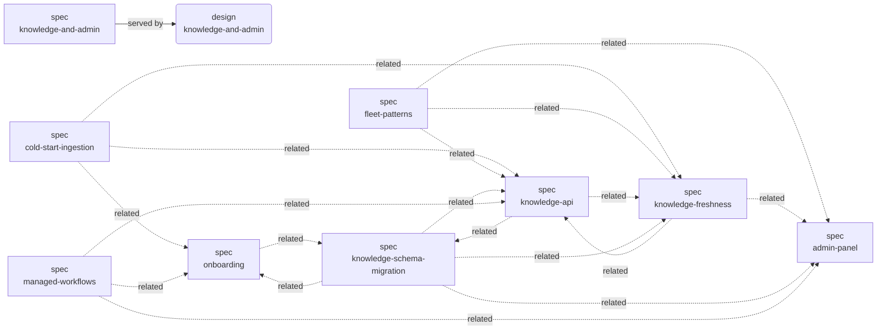
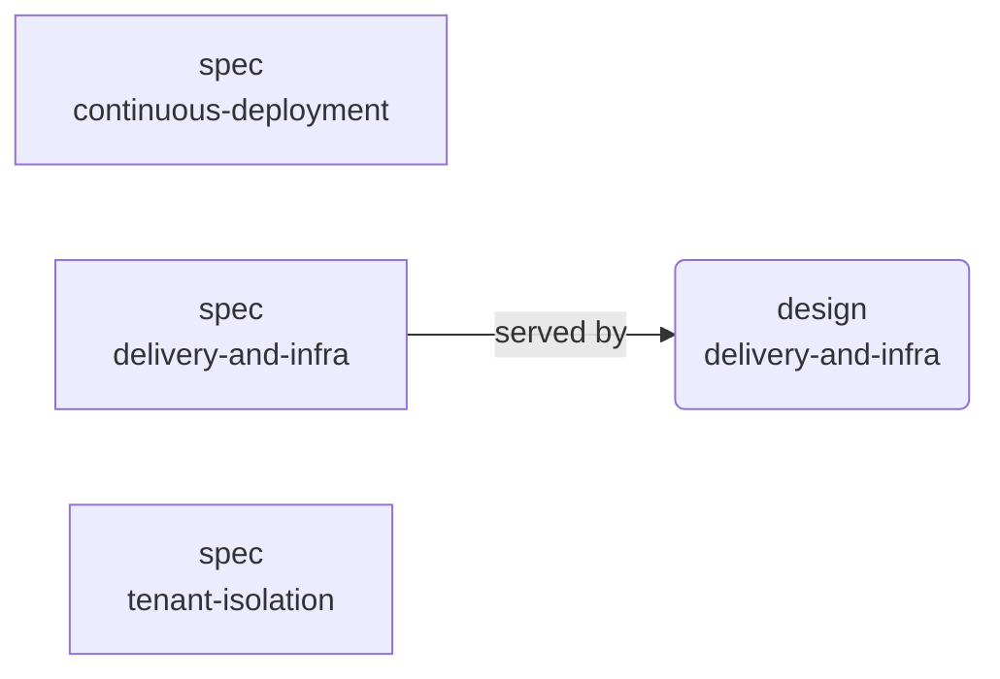
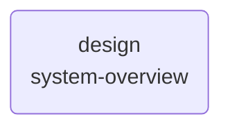

# Coder system — cross-link graph

> Generated from `served_by_designs`, `implements_specs`, `decided_by`, and `related_*` frontmatter on each active artifact. Hand edits are lost on the next `scripts/render_graph.py` run. The taxonomy tree lives in [`INDEX.md`](./INDEX.md); this file shows the **non-tree** relationships.

Mermaid notation: `[spec]` rectangle, `(design)` rounded. Solid `-->` is `served_by_designs` / `implements_specs` (the spec/design pair that realises a contract). Dashed `-.->` is `related_*` (sibling cross-link).

## Pipeline operations

## Worker roles

## Tenancy & access

## Knowledge & admin

## Delivery & infra

## Other

### System Overview

## ADR fan-out

Which active artifacts cite each ADR via `decided_by`. Use this
to spot ADRs whose decisions ripple into multiple components.

| ADR | Cited by |
|---|---|
| [0001](./adrs/0001-*.md) | [design/system-overview](./designs/active/system-overview.md) |
| [0005](./adrs/0005-*.md) | [design/system-overview](./designs/active/system-overview.md) |
| [0006](./adrs/0006-*.md) | [design/system-overview](./designs/active/system-overview.md), [design/worker-roles](./designs/active/worker-roles.md) |
| [0007](./adrs/0007-*.md) | [design/system-overview](./designs/active/system-overview.md), [design/worker-roles](./designs/active/worker-roles.md) |
| [0008](./adrs/0008-*.md) | [design/system-overview](./designs/active/system-overview.md) |
