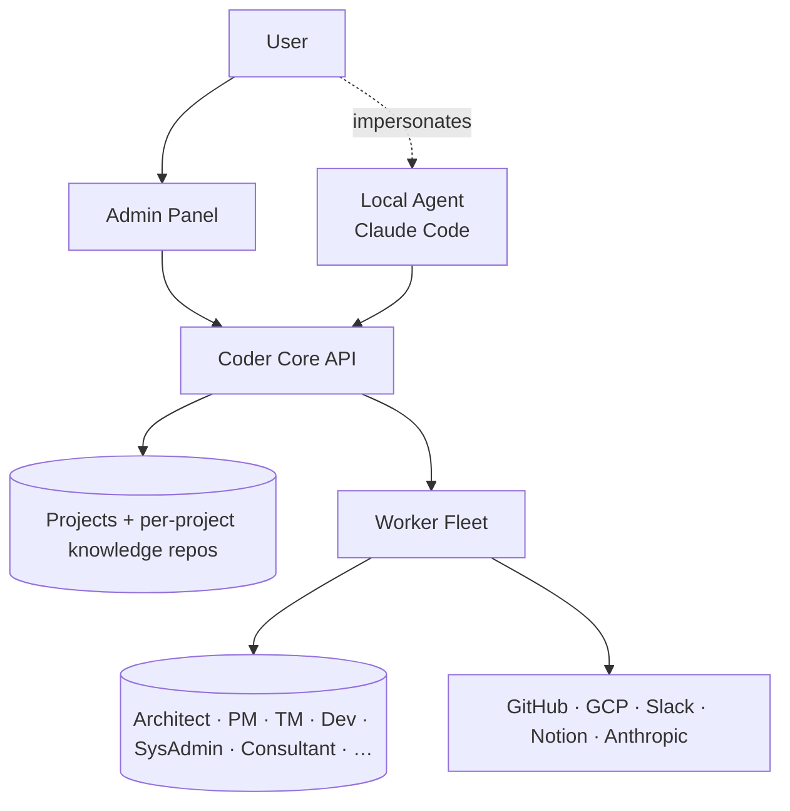

# System Overview

> The big picture. Start here.

## Context

**Coder** is an end-to-end system for building and operating software
products with autonomous agent teams. A user runs the Coder system; the
Coder system runs **projects**; each project has a **team** of **workers**
that fill **roles** (Architect, PM, Developer, …); workers act on behalf of
the project against external systems (GitHub, GCP, Slack, …).

No part of Coder is running yet. The previous VibeTrade-coupled
`coder-agent` / `coder-agent-admin` were deleted in favor of a clean
rebuild. The build plan is WIP design [`0004`](../wip/0001-generalize-coder-from-vibetrade.md).

## Goals

- One Coder system manages many projects in parallel.
- Each project has its own knowledge repo (the `template/` blueprint),
  its own worker team, and its own context.
- Workers are services *or* impersonated local agents (e.g. Claude Code on
  the user's laptop in the role of "Architect for project X").
- The user interacts via an Admin Panel for status, debugging, and override.
- All knowledge is structured Markdown + YAML, queryable through a Coder API.

## Non-goals

- Replacing the user. The user is god (admin panel). Workers escalate.
- Hosting customer code. Coder *operates on* customer code in the
  customer's own GitHub / cloud accounts.

## Top-level architecture

## Components

- **Coder Core API** — orchestrates projects, dispatches tasks to workers,
  serves knowledge repo contents to workers and the admin panel.
- **Worker Fleet** — pool of agent services that adopt roles per project.
  See design `0002`.
- **Admin Panel** — user-facing surface. Status, override, debug.
- **Per-project knowledge repos** — every project has its own `coder-system`-shaped
  repo. See design `0003`.
- **External integrations** — GitHub, GCP, Slack, Notion, Anthropic, …

## Today's reality (as of 2026-04-08)

Nothing is running yet. The two new services exist as `planned` entries
in the registries:

- [`coder-core`](../../services/coder-core.md) — multi-tenant orchestrator (planned)
- [`coder-admin`](../../services/coder-admin.md) — user-facing admin panel (planned)

The build plan is WIP design [`0004`](../wip/0001-generalize-coder-from-vibetrade.md).
VibeTrade will be re-onboarded as the first project on the new system.

## Decisions already locked in

- **Multi-tenant Core, project-aware in every call** — [ADR 0005](../../adrs/0005-multi-tenant-coder-core.md).
- **Per-role service accounts** — [ADR 0006](../../adrs/0006-per-role-service-accounts.md).
- **Reviewer is a separate role** from Product Manager — [ADR 0007](../../adrs/0007-reviewer-separated-from-pm.md).
- **Knowledge repo is CI-validated** — [ADR 0008](../../adrs/0008-ci-validation-of-knowledge-repo.md).

## Open questions

- Where does pipeline state live during a run — Postgres + state machine or a workflow engine?
- How are workers actually launched — long-running per-role services that pull tasks, or short-lived job runners spawned by Core?
- Cache strategy for the GitHub-backed knowledge layer — pull-on-read, webhook-triggered, or periodic sync?

## Links

- ADRs: [0001](../../adrs/0001-knowledge-repo-layout.md), [0005](../../adrs/0005-multi-tenant-coder-core.md), [0006](../../adrs/0006-per-role-service-accounts.md), [0007](../../adrs/0007-reviewer-separated-from-pm.md), [0008](../../adrs/0008-ci-validation-of-knowledge-repo.md)
- Designs: [`0002`](./0002-worker-roles-and-impersonation.md), [`0003`](./0003-knowledge-repo-model.md), [`0004`](../wip/0001-generalize-coder-from-vibetrade.md) (WIP)
