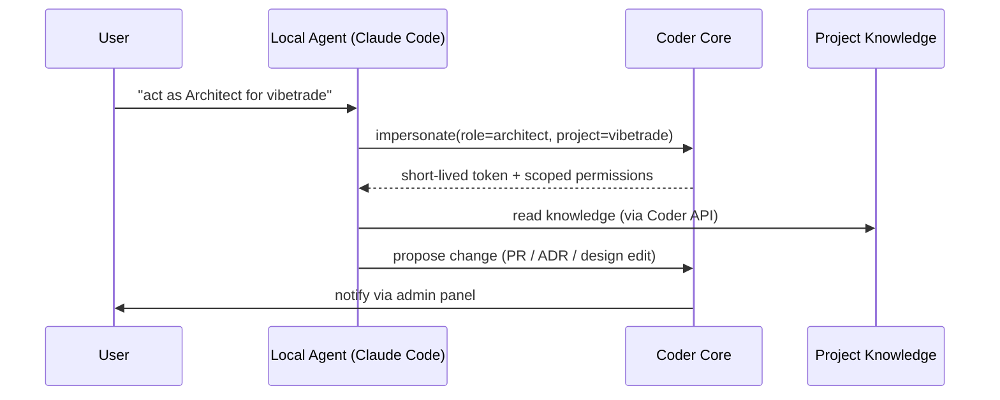

# Worker Roles & Impersonation

## Context

A Coder project is operated by a **team** of **workers**, each in a
**role**. A worker is a service *or* an impersonated local agent.
Both must obey the same role contract: same capabilities, same
permissions, same escalation paths.

## Goals

- A role is a contract: capabilities, permissions, prompts, tools, escalation.
- A worker is an instance of a role for a project.
- A worker can be (a) a backend service in the Coder fleet, or
  (b) a local agent (Claude Code, Cursor, etc.) impersonating that role.
- The user can take over any role at any time (admin panel "drive" mode).

## Non-goals

- Workers don't share secrets — the System Admin role brokers temporal
  access on demand.

## Identity

Each role-worker runs under **its own GCP service account** with the
minimum permissions for its job. The System Admin worker is the only one
that can grant scoped, time-bounded access to other workers.
See [ADR 0006](../../adrs/0006-per-role-service-accounts.md).

## Roles

See [`../../roles/REGISTRY.md`](../../roles/REGISTRY.md). The current
defined set:

| Role | One-line job |
|---|---|
| `system-admin` | Owns cloud resources and brokers access to them. |
| `software-architect` | Decides how the system is built. Owns designs and ADRs. |
| `team-manager` | Plans cycles, breaks down work, ensures task quality. |
| `product-manager` | Owns specs, roadmap, acceptance. |
| `developer` | Executes tasks, writes tests, creates test environments. |
| `reviewer` | Reviews completed tasks for code quality before PM acceptance. |
| `consultant` | Async observer; suggests improvements to prompts and process. |
| `qa-engineer` *(proposed)* | Owns test strategy, coverage, regression suites. |
| `sre` *(proposed)* | Owns reliability, observability, oncall. |
| `security-officer` *(proposed)* | Owns auth, secrets policy, threat model. |
| `release-manager` *(proposed)* | Owns release trains, changelogs, rollbacks. |

**Reviewer** is a defined role per [ADR 0007](../../adrs/0007-reviewer-separated-from-pm.md):
code review is separated from product acceptance. The Reviewer signs off
on technical quality; the Product Manager signs off on product fit.

## Impersonation

The impersonating agent uses the **same** role contract as a backend
worker. The only difference is who runs the loop.

## Open questions

- Does Consultant overlap too much with QA + SRE? Or is its async
  process-improvement angle distinct enough to keep separate?
- Should there be a `data-engineer` / `data-analyst` role for
  data-heavy projects, or is that a Developer specialization?

## Links

- Roles: [`../../roles/`](../../roles/)
- Designs: `0001` (system overview)
