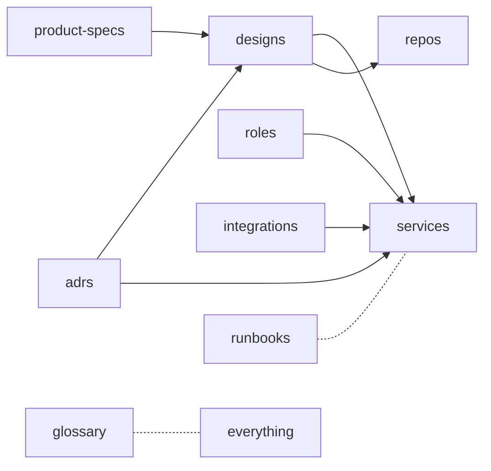

# Knowledge Repo Model

## Context

Coder must be **excellent** at managing project knowledge (goal #5). Every
project Coder manages will have its own knowledge repo with the same
structure. We need that structure to be:

- Human-readable (Markdown).
- Machine-readable (YAML registries, frontmatter).
- Cross-linkable (so a Coder API can serve a graph view).
- Stable over time (ADRs append-only, designs move not delete).

## Design

Two top-level sections in this repo:

```
coder-system/
├── system/      ← knowledge of Coder itself
└── template/    ← blueprint per-project repos copy
```

Both sections share the same artifact taxonomy:



### Artifact types

| Type | Folder | Lifecycle |
|---|---|---|
| Service | `services/` | live |
| Repo | `repos/` | live |
| Design | `designs/{active,wip,deprecated}/` | wip → active → deprecated |
| ADR | `adrs/` | append-only, supersede |
| Product spec | `product-specs/{active,wip,deprecated}/` | wip → active → deprecated |
| Role | `roles/` | live |
| Integration | `integrations/` | live |
| Runbook | `runbooks/` | live |
| Glossary | `glossary.md` | live |

### Frontmatter contract

Every artifact MD file begins with YAML frontmatter. Required fields are
defined per type in `_TEMPLATE.md` files. Cross-link fields:

- `implements_specs`, `serves_spec` — design ↔ spec
- `decided_by` — anything ↔ ADR
- `affects_services`, `affects_repos` — design ↔ infra
- `depends_on` — service ↔ service / integration / data store
- `related_designs`, `superseded_by`

### Registry contract

Every folder with multiple items has:
- `registry.yaml` — source of truth, machine-readable
- `REGISTRY.md` — generated human view, do not hand-edit

The future Coder API reads `registry.yaml` files to serve knowledge.

### Agent contract

`AGENTS.md` at the repo root is the single source of truth for agent
behavior. `CLAUDE.md` and `.cursor/rules/coder-system.mdc` are thin
pointers. Any future agent surface adds another pointer; never duplicates.

## Open questions

- Do we need a CI step to validate registries + cross-link integrity?
  (Probably yes — see proposed ADR.)
- Where does the registry-MD generator live? In this repo as a tiny script,
  or in the Coder Core API?

## Links

- ADRs: 0001 (layout), 0002 (yaml registries), 0003 (mermaid), 0004 (agents.md)
- Designs: 0001 (system overview)
