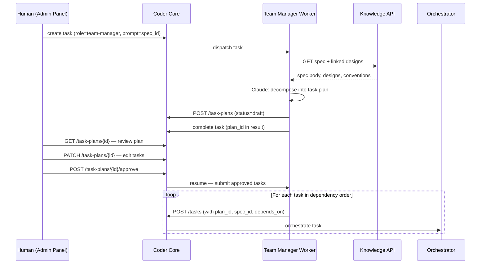

# Team Manager Worker

## Context

Specs 0004 (Developer) and 0009 (Reviewer) ship leaf workers — they
receive a task, do one thing, and report back. The missing piece is
**planning**: someone reads a spec, decides what tasks to create, writes
prompts, and sequences them. Today that's the human. Spec 0013 makes it
a worker.

The Team Manager is the first **planning worker** — it doesn't touch
code; it reads structured knowledge and produces a batch of tasks for
other workers to execute. This is a new pattern: a worker that creates
other workers' work.

## Goals

- Automate spec → task decomposition with human approval gate.
- Store plans as reviewable, editable artifacts in Postgres.
- Submit approved tasks in dependency order via the existing task API.
- Follow the established worker subprocess pattern (Claude call, result
  on task row, structured logs).

## Non-goals

- Cross-spec planning or multi-spec coordination (v1 is single-spec).
- Wall-clock time estimates (complexity S/M/L only).
- Autonomous execution without human plan review.
- Knowledge write API (0014) dependency — plans live in Postgres, not
  the knowledge repo.

## Design



### Components

#### Migration 0013 — `task_plans` table

```
task_plans
  id            UUID PK
  project_id    UUID FK → projects
  spec_id       TEXT          -- knowledge spec ID (e.g. "0013")
  created_by_task_id  UUID FK → tasks  -- the TM task that created this
  status        TEXT          -- draft | approved | rejected
  plan_json     JSONB         -- ordered list of planned tasks
  feedback      TEXT          -- human rejection reason (nullable)
  created_at    TIMESTAMPTZ
  updated_at    TIMESTAMPTZ
```

`plan_json` schema (array of objects):

```json
[
  {
    "order": 1,
    "role": "developer",
    "repo": "coder-core",
    "prompt": "Add migration 0013 with task_plans table...",
    "depends_on": [],
    "complexity": "S"
  },
  {
    "order": 2,
    "role": "developer",
    "repo": "coder-core",
    "prompt": "Implement task plan CRUD endpoints...",
    "depends_on": [1],
    "complexity": "M"
  }
]
```

`depends_on` references `order` values within the same plan (not task
IDs — those don't exist until submission).

#### Migration 0013 — `tasks` table additions

```
tasks (new columns)
  plan_id       UUID FK → task_plans (nullable)
  spec_id       TEXT (nullable)
  plan_order    INT (nullable)   -- position in the plan
```

These let submitted tasks trace back to their plan and spec.

#### Worker: `workers/team_manager.py`

Follows the Developer/Reviewer subprocess pattern:

1. Parse spec ID from the task prompt.
2. `GET /v1/projects/{id}/knowledge/product-specs/{spec_id}` — load spec.
3. For each ID in `served_by_designs`, load the design.
4. If no designs linked, log warning, proceed with spec body only.
5. Build system prompt with spec body, design bodies, and project
   conventions.
6. Call Claude: "Decompose this spec into developer tasks."
7. Parse Claude's response into `plan_json` format.
8. `POST /v1/projects/{id}/task-plans` with `status=draft`.
9. Write `plan_id` to the task result. Task completes.

The worker **does not block** waiting for approval. It creates the
draft plan and exits. A second phase handles submission.

#### API: Task Plan endpoints

| Method | Path | Auth | Description |
|---|---|---|---|
| `POST` | `/v1/projects/{id}/task-plans` | admin | Create plan (TM worker) |
| `GET` | `/v1/projects/{id}/task-plans` | admin | List plans (filterable by status) |
| `GET` | `/v1/projects/{id}/task-plans/{plan_id}` | admin | Get plan detail |
| `PATCH` | `/v1/projects/{id}/task-plans/{plan_id}` | admin | Edit plan_json or individual tasks |
| `POST` | `/v1/projects/{id}/task-plans/{plan_id}/approve` | admin | Approve → triggers task submission |
| `POST` | `/v1/projects/{id}/task-plans/{plan_id}/reject` | admin | Reject with feedback |

#### Task submission (on approve)

When the human approves a plan:

1. Coder Core iterates `plan_json` in order.
2. For each entry, `POST /v1/projects/{id}/tasks` with `role`, `repo`,
   `prompt`, `plan_id`, `spec_id`, `plan_order`.
3. Tasks whose `depends_on` list is empty are created with
   `stage=queued` immediately.
4. Tasks with dependencies are created with `stage=blocked`.
5. When a blocking task reaches `accepted`, the orchestrator checks for
   `blocked` tasks in the same plan whose dependencies are now satisfied
   and moves them to `queued`.

This keeps submission synchronous and dependency resolution in the
orchestrator where it belongs.

#### New task stage: `blocked`

Add `blocked` to the `TaskStage` enum. Blocked tasks sit in the queue
but are not dispatched. The orchestrator's completion handler checks:

```python
# On task acceptance
sibling_tasks = get_tasks_by_plan_id(task.plan_id)
for t in sibling_tasks:
    if t.stage == "blocked":
        blockers = plan_json[t.plan_order]["depends_on"]
        if all(siblings[o].stage == "accepted" for o in blockers):
            t.stage = "queued"
```

#### Admin Panel: Plan Review view

New route: `/projects/:id/plans/:planId`

- Shows the plan as an ordered task list (cards or table rows).
- Each task is editable inline: prompt (textarea), role (dropdown),
  repo (dropdown), complexity (S/M/L chips), depends_on (multi-select).
- Drag-to-reorder (updates `order` and `depends_on` references).
- "Approve" button → `POST .../approve` → tasks appear in pipeline.
- "Reject" button → feedback textarea → `POST .../reject`.
- Plans list at `/projects/:id/plans` with status filter.

### Data flow — happy path

1. Human creates TM task: "Plan spec 0013 for project coder"
2. Dispatcher picks up `role=team-manager` task, runs worker.
3. Worker loads spec 0013 + designs, calls Claude, gets 5-task plan.
4. Worker POSTs draft plan, completes its task.
5. SSE pushes "new plan" event to admin panel.
6. Human opens plan, tweaks task 3's prompt, approves.
7. Tasks 1 and 2 (no deps) go to `queued`. Tasks 3–5 go to `blocked`.
8. Developer picks up task 1, ships it, orchestrator accepts.
9. Task 3 depends on task 1 → moves to `queued`.
10. Pipeline runs until all 5 tasks are accepted.

### Edge cases

- **Spec not found:** Worker fails with clear error, task → `failed`.
- **Claude produces invalid plan:** Worker validates `plan_json` schema
  before POSTing. On validation failure, task → `failed` with the raw
  output in logs for debugging.
- **All plan tasks fail:** Plan stays `approved`, individual tasks
  follow normal fix loops. Human can override or reject the plan.
- **Cyclic dependencies:** Validate at plan creation — reject if the
  dependency graph has cycles.
- **Plan rejected:** Human provides feedback. Can create a new TM task
  referencing the same spec (optionally including the rejection
  feedback in the prompt).
- **Mid-plan human override:** Individual tasks can still be
  paused/skipped/rejected via the existing override API. Plan-level
  status tracks overall progress but doesn't block per-task overrides.

## Rollout

### Phase 1 — coder-core (backend)

1. Migration 0013: `task_plans` table + `tasks` columns (`plan_id`,
   `spec_id`, `plan_order`).
2. Add `blocked` to `TaskStage` enum.
3. Task plan CRUD endpoints.
4. Orchestrator: dependency resolution on task completion.
5. `workers/team_manager.py` — subprocess worker.
6. Dispatcher: route `role=team-manager` to the new worker.

### Phase 2 — coder-admin (frontend)

7. Plan list and detail views.
8. Inline task editing.
9. Approve / reject actions.
10. SSE integration for plan events.

### Phase 3 — validation

11. Dog-food: use the TM worker to plan a real spec for the `coder`
    project.
12. Iterate on Claude's planning prompt based on plan quality.

## Links

- Specs: [`0013`](../../product-specs/wip/0013-team-manager-worker-v1.md),
  [`0010`](../../product-specs/active/0010-task-orchestration-v1.md),
  [`0012`](../../product-specs/active/0012-admin-auth-and-mutations.md)
- Designs: [`0001`](../active/0001-system-overview.md) (system overview),
  [`0002`](../active/0002-worker-roles-and-impersonation.md) (worker roles),
  [`0004`](../active/0001-generalize-coder-from-vibetrade.md) (clean rebuild)
