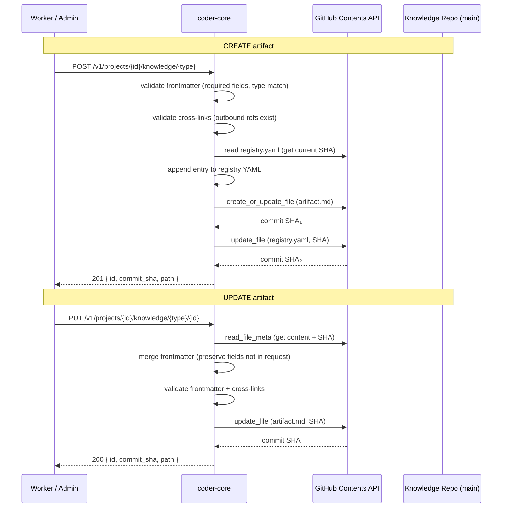

# Knowledge Write API

## Context

Spec 0002 shipped a read-only knowledge surface. Workers can list
registries, fetch artifacts, and resolve cross-links. But they can't
*create* or *update* artifacts — that's a manual `git commit` by the
human. Spec 0014 removes that bottleneck so the PM and Architect
workers can produce their outputs (specs, designs, ADRs) via the API.

The existing checkbox PATCH endpoint (spec 0012) already proves the
write pattern: `read_file_meta` → mutate → `update_file` with
optimistic SHA concurrency. This design extends that pattern to full
artifact create/update.

## Data flow



## API endpoints

| Method | Path | Description |
|--------|------|-------------|
| `POST` | `/v1/projects/{id}/knowledge/{type}` | Create artifact |
| `PUT` | `/v1/projects/{id}/knowledge/{type}/{artifact_id}` | Update artifact |

### POST — create artifact

**Request body:**

```json
{
  "id": "0019",
  "frontmatter": {
    "title": "Example spec",
    "status": "wip",
    "owner": "pm-worker",
    "created": "2026-04-12"
  },
  "body": "# Example spec\n\n## Problem\n\n..."
}
```

The `id` field is required and becomes the artifact's canonical ID. The
`type` field in frontmatter is inferred from the URL path (not
user-supplied) to prevent mismatches.

**Validation:**

1. Frontmatter merged with `{ id, type }` from the URL + body.
2. `validate_required_fields()` — all required fields for the type must
   be present.
3. Cross-link validation — every outbound ref (e.g. `related_specs`,
   `implements_specs`) must exist in the target registry. Self-references
   are allowed.
4. ID uniqueness — the ID must not already exist in the type's registry.

**File placement:**

- Path: `system/{folder}/{status}/{id}-{slugified_title}.md`
- Status from frontmatter determines subfolder (`wip/`, `active/`,
  `deprecated/`). Defaults to `wip` if omitted.

**Registry update:**

After the artifact file is committed, the endpoint appends a new entry
to `system/{folder}/registry.yaml` and commits it. Two commits per
create (artifact + registry). Acceptable for v1; a multi-file commit
via the Git Trees API is a future optimisation.

**Response:** `201 Created`

```json
{
  "id": "0019",
  "commit_sha": "abc123...",
  "path": "system/product-specs/wip/0019-example-spec.md"
}
```

### PUT — update artifact

**Request body:**

```json
{
  "frontmatter": { "status": "active" },
  "body": "# Updated body\n\n..."
}
```

Both `frontmatter` and `body` are optional — supply only what you want
to change.

**Merge semantics:**

- Existing frontmatter is read from the file.
- Request frontmatter fields are merged on top (shallow merge).
- The `id` and `type` fields cannot be changed (400 if attempted).
- The `body` replaces the entire body if supplied.

**Concurrency:** Optimistic via GitHub's SHA. If the file changed
between read and write, GitHub returns 409 and we propagate it.

**Status change → file move:**

If `status` changes (e.g. `wip` → `active`), the endpoint must:

1. Create the file at the new path (`active/{id}-{slug}.md`).
2. Delete the file at the old path.
3. Update the registry entry's `file` and `folder` fields.

Three commits for a status change. Acceptable for v1.

**Response:** `200 OK`

```json
{
  "id": "0019",
  "commit_sha": "def456...",
  "path": "system/product-specs/active/0019-example-spec.md"
}
```

## GitHub client additions

The existing `GitHubClient` needs two new methods:

```python
async def create_file(
    self, org: str, repo: str, path: str,
    content: str, message: str, branch: str = "main",
) -> dict[str, object]:
    """PUT to Contents API without a SHA (creates new file)."""

async def delete_file(
    self, org: str, repo: str, path: str,
    message: str, sha: str, branch: str = "main",
) -> dict[str, object]:
    """DELETE to Contents API (for status-change file moves)."""
```

## Commit message format

All commits use a structured format for auditability:

```
knowledge({type}): {verb} {id} — {title}

Actor: {actor_type}/{actor_id}
Project: {project_id}
```

Examples:
- `knowledge(spec): create 0019 — Example spec`
- `knowledge(design): update 0007 — Knowledge Write API`

## Frontmatter validation

Reuses the existing `validate_required_fields()` from
`knowledge/schema.py`. The write endpoint additionally:

1. Ensures `type` matches the URL path's artifact type.
2. Ensures `id` matches the URL parameter (for PUT).
3. Runs cross-link validation against live registries.

## Cross-link validation

For each field in `CROSS_LINK_FIELDS` present in the frontmatter:

1. Load the target registry (e.g. `designs/registry.yaml`).
2. Check that every referenced ID exists in that registry.
3. **Exception:** self-references are allowed (the artifact's own ID
   in its own type's registry, since the registry entry is being
   created in the same operation).
4. Return 422 with the list of broken links if any fail.

## Error responses

| Status | When |
|--------|------|
| 201 | Artifact created successfully |
| 200 | Artifact updated successfully |
| 400 | Attempt to change `id` or `type`, or invalid frontmatter YAML |
| 404 | Artifact not found (PUT), or project not found |
| 409 | Optimistic concurrency conflict (file changed since read) |
| 422 | Frontmatter validation failed or cross-link broken |

## Edge cases

1. **Registry parse failure during cross-link check:** Treat as "cannot
   validate" → 502, not silent pass. Workers should retry.
2. **Race between two creates with same ID:** Second `create_file` call
   to GitHub gets a 422 (file already exists) → surface as 409.
3. **Partial failure (artifact committed, registry update fails):**
   The artifact exists but isn't in the registry. Endpoint returns 500
   with the artifact commit SHA so the caller can retry the registry
   update. Future: use Git Trees API for atomic multi-file commits.

## Rollout

1. Add `create_file` and `delete_file` to `GitHubClient`.
2. Add `POST` and `PUT` endpoints to `knowledge.py`.
3. Wire cross-link validation into the write path.
4. Test with real GitHub repo (integration test against a test org).
5. Ship behind the existing project-auth guard (no new auth needed).
