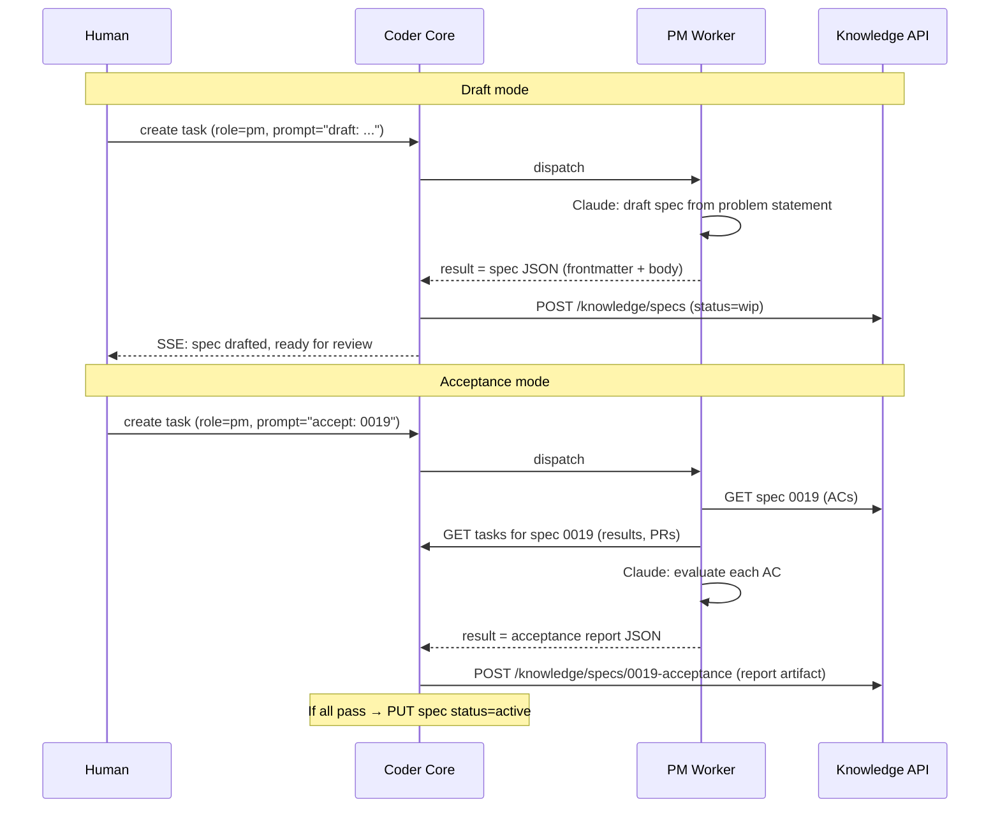

# PM Worker

## Context

The human writes every product spec and manually checks each AC after
delivery. This is the primary bottleneck in the autonomous lifecycle.
Spec 0016 adds a PM worker that drafts specs from problem statements
and runs acceptance testing against delivered work.

The PM follows the same subprocess pattern as Developer (0004), Reviewer
(0009), and Team Manager (0013): receive a task, call Claude, parse the
output, write results back.

## Goals

- Automate spec drafting from problem statements.
- Automate AC acceptance testing with per-AC verdicts.
- Human approval gate on both drafts and acceptance.
- Follow the established worker subprocess pattern.

## Non-goals

- Autonomous spec approval (human always approves in v1).
- Multi-stakeholder review flows.
- Acceptance for non-spec deliverables.

## Design

### Two modes

The PM worker has two modes, distinguished by prompt prefix:

- **`draft: <problem statement>`** — produce a spec document.
- **`accept: <spec_id>`** — evaluate ACs and produce a verdict report.

The dispatcher routes both to the same `run_pm_task` function. The
function parses the mode from the prompt and branches.



### Worker: `workers/pm.py`

Follows the subprocess pattern:

```python
async def run_pm_task(task: WorkerInput) -> WorkerResult:
    mode, payload = _parse_mode(task.prompt)
    if mode == "draft":
        return await _run_draft(task, payload)
    elif mode == "accept":
        return await _run_accept(task, payload)
    else:
        return WorkerResult(status=FAILED, error="unknown PM mode")
```

#### Draft mode

1. Parse problem statement from prompt.
2. Call `claude` CLI with system prompt + problem statement.
3. System prompt instructs Claude to output a JSON envelope:
   ```json
   {
     "id": "0019",
     "title": "Short Title",
     "frontmatter": { ... },
     "body": "## Problem\n..."
   }
   ```
4. Return the JSON as `WorkerResult.result`.
5. Dispatcher Phase 4 picks up the result, parses it, and POSTs to the
   knowledge write API to create the spec in `wip/`.

#### Acceptance mode

1. Parse spec ID from prompt.
2. Call `claude` CLI with system prompt + spec content + task evidence.
3. The system prompt instructs Claude to:
   - Read each AC from the spec.
   - For each AC, determine pass / fail / partial.
   - Cite specific evidence (task result text, PR URL, test output).
4. Claude outputs a JSON report:
   ```json
   {
     "spec_id": "0019",
     "verdicts": [
       {"ac": "AC1", "verdict": "pass", "evidence": "Migration 0014 creates the table..."},
       {"ac": "AC2", "verdict": "pass", "evidence": "POST endpoint returns 201..."},
       {"ac": "AC3", "verdict": "fail", "evidence": "No test covers the edge case..."}
     ],
     "all_pass": false
   }
   ```
5. Return the JSON as `WorkerResult.result`.
6. Dispatcher Phase 4 picks up the result and:
   - If `all_pass=true`: moves spec to `active/` via knowledge PUT API.
   - Posts a decision message on the originating task thread with the
     verdict summary.

### Dispatcher Phase 4 for PM

The dispatcher already has Phase 4 for TM (plan creation). PM adds two
new branches:

```python
if role == "pm" and status == SUCCEEDED:
    parsed = parse_pm_result(result.result)
    if parsed is None:
        logger.warning("PM result not parseable")
    elif parsed["mode"] == "draft":
        # POST to knowledge API → creates wip/ spec
        await _create_spec_from_draft(parsed, project_id, task_id)
    elif parsed["mode"] == "accept":
        # If all_pass → PUT spec to active
        # Post verdict message on task thread
        await _process_acceptance(parsed, project_id, task_id)
```

### System prompt

The PM system prompt (`system/roles/pm.md`) contains:

1. Role definition: "You are the product manager for this project."
2. Spec template from `_TEMPLATE.md` (embedded, not fetched).
3. Instructions for draft mode output format (JSON envelope).
4. Instructions for acceptance mode output format (verdict report).
5. Quality criteria: ACs must be observable and testable, each AC should
   map to one verifiable behavior, use spec conventions from the project.

### Configuration

```python
# config.py
pm_system_prompt_path: str = "system/roles/pm.md"
```

```python
# dispatcher.py _system_prompt_path_for()
if role == "pm":
    return settings.pm_system_prompt_path
```

### Pipeline routing

PM tasks do **not** go through the orchestrated pipeline (like TM):

```python
# tasks.py
pipeline_roles = frozenset({"developer", "reviewer"})
```

PM tasks are dispatched once and complete. No test/review stages.

### No new migration

PM uses existing tables:
- `tasks` — PM tasks stored like any other.
- `task_messages` — PM posts verdict messages.
- Knowledge write API — creates/updates specs.

### No new admin UI

PM output is visible through:
- Task detail page (result shows the spec JSON or acceptance report).
- Knowledge browser (drafted specs appear in the specs registry).
- Task messages (acceptance verdicts appear in the thread).

## Rollout

1. Create `system/roles/pm.md` in coder-system.
2. Implement `workers/pm.py` with draft + accept modes.
3. Register `"pm"` in dispatcher `_RUNNERS` + config.
4. Extend dispatcher Phase 4 for PM spec creation + acceptance.
5. Write tests.
6. Dog-food: draft a real spec, run acceptance on a delivered spec.

## Links

- Specs: [`0016`](../../product-specs/wip/0016-pm-worker-v1.md)
- Designs: [`0006`](../active/0006-team-manager-worker.md) (TM worker),
  [`0007`](../active/0007-knowledge-write-api.md) (knowledge write),
  [`0008`](../active/0008-worker-communication.md) (worker comms)
