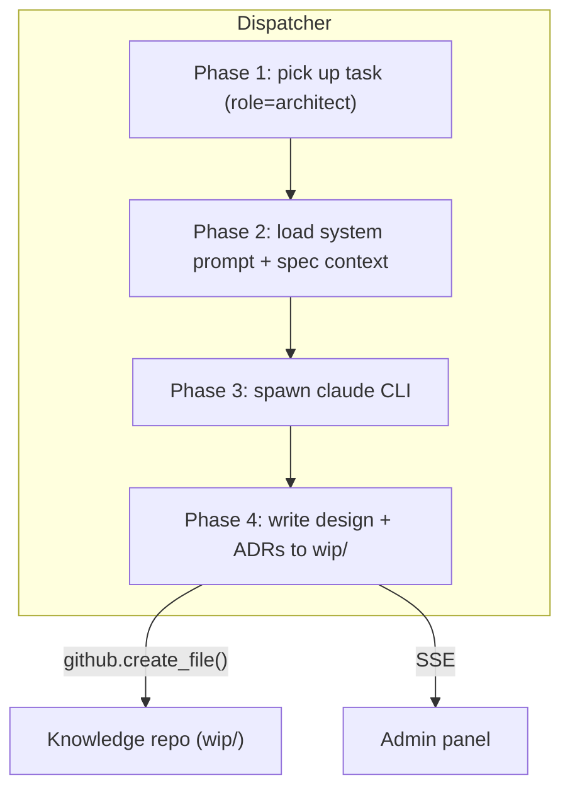

# Architect Worker

## Context

After a product spec is approved, someone must decide *how* to build
it — components, data flow, API contracts, storage schema, rollout
approach — before the Team Manager can plan tasks. Today the human
writes all design documents and ADRs. This bottleneck blocks the path
to full self-hosting.

Spec 0017 asks for an `architect` role worker that, given a spec ID,
produces a design document (and optional ADRs) following the project's
knowledge repo conventions.

## Goals / non-goals

**Goals:**
- Architect worker produces a design doc from an approved spec.
- Design output follows the `designs/_TEMPLATE.md` schema with inline
  Mermaid diagrams.
- Non-obvious decisions are captured as draft ADRs.
- Designs and ADRs are written to `wip/` via the GitHub Contents API.
- Human reviews before the TM plans tasks.

**Non-goals:**
- Generating implementation code.
- Autonomous design approval.
- Generating Terraform / infra configs.

## Design



### Components

- **`workers/architect.py`** — the worker module. Contains:
  - `parse_architect_result(text)` — extracts design JSON (and optional
    ADR list) from the claude output.
  - `run_architect_task(task)` — subprocess runner, same pattern as PM.
  - Built-in system prompt instructing Claude to output structured JSON
    with design frontmatter, body (markdown with Mermaid), and optional
    ADR list.

- **Dispatcher registration** — `"architect": run_architect_task` added
  to `_RUNNERS`. `architect_system_prompt_path` added to config.
  `_system_prompt_path_for("architect")` wired.

- **Phase 4 handler: `_handle_architect_result()`** — mirrors PM draft
  mode. Writes the design file to `system/designs/wip/{id}-{slug}.md`
  and any ADR files to `system/adrs/wip/{id}-{slug}.md`. Publishes
  `design_drafted` SSE event.

### Data flow

1. Human creates a task: `POST /v1/projects/{id}/tasks` with
   `role=architect`, `prompt="design: 0019"` (spec ID).
2. Dispatcher picks up the task, loads the system prompt from
   `system/roles/software-architect.md`.
3. Claude receives:
   - The built-in architect system prompt (JSON output format).
   - The target spec content (from the task prompt).
   - All active designs and ADRs as context (loaded by the system
     prompt instructions — Claude reads them via the knowledge repo).
4. Claude outputs a JSON envelope with `design` and optional `adrs`.
5. Phase 4 writes the design file(s) to `wip/` in the knowledge repo.
6. SSE event notifies the admin panel.

### JSON output format

```json
{
  "design": {
    "id": "0010",
    "title": "Short Title",
    "frontmatter": {
      "id": "0010",
      "title": "Short Title",
      "type": "design",
      "status": "wip",
      "owner": "ro",
      "created": "2026-04-12",
      "updated": "2026-04-12",
      "implements_specs": ["0019"],
      "decided_by": [],
      "related_designs": [],
      "affects_services": [],
      "affects_repos": []
    },
    "body": "# Title\n\n## Context\n...\n\n## Design\n\n```mermaid\n...\n```\n\n..."
  },
  "adrs": [
    {
      "id": "0005",
      "title": "Use SSE over WebSockets",
      "frontmatter": { "...": "..." },
      "body": "# ADR 0005 — Use SSE over WebSockets\n\n..."
    }
  ]
}
```

### Edge cases

- **No ADRs needed**: `adrs` array is empty — Phase 4 skips ADR writes.
- **Claude returns invalid JSON**: task succeeds but Phase 4 logs a
  warning and skips file creation (same pattern as PM).
- **GitHub write fails**: logged as exception, task still marked
  succeeded (the result is in the transcript).

## Open questions

_Resolved before implementation._

- **Context loading**: Load all active designs + ADRs to maintain
  consistency. The architect needs the full landscape.
- **Output path**: Designs start in `wip/` with human approval gate,
  same pattern as PM specs.
- **ADR threshold**: System prompt instructs Claude to draft ADRs for
  decisions affecting multiple components, introducing new dependencies,
  or deviating from existing patterns.

## Rollout

Single commit: worker + dispatcher registration + config + tests.
No migration needed. No admin UI changes (architect tasks already
render in the pipeline view via existing task infrastructure).

## Links

- Specs: [`0017`](../../product-specs/wip/0017-architect-worker-v1.md)
- Related designs: [`0006`](../active/0006-team-manager-worker.md), [`0009`](../active/0009-pm-worker.md)
