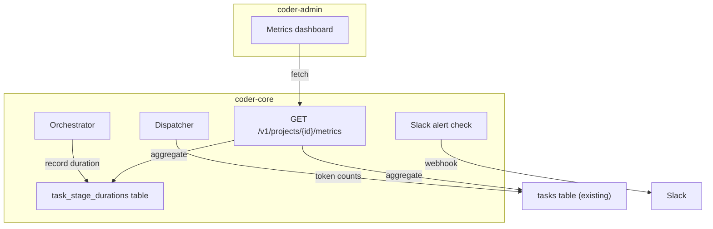

# Observability and Cost Tracking

## Context

Coder has no visibility into how much it costs to run or how healthy
the pipeline is. Token spend, stage durations, and failure rates are
not aggregated. Without this data, the human cannot budget, detect
regressions, or identify expensive specs.

Token counts are already captured per task (`cost_input_tokens`,
`cost_output_tokens` on `TaskRow`). Stage transitions are logged to
`task_logs`. What's missing: a denormalized stage-duration table,
aggregation API, Slack alerts, and a dashboard.

## Goals / non-goals

**Goals:**
- Per-task stage duration recording (denormalized for fast queries).
- Aggregation API: daily cost, success rate, per-spec cost.
- Slack webhook alerts for cost and success-rate thresholds.
- Admin panel `/metrics` dashboard with charts.

**Non-goals:**
- Real-time streaming metrics (batch aggregation is fine for v1).
- Per-AC cost attribution.
- External observability platform integration (Datadog, Grafana).

## Design

### Components

- **Migration 0014: `task_stage_durations`** — denormalized table
  recording each stage's wall-clock duration:
  - `id` (UUID PK)
  - `task_id` (FK → tasks)
  - `project_id` (for fast project-scoped queries)
  - `stage` (varchar)
  - `started_at` (timestamptz)
  - `ended_at` (timestamptz, nullable while in-progress)
  - `duration_seconds` (float, computed on end)
  - Index on `(project_id, started_at)` for time-range queries.

- **Orchestrator hook** — on each stage transition, close the previous
  duration row and open a new one. Lightweight: one UPDATE + one INSERT
  per transition.

- **Metrics API** (`api/metrics.py`) — `GET /v1/projects/{id}/metrics`
  with query params:
  - `?period=7d` (1d, 7d, 30d)
  - Returns JSON with `daily_cost`, `success_rate`, `per_spec_cost`,
    `stage_durations_avg`.

- **Slack alerts** (`integrations/slack.py`) — simple webhook POST.
  Checked after each task completes. Two thresholds:
  - `SLACK_COST_ALERT_THRESHOLD` (daily token cost)
  - `SLACK_SUCCESS_RATE_THRESHOLD` (rolling 24h, default 0.8)
  - Alerts are rate-limited (one per threshold per hour).

- **Admin dashboard** — new `/metrics` route in coder-admin using
  Recharts. Shows: daily cost bar chart, success rate line chart,
  per-spec cost table, average stage durations.

### Data flow

1. Worker completes → dispatcher writes `cost_input_tokens`,
   `cost_output_tokens` to `TaskRow` (existing).
2. Orchestrator transitions stage → closes previous duration row,
   opens new one in `task_stage_durations`.
3. Dispatcher completes task → calls `_check_alerts()` which queries
   rolling 24h stats and fires Slack webhook if thresholds breached.
4. Admin dashboard calls `GET /metrics` → aggregation query over
   `tasks` + `task_stage_durations` for the requested period.

### Edge cases

- **No Slack webhook configured**: alerts silently skip (graceful
  degradation, same as CD's Slack notifications).
- **No tasks in period**: metrics return zero values, not errors.
- **Stage duration for non-orchestrated tasks**: PM/TM/Architect tasks
  don't go through the orchestrator stages — they get a single
  "running" duration from `started_at` to `finished_at`.
- **Alert rate limiting**: use an in-memory timestamp per threshold
  type. Restarts reset the limiter (acceptable for v1).

## Open questions

_Resolved before implementation._

- Token capture: already in place via `parse_claude_json_envelope()`.
- Alert thresholds: env vars in Settings class (simple, consistent).
- Dashboard charts: Recharts (lightweight, React-native, MIT license).

## Rollout

1. Migration 0014 + orchestrator duration recording.
2. Metrics API endpoint.
3. Slack alert integration.
4. Admin dashboard (coder-admin).
5. All in one deployment cycle.

## Links

- Specs: [`0018`](../../product-specs/wip/0018-observability-and-cost-tracking.md)
- Related: [`0010`](../active/0010-task-orchestration.md) (stage model), [`0011`](../active/0011-continuous-deployment.md) (Slack pattern)
