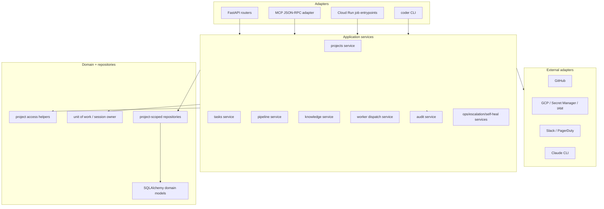

# 0051 — coder-core modular monolith hardening (design)

## Context

`coder-core` should stay one deployed service for now. The system's
most important guarantees are local and cross-cutting: every request is
project-scoped, every mutation is auditable, worker identity is carried
through task state, and knowledge writes must stay consistent with
registries and ship gates. Splitting those responsibilities across
services before the internal boundaries are explicit would make
correctness harder.

The target design is a modular monolith. `coder-core` keeps one FastAPI
app and one Postgres schema, but its internals are shaped like stable
subsystems with clear application services and one-way dependencies.
Future extraction remains possible, but the near-term win is safer
local change.

## Goals / non-goals

- Goals:
  - Thin HTTP/MCP adapters.
  - Application services own workflows and transaction boundaries.
  - Central project access and project-scoped query helpers.
  - In-process protocols for future extraction seams.
  - Service-level tests for behavior; route tests for wiring.
- Non-goals:
  - No runtime service split.
  - No database split.
  - No public API redesign.
  - No frontend redesign.

## Design



The intended dependency direction is:

```text
adapters -> application services -> domain/repositories -> db/external adapters
```

Feature modules may depend on shared infrastructure and protocols, but
not on each other's routers. Cross-feature workflow calls happen
through application-service methods or explicit protocols.

## Target package shape

The exact file movement should be incremental, but the desired shape is:

```text
coder_core/
  api/                 # HTTP adapters only
  mcp/                 # JSON-RPC adapter; calls application services
  projects/            # project lifecycle, auth mode, budget config
  tasks/               # task lifecycle, retry, merge, transcript
  pipeline/            # pipeline runs, stages, gates, orchestration
  knowledge/           # knowledge repo parsing/service/ship/freshness
  workers/             # role execution, dispatcher, subprocess auth
  audit/               # audit writer/query service
  ops/                 # queue depth, GC, self-heal, escalation jobs
  integrations/        # GitHub/GCP/Slack/Secret Manager adapters
  domain/              # SQLAlchemy models and domain enums
  db.py                # engine/session/unit-of-work primitives
```

Some folders already exist. The work is mostly to tighten ownership:
routers stop owning workflow logic, feature internals stop reaching
around one another, and cross-cutting behavior gets shared APIs.

## Components

### HTTP and MCP adapters

Routers validate inputs, obtain caller context, call one application
service method, and translate application errors to HTTP responses.
They should not coordinate multi-step business workflows directly.

MCP tools follow the same rule: the JSON-RPC layer resolves the caller,
validates the tool payload, and calls the same application services as
HTTP where semantics overlap.

### Application services

Each service owns a Coder capability, not a transport:

- `ProjectService`: project CRUD/admin mutation/auth-mode/budget/MCP
  toggles.
- `TaskService`: create, retry, override, merge, transcript, feedback.
- `TaskPlanService`: draft reads, approve/reject, task fan-out.
- `PipelineService`: run state, gates, stage transitions, run
  timeline.
- `KnowledgeService`: list/read/write/verify/ship/freshness.
- `WorkerDispatchService`: enqueue/kick off role work and expose a
  dispatch protocol.
- `AuditService`: append/query audit rows.
- `OpsService` family: queue depth, branch GC, regression checks,
  escalation watches, self-healing watches.

Cross-service calls go through the protocols in *Extraction-ready
protocols* below, not through direct service-to-service imports. A
service that needs to invoke another service's capability depends on
the protocol; the wiring layer binds the in-process implementation.
This keeps the dependency graph inspectable and prevents the
"services calling services calling services" drift that vibe-level
rules don't survive in code review.

The caller owns the transaction unless the callee is explicitly
documented as a whole-workflow operation.

### Unit of work

Mutation services use a consistent unit-of-work pattern:

```python
async with session_scope() as session:
    project = await access.require_project(session, project_id, actor)
    result = await repository.mutate(session, project, ...)
    await audit.record(session, ...)
    return result
```

The important rule is visible ownership. A helper either participates
in the caller's session or owns the entire transaction; it does not
commit as a hidden side effect.

### Tenant access helpers

All touched workflows route through shared access helpers:

```python
project = await project_access.require_project(session, project_id, actor)
await project_access.require_admin(actor)
```

Project-scoped repositories accept `project_id` or a verified project
object and include that scope in every query. Raw cross-tenant reads
are centralized and named as fleet/admin operations.

### Extraction-ready protocols

Define protocol boundaries where future service extraction is plausible:

```python
class WorkerDispatcher(Protocol):
    async def dispatch(self, project_id: str, task_id: str) -> None: ...

class KnowledgeRepository(Protocol):
    async def read_artifact(self, project_id: str, artifact_ref: ArtifactRef) -> Artifact: ...
    async def write_artifact(self, project_id: str, change: KnowledgeChange) -> WriteResult: ...

class AuditRecorder(Protocol):
    async def record(self, event: AuditEventCreate) -> None: ...

class EventPublisher(Protocol):
    async def publish(self, event: DomainEvent) -> None: ...
```

The first implementation stays in-process. The interface exists to
make dependencies explicit and to keep future extraction from turning
into a behavioral rewrite.

## Data flow

Task creation after the refactor:

1. `POST /v1/projects/{id}/tasks` resolves actor and request model.
2. Router calls `TaskService.create_task(project_id, actor, command)`.
3. `TaskService` opens/uses the unit of work.
4. `ProjectAccess` verifies the caller can act on the project.
5. `TaskRepository` inserts the task row scoped to the project.
6. `AuditService` records `task.created` in the same transaction.
7. `WorkerDispatchService` is invoked through a protocol after commit
   or via an explicit outbox-style callback if dispatch must observe
   committed state.
8. Router returns the existing response model.

Knowledge write follows the same shape, except the service coordinates
GitHub tree writes and registry updates through `KnowledgeRepository`
and records audit rows atomically with local DB state where applicable.

## Edge cases

- **Dispatch before commit:** worker dispatch must not observe a task
  that can still roll back. Dispatch happens after commit or through a
  durable transition that the dispatcher leases.
- **Audit rollback:** for mutations requiring atomic audit, audit rows
  use the caller's transaction. Non-atomic operational observations are
  named separately.
- **Admin/fleet reads:** any intentionally cross-project query uses a
  fleet/admin service method and is covered by admin auth tests.
- **External failure after local write:** workflows that touch GitHub,
  Slack, GCP, or Claude must document whether the external call happens
  before local commit, after local commit, or with compensating state.
- **Tests bypassing services:** fixtures may insert setup rows directly,
  but behavior tests should exercise services or routes, not private
  repository helpers alone.

## Rollout

1. **Map and guard.** Add `docs/module-boundaries.md` (or equivalent)
   in `coder-core` declaring the allowed dependency graph
   (`adapters -> application services -> domain/repositories`,
   feature modules independent at the router level). Enforce it in CI
   with `import-linter` (preferred) or ruff `TID`/`TCH` rules. The
   failure mode without enforcement is predictable: the monolith stays
   a monolith in name, and feature modules quietly grow imports of
   each other's internals within a quarter. The CI check is
   load-bearing, not aspirational.
2. **Pilot one router.** Start with `task_plans` or `tasks` because the
   workflows are important but bounded enough to prove the pattern.
3. **Move knowledge write/ship.** Apply the same service/transaction
   shape to the riskiest GitHub + registry workflows.
4. **Unify access helpers.** Route touched project-scoped workflows
   through shared tenant access helpers.
5. **Add protocols.** Introduce worker dispatch and knowledge
   repository protocols with in-process implementations.
6. **Test migration.** Move behavior-heavy route tests down to service
   tests, but keep a route-level smoke/contract test for every public
   endpoint covering the happy path, the primary auth/forbidden case,
   and request/response shape. Route coverage drops in detail, not in
   surface — every endpoint stays exercised end-to-end through the
   wired adapters so router-to-service wiring regressions still fail
   loudly.
7. **Document extraction decision.** At the end, record whether worker
   runtime extraction is now justified. Default expected outcome:
   "not yet; boundaries are clean enough to wait."

No feature flag is needed because public behavior should not change.
Rollout is by small PR slices, each preserving the full test suite.

## Rollout outcome (2026-04-26)

All seven steps landed. The modular-monolith hardening described
above is fully implemented; what remains is the open work flagged
below, none of which blocks the design's completion criteria.

- **Step 1 — map and guard.** `coder-core/docs/module-boundaries.md`
  declares the dependency graph; `import-linter` enforces it via
  `make boundaries` (also wired into CI). Four contracts:
  domain-independence, MCP→HTTP forbidden, integrations-leaf,
  features-don't-depend-on-adapters.
- **Steps 2–3 — service extraction.** Every former MCP→API edge has
  been replaced with a direct service call, and every router workflow
  named in the spec has been lifted into its feature module. New
  feature packages: `coder_core/tasks` (lifecycle / plan / message
  thread / retry / override / merge), `coder_core/pipelines`,
  `coder_core/metrics`, `coder_core/impersonation`,
  `coder_core/projects` (create / update / archive / rotate API key /
  budget override grant + revoke / monthly reset / auth-mode toggle /
  mcp-enabled toggle).
  `coder_core/knowledge/write_service.py` houses the create / update /
  approve / reject workflows; `coder_core/knowledge/ship.py` exports
  `ship_wip_to_active` (spec 0044's atomic wip→active commit). Two
  preceding cleanups lifted misplaced
  shared infra out of router files: `coder_core/admin_jwt.py` (JWT
  mint/decode) and `coder_core/budget.py` (project budget policy). The
  `import-linter` ledger went from 16 entries to **0**.
- **Step 4 — tenant access helpers.** `coder_core/access.py` owns the
  one canonical `load_in_project()` helper; every service that loads
  a project-scoped row goes through it. The
  `row.project_id != caller.project.id` check now exists in exactly
  one place — the multi-tenancy invariant from
  [ADR 0005](../../adrs/0005-multi-tenant-coder-core.md) is auditable
  by reading a single function.
- **Step 5 — protocols.** `coder_core/contracts.py` declares the four
  forward-looking protocols (`WorkerDispatcher`,
  `KnowledgeRepository`, `AuditRecorder`, `EventPublisher`).
  `WorkerDispatcher` is fully plumbed: every service that kicks a
  worker goes through `coder_core.workers.get_dispatcher()` instead
  of importing `orchestrate_task` directly, and the default in-process
  implementation in `coder_core/workers/__init__.py` is swappable via
  `set_dispatcher` for tests / future RPC clients. The remaining
  three protocols (`KnowledgeRepository`, `AuditRecorder`,
  `EventPublisher`) are declared but not yet wired — their concrete
  call sites already go through narrow interfaces (the existing
  `KnowledgeService`, `record_audit_event`, `publish`), so wiring is
  a one-edit-per-call-site exercise that makes sense alongside an
  actual consumer.
- **Cross-cutting infra introduced:** `coder_core/errors.py`
  (`ServiceError` base) and a single `except ServiceError` branch in
  the MCP transport. New service errors get JSON-RPC mapping for
  free without per-feature wiring.
- **Step 6 — service-level tests for every migrated service.**
  Behaviour coverage at the service boundary now exists for:
    - `tasks.plan_service` → `tests/test_task_plan_service.py`
      (12 tests, ~0.6s)
    - `pipelines.service` → `tests/test_pipeline_run_service.py`
      (18 tests, ~0.7s — list/get/override + audit + event publish)
    - `metrics.service` → `tests/test_metrics_service.py`
      (8 tests, ~0.5s — period validation, project scope, success
      rate, period-window arithmetic)
    - `tasks.messages_service` → `tests/test_task_messages_service.py`
      (10 tests, ~0.6s)
    - `impersonation.service` → `tests/test_impersonation_service.py`
      (6 tests, ~0.9s — happy path with `LocalBroker`, role allowlist,
      broker-not-configured)
    - `tasks.service` → `tests/test_tasks_service.py`
      (16 tests, ~1.2s — list/get/create with the pm-draft pipeline
      auto-create branch covered)
    - `knowledge.write_service` → `tests/test_knowledge_write_service.py`
      (19 tests, ~0.9s — uses an in-memory fake of the GitHub Contents
      API so create / update / approve / reject / file-move /
      immutable-field paths run offline)

  Route-level tests in their existing files remain as smoke coverage
  for router-to-service wiring. **Combined: 89 service tests, ~6s
  total** — the equivalent route coverage takes roughly 60s, and the
  failure stack traces now point at the workflow rather than the
  request stack.

## Extraction decision

**Not yet — and the bar for revisiting is clearer now.**

The original motivation for splitting `coder-core` into per-role
worker services was that the orchestrator and the workers were
tangled at the router/handler level: a worker reaching for a budget
calculation imported a FastAPI handler module; an MCP tool
fast-pathing through HTTP brought the whole router subgraph into the
worker process at import time. After this rollout, those edges are
gone. The dispatcher reaches a budget helper that has no transport
dependency. The MCP layer talks to services, not handlers. The
import boundary is enforced by CI.

That removes the *forced* extraction case. What's left is the
pragmatic one: extract when one of the following hits, not before:

1. **Cost / scaling differential.** A specific worker role (most
   likely `developer` running long Claude calls) drives memory or
   wall-clock characteristics that hurt the rest of the service.
   At that point we extract one role to a Cloud Run job, leaving
   the orchestrator + the lighter roles in the monolith. The
   `WorkerDispatcher` protocol from step 5 is what that change
   binds to — and as of 2026-04-26 it is fully plumbed, so the
   extraction is a swap of `_InProcessWorkerDispatcher` for an RPC
   implementation, not a rewrite of every service.
2. **Independent deploy / rollback need.** A regression in a worker
   role needs to roll back without touching the orchestrator's
   revision. Today they share an image; if this becomes load-bearing
   we split the image.
3. **Distinct credential scope.** A worker role needs IAM that the
   orchestrator must not have (today they share `coder-core-sa`,
   per ADR 0006 each role has a service account but they're all
   minted by the same broker process). This is the scariest of the
   three and the one most likely to actually justify extraction.

Until one of those triggers, the modular-monolith shape is cheaper
to operate and reason about than a fleet of services. The cost of
*reversing* extraction (collapsing a fleet back into a monolith) is
much higher than the cost of *delaying* it, so the asymmetry favours
waiting.

## Open work

- **Route-level test cleanup.** Now that every migrated service has
  thorough service-level coverage, the route-level tests can shrink
  to genuine smoke shape (status code, primary auth case, response
  envelope) — they're currently still detail-heavy for historical
  reasons. Cleanup is non-blocking; the duplication is wasted CPU,
  not a correctness risk.
- **Auto-approval / pipeline / verify / approve / reject knowledge
  endpoints.** The MCP surface doesn't expose these, so they didn't
  hit the boundary contract — they remain in `api/knowledge.py`.
  When their MCP tools land, they'll need the same treatment.
- **Other CRUD endpoints in `api/task_plans.py` and `api/tasks.py`.**
  The pilot covered the MCP-coupled methods. The remaining CRUD
  (create/list/get/update plan, retry/override/merge task) follows
  the same pattern; purely a follow-up.

## Links

- Spec: [0051](../../product-specs/active/0051-coder-core-modular-monolith.md)
- Related designs: system-overview, worker-communication,
  knowledge-write-api, audit-log, tenant-isolation, worker-roles,
  observability-and-cost-tracking
