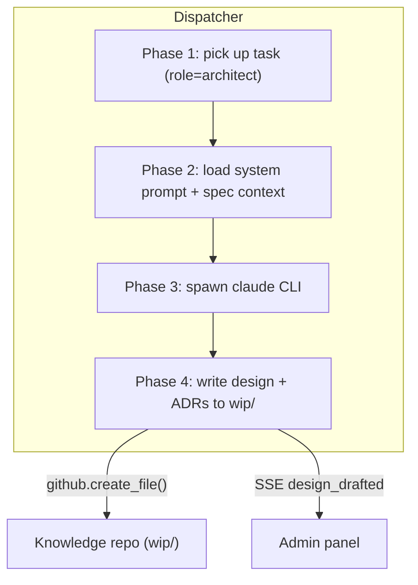

# Architect Worker

## What it is

The Architect worker closes the gap between an approved product spec
and a plannable set of tasks. Given a spec ID, it produces a design
document — components, data flow, API contracts, storage schema,
rollout — following the project's `designs/_TEMPLATE.md` schema with
inline Mermaid diagrams. When a decision is non-obvious, it also
drafts ADRs. Designs and ADRs land in `wip/` for human review before
the Team Manager plans tasks.

It is a subprocess worker, mirroring the PM pattern: receive a task,
call Claude, parse a JSON envelope, write files through the knowledge
write API.

## Architecture

### Parts

- **`workers/architect.py`** — `run_architect_task(task)` (subprocess
  runner, PM pattern) and `parse_architect_result(text)` (extracts
  the design envelope and any ADR list from Claude's output).
- **Built-in system prompt** — instructs Claude to output structured
  JSON with design frontmatter, body (markdown with Mermaid), and
  optional ADR list. Tells Claude to load all active designs and
  ADRs first for consistency.
- **Dispatcher registration** — `"architect": run_architect_task`
  added to `_RUNNERS`; `architect_system_prompt_path` in config;
  `_system_prompt_path_for("architect")` wired.
- **Schema gate** — `workers/_compliance.py::validate_and_retry`
  validates the architect output against
  `workers/schemas/architect.json` (frontmatter shape, at least one
  inline Mermaid fence, ADR list well-formed) before Phase 4 runs.
  Schema failures re-prompt Claude with the validator errors and
  last raw output, up to `worker_output_compliance_budget`. On
  exhaustion returns `SchemaFailure` and Phase 4 is skipped.
- **Transient retry** — `workers/_transient_retry.py::run_with_transient_retry`
  wraps the claude spawn. Architect's longer per-task deadline
  (900 s) is signalled via `exit_code=-9 + "coder task deadline
  exceeded after Xs"`, which the classifier returns as `unknown`
  (not retried) so the worker's `TaskStatus.TIMED_OUT` path runs.
- **Phase 4 handler `_handle_architect_result`** — writes the design
  to `system/designs/wip/{id}-{slug}.md` and each ADR to
  `system/adrs/wip/{id}-{slug}.md` via the knowledge write API.
  Publishes `design_drafted` SSE event. Only runs on the
  `ValidatedOutput` branch.

### Data flow

1. Human creates a task: `role=architect`, `prompt="design: 0019"`.
2. Dispatcher loads the architect system prompt from
   `system/roles/software-architect.md` and spawns `claude`.
3. Claude reads the target spec and the full landscape of active
   designs + ADRs (via the knowledge API), then emits a JSON
   envelope `{design: {...}, adrs: [...]}` with valid frontmatter
   and Mermaid-containing body.
4. Phase 4 parses the envelope and creates the design file (and each
   ADR file) in `wip/` through the knowledge write API.
5. SSE `design_drafted` notifies the admin panel; the human reviews,
   edits if needed, and promotes to `active/` before the Team
   Manager plans tasks against it.

### Invariants

- Architect output always lands in `wip/` — humans approve before
  promotion.
- The architect reads all active designs + ADRs as context, so new
  designs are consistent with the existing landscape.
- ADRs are drafted when a decision affects multiple components,
  introduces new dependencies, or deviates from existing patterns.
- Malformed architect output triggers the `validate_and_retry`
  re-prompt loop. On budget exhaustion the task lands in `failed`
  with `failure_kind="schema"` and `failure_detail` carrying the
  validator errors and a truncated raw snippet — zero design files
  or ADR files written, zero registry mutations.
- GitHub write failures after schema validation passes are logged;
  the task is still marked succeeded — the result is recoverable
  from the transcript.

## Interfaces

- Task API: `role=architect`, prompt `design: <spec_id>`.
- Knowledge write API (consumed): creates `designs/wip/*` and
  `adrs/wip/*`.
- SSE event: `design_drafted`.
- System prompt: `system/roles/software-architect.md`.

## Evolution

- `0010-architect-worker` (spec 0017) — introduced the architect
  subprocess worker, its JSON output format, and Phase 4 design/ADR
  write integration. Shipped as a single commit: worker + dispatcher
  registration + config + tests. No migration, no new admin UI.
- `0025` — worker output compliance: `architect.json` schema,
  `validate_and_retry` gate before Phase 4. The Mermaid-required
  invariant moves into the schema itself. ADR 0012 for re-prompt-only.
- `0027` — transient-failure retry wrapping the claude spawn.
  ADR 0013.

## Links

- Specs: [`0017`](../../product-specs/wip/0017-architect-worker-v1.md)
- Designs: team-manager-worker, pm-worker, knowledge-write-api
- Services: `coder-core`
