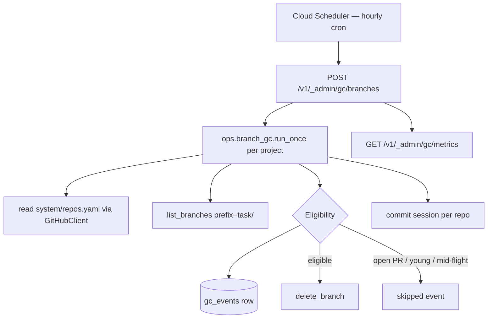

# Branch cleanup

## What it is

The design for the branch-cleanup GC shipped under spec 0023. It
runs as an admin HTTP endpoint driven by Cloud Scheduler — not a
worker role — because the job is stateless, needs no LLM, and wants
direct in-process access to the `tasks` and `projects` tables that
``coder-core`` already serves.

## Architecture

### Parts

- `migrations/versions/0019_branch_gc.py` — adds
  `tasks.branch_name`, `projects.gc_enabled`, `gc_events` table with
  indexes on `(project_id, run_id, created_at)` and `run_id`.
- `src/coder_core/ops/branch_gc.py` — `run_once(...)` orchestration,
  `_decide(...)` eligibility pipeline (pure, unit-tested), per-repo
  commit.
- `src/coder_core/api/gc.py` — admin endpoints:
  `POST /v1/_admin/gc/branches`, `GET /runs`, `GET /runs/{run_id}`,
  `GET /metrics`. All gated by `decode_admin_jwt`.
- `src/coder_core/integrations/github.py` — `list_branches(prefix)`,
  `list_pulls(head, state)`, `delete_branch(branch)` — 204/404 both
  success (idempotent).
- `src/coder_core/workers/developer.py` — `_read_workspace_task_branch`
  captures the ``task/<slug>`` branch HEAD was on after the worker
  finished; dispatcher persists it onto `tasks.branch_name`.

### Data flow

1. Cloud Scheduler invokes the admin endpoint with a service-account
   JWT minted by the scheduler's service account.
2. `run_once` reads the project's `system/repos.yaml`.
3. For each repo, `GitHubClient.list_branches(prefix="task/")`
   enumerates candidates.
4. Each candidate is evaluated by `_decide`:
   - Name guard (starts with `task/`).
   - `projects.gc_enabled` guard.
   - Age guard (> 24h via the branch head commit date).
   - Task lookup by `branch_name`. Terminal stage or terminal status
     (for legacy rows) = eligible; missing row + age > 7d = eligible
     orphan; anything else skipped.
   - Open-PR guard (`list_pulls` head-scoped, state=open). Any API
     failure skips with `github_error`.
5. `delete_branch` is awaited on eligibility; any exception recorded
   as `reason=github_error` and processing continues (AC6).
6. One `gc_events` row per decision. Session commits per repo so a
   crash mid-pass preserves audit rows for the repos already done.

### Invariants

- Non-`task/*` branches are never even enumerated — the prefix filter
  on `list_branches` is structural.
- A branch with an open PR is never deleted. Fail-closed on PR-check
  API errors.
- A branch in a pre-pipeline `succeeded` state is never deleted — the
  reviewer may still be running.
- Every GC action writes exactly one event row (pass failures in the
  admin trigger write a synthetic row too).

## Interfaces

- `POST /v1/_admin/gc/branches` — body `{project_id?, dry_run?}`;
  returns `{runs: [GcRunSummary]}`.
- `GET /v1/_admin/gc/runs?project_id=&limit=` — recent runs.
- `GET /v1/_admin/gc/runs/{run_id}` — full event list.
- `GET /v1/_admin/gc/metrics?period=1d|7d|30d&project_id=` —
  `deleted_total`, `errors_total`, `skipped_total`,
  `dry_run_deleted_total`, `false_delete_total`.

## Evolution

- 2026-04-15 — shipped (PR coder-devx/coder-core#10 squashed to main).
  Original WIP 0023 spec and design promoted to this active file.

## Links

- Spec: [branch-cleanup](../../product-specs/active/branch-cleanup.md)
- Runbook: [branch-gc](../../runbooks/branch-gc.md)
- Related components:
  [worker-roles](./worker-roles.md),
  [observability-and-cost-tracking](./observability-and-cost-tracking.md)
