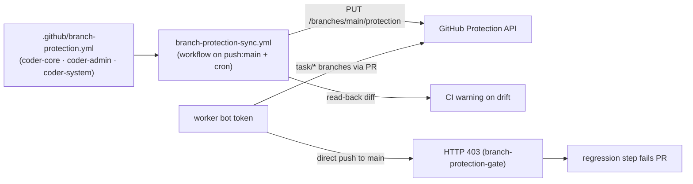

# Branch protection enforcement

## What it is

The governance layer that closes off direct writes to `main` on every
orchestrator-managed repo. GitHub branch-protection rules requiring at
least one approving PR review are applied via a config-as-code workflow
in each repo; admin bypass is disabled; the worker bot is absent from
every bypass-actors list. Each repo's CI runs a regression step on every
PR that attempts a direct push using the worker bot's token and asserts
HTTP 403. This is the engineering shape of the response to the
2026-05-12 `e6f7382` incident — the developer worker pushed straight to
`coder-core/main` because the rules were absent or carried a bypass.

## Architecture

### Parts

- **`.github/branch-protection.yml`** (in each of `coder-core`,
  `coder-admin`, `coder-system`) — declares the desired protection
  state as a YAML document matching the GitHub API schema:
  `required_pull_request_reviews` (1 approving review, dismiss stale
  on new push), `enforce_admins: true`, empty `restrictions` actors
  list, `required_status_checks.strict: true`. `enforce_admins: true`
  is load-bearing — a token with admin scope would otherwise bypass.
- **`branch-protection-sync.yml`** workflow — runs on `push: [main]`
  and a nightly `cron:` schedule. PUTs the YAML to
  `/repos/{owner}/{repo}/branches/main/protection`, reads the state
  back, and fails the workflow run on any divergence. Drift surfaces
  as a CI failure before the next deploy.
- **`branch-protection-gate` CI step** — added to each repo's
  `.github/workflows/ci.yml`. Uses the worker bot token
  (`BOT_GITHUB_TOKEN` repo secret) to attempt
  `git push origin HEAD:refs/heads/main` and asserts a 403 rejection.
  Runs on every PR; non-403 (success or any other failure) blocks
  the merge.
- **Worker bot token scope.** `coder-coder-github-pat` in Secret
  Manager is a fine-grained PAT with `contents: write` (non-main
  refs only — branch protection makes `main` read-only regardless),
  `pull-requests: write`, `actions: read`,
  `administration: read` (so the drift check can read protection
  state). Fine-grained PAT chosen over GitHub App installation
  token for simpler operator provisioning; branch protection is
  the primary enforcement layer, token scope is defence-in-depth.
- **Runbook.** `system/runbooks/github-branch-protection.md`
  carries the operator-facing PAT-rotation procedure and a
  per-repo verification checklist.

### Data flow

1. Operator creates or rotates `coder-coder-github-pat` per the
   runbook; the PAT is written to Secret Manager and to each repo's
   `BOT_GITHUB_TOKEN` secret.
2. On every push to `main` (and on the nightly cron), the
   `branch-protection-sync.yml` workflow reads
   `.github/branch-protection.yml` and PUTs the live API; reads back
   and diffs. Drift fails the workflow.
3. On every PR, the `branch-protection-gate` CI step runs a worker-bot
   `git push` to `main` and asserts 403; non-403 blocks merge.
4. The drift workflow's failure path emits an audit event via
   `coder-core`'s GitHub webhook receiver (existing
   `audit_event` channel) so operators see protection lapses in the
   admin audit page alongside other access events.

### Invariants

- **`enforce_admins` is always `true`.** Admin bypass would
  invalidate the gate; the YAML and the read-back diff both
  enforce.
- **Worker bot is absent from every bypass-actor list.** The
  drift check verifies the API response carries an empty
  `bypass_pull_request_allowances`.
- **`branch-protection-gate` runs on every PR.** A PR without the
  step on the required-checks list cannot merge; CI required-checks
  configuration lives in the same protection YAML.
- **Direct push returns 403 across all three repos.** A 200, 422,
  or any non-403 failure on the gate step is treated identically:
  block merge, page the operator.
- **Token rotation preserves protection.** Re-issuing
  `coder-coder-github-pat` leaves the per-repo protection state
  untouched; the runbook requires updating `BOT_GITHUB_TOKEN` in
  each repo alongside Secret Manager.

## Interfaces

- **GitHub branch protection:**
  `PUT /repos/{owner}/{repo}/branches/main/protection` — applied
  by the sync workflow.
- **GitHub Actions workflows:** `.github/workflows/branch-protection-sync.yml`
  (apply + drift-check) and the
  `branch-protection-gate` step in each repo's `ci.yml`.
- **Config files:** `.github/branch-protection.yml` in each of the
  three repos.
- **Secrets:** `BOT_GITHUB_TOKEN` (repo secret, set per repo) +
  `coder-coder-github-pat` (Secret Manager).
- **Runbook:** `system/runbooks/github-branch-protection.md`.

## Where in code

- `coder-core/.github/branch-protection.yml` — protection-state
  declaration
- `coder-core/.github/workflows/branch-protection-sync.yml` — apply
  + drift-check workflow
- `coder-core/.github/workflows/ci.yml` — `branch-protection-gate`
  step (regression test)
- `coder-admin/.github/branch-protection.yml` — protection-state
  declaration
- `coder-system/.github/branch-protection.yml` — protection-state
  declaration
- `system/runbooks/github-branch-protection.md` — PAT-rotation
  runbook

## Evolution

- 2026-05-20 (spec 0089) — initial enforcement across all three
  orchestrator-managed repos: protection rules, no-bypass-actor
  list, CI regression test, config-as-code drift detection.
  Responds to the 2026-05-12 incident where the developer worker
  bot direct-pushed `e6f7382` to `coder-core/main`, bypassing PR
  review and CI.

## Links

- Specs: [branch-protection](../../../product-specs/active/delivery/branch-protection.md)
- Designs: [continuous-deployment](./continuous-deployment.md),
  [developer-worker](../workers/developer-worker.md),
  [audit-log](../tenancy/audit-log.md),
  [service-accounts](../tenancy/service-accounts.md)
- Runbook: `system/runbooks/github-branch-protection.md`
- Services: `coder-core`
