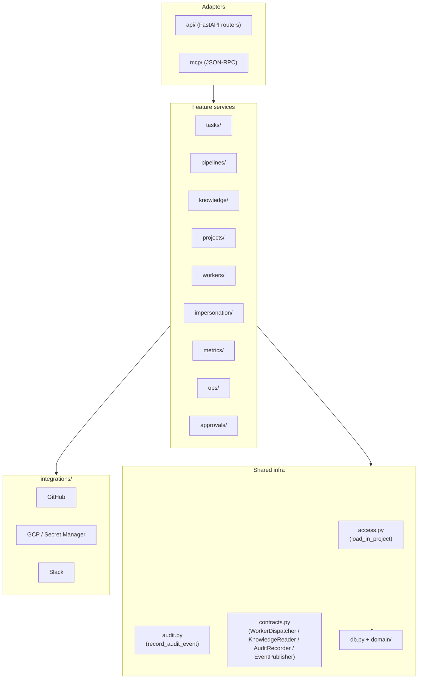

# coder-core modular monolith

## What it does today

`coder-core` is one deployed service: one FastAPI app, one Postgres
schema. Internally it's a layered modular monolith — thin HTTP / MCP
adapters call application services, which call domain repositories +
external integrations. Dependencies flow downward only; `import-linter`
contracts enforce the graph at CI. Cross-feature router-to-router
imports are banned; every feature exposes a service module that both
adapters consume.

## Architecture

### Parts

- **`api/`** — FastAPI routers; thin. Translate transport ↔ service. No workflow logic. `ServiceError.code` → `HTTPException`.
- **`mcp/`** — JSON-RPC sub-app; same shape as `api/`. Single `except ServiceError` clause maps to `-32602`.
- **Feature packages** (`tasks/`, `pipelines/`, `knowledge/`, `projects/`, `workers/`, `impersonation/`, `metrics/`, `ops/`, `approvals/`, `escalations/`, `rotation/`, `self_heal/`, `oauth/`) — own workflow and transaction boundaries; expose service functions both adapters call.
- **`domain/`** — SQLAlchemy models only; no outward imports. Read schemas (Pydantic) paired with ORM rows for API responses.
- **`access.py`** — single canonical `load_in_project(session, model, pk, project_id)`; the only authorised tenant row loader.
- **`contracts.py`** — four `Protocol` interfaces (`WorkerDispatcher`, `KnowledgeReader`, `AuditRecorder`, `EventPublisher`) as future extraction seams; cross-feature wiring goes through these, not direct imports.
- **`integrations/`** — leaf adapters; cannot import feature modules or other adapters.

### Data flow

A `POST` lands on a router → router parses + calls a service method →
service opens session, runs `load_in_project` for tenant scope, mutates,
calls `record_audit_event` inside the same transaction, returns Pydantic
schema → router returns response. Cross-feature calls go through a
`contracts.py` Protocol (e.g. tasks calls `WorkerDispatcher`, not
`workers.orchestrate_task` directly).

### Invariants

- **Import contracts are CI-enforced.** `make boundaries` (also part of `make check`) runs `import-linter` against four contracts; new violations fail the merge. No `ignore_imports` entries today.
- **Adapter symmetry.** Every HTTP route has an MCP equivalent calling the same service method; both adapters can be swapped or replaced.
- **Multi-tenancy is structural.** `load_in_project` is the only tenant row loader; alternative SQL paths are forbidden by contract.
- **Audit + mutation share a transaction.** `record_audit_event` is called by the caller inside its own session; rollback rolls the audit row back too.
- **Workflow logic lives in services, not adapters.** Routers translate; services orchestrate. CI catches new workflow code in `api/` or `mcp/`.
- **Domain is sink-only.** `domain/` imports only `db` + stdlib. Bidirectional dependency is a contract violation.

## Interfaces

| Surface | Effect |
|---|---|
| `contracts.WorkerDispatcher` (Protocol) | Cross-feature dispatch seam; tests swap via `set_dispatcher` / `get_dispatcher` |
| `contracts.KnowledgeReader` (Protocol) | Cross-feature knowledge fetch seam |
| `contracts.AuditRecorder` (Protocol) | Session-coupled audit writes seam |
| `contracts.EventPublisher` (Protocol) | SSE domain-event fanout seam |
| `access.load_in_project(...)` | Canonical row loader; 404 on mismatch OR missing |
| `errors.ServiceError` | Single transport-neutral exception; HTTP + MCP both translate it |
| `make boundaries` / `make check` | CI lint over the four contracts |

## Where in code

- `src/coder_core/contracts.py` — the four `Protocol` seams
- `src/coder_core/access.py` — `load_in_project` (canonical tenant loader)
- `src/coder_core/errors.py` — `ServiceError` base
- `src/coder_core/mcp/app.py` — single `except ServiceError` translation point
- `docs/module-boundaries.md` — the contracts (mirrors `pyproject.toml` `[tool.importlinter]`)
- `pyproject.toml` — `[tool.importlinter]` contracts (4 kept, 0 broken)

## Evolution

Rollout completed 2026-04-26 (all seven steps); `import-linter` ledger
went from 16 violations → 0. Worker-dispatch protocol fully plumbed and
swappable. Future per-role extraction (worker-fleet split) goes through
the `WorkerDispatcher` seam.

## Links

- Spec: [delivery-and-infra](../../../product-specs/active/delivery-and-infra.md)
- ADRs: [0005](../../../adrs/0005-multi-tenant-coder-core.md), [0006](../../../adrs/0006-per-role-service-accounts.md), [0007](../../../adrs/0007-reviewer-separated-from-pm.md)
- Designs: [system-overview](../system-overview.md), [worker-communication](../pipeline/worker-communication.md), [tenant-isolation](./tenant-isolation.md), [audit-log](../tenancy/audit-log.md)
- Repos: coder-core, coder-system
