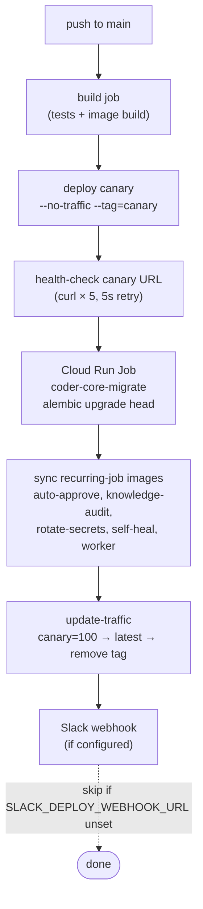

# Continuous Deployment

## What it is

Push-to-`main` in either `coder-core` or `coder-admin` auto-deploys to
Cloud Run via a canary-then-traffic-shift pattern. For `coder-core`,
Alembic migrations run as a Cloud Run Job before traffic shifts, and
recurring-job images are synced in the same workflow so reaper /
self-heal / metrics ticks pick up the new revision atomically with
the request handlers. A Slack webhook announces success and failure;
absence of the webhook is a graceful degrade, not a failure.

## Architecture

### Parts

- **GitHub Actions — `coder-core/.github/workflows/ci.yml`,
  `coder-admin/.github/workflows/ci.yml`.** Each repo's `ci.yml`
  has a `build` job and (on `main` only) a `deploy` job. Every
  step listed below lives in `coder-core/.github/workflows/ci.yml`'s
  `deploy` job; `coder-admin`'s deploy is a thinner subset (no
  migrations, no recurring jobs).
- **Step 1 — Deploy canary.**
  `gcloud run services update --tag=canary --no-traffic` deploys
  the new revision under the `canary` traffic tag without serving
  any production traffic. The canary URL is
  `canary---<service>-<hash>-ew.a.run.app`.
- **Step 2 — Health-check canary.** `curl` the canary URL up to 5
  times with a 5-second backoff; non-200 fails the workflow before
  any traffic moves.
- **Step 3 — Migrations** (`coder-core` only).
  `gcloud run jobs execute coder-core-migrate --execute-now --wait`
  with `--max-retries=0 --task-timeout=120s`. Hard-fails the
  workflow on non-zero exit; canary is left at 0% traffic so the
  prior revision keeps serving.
- **Step 4 — Sync recurring-job images.** Update the image of every
  Cloud Run Job that runs on a schedule
  (`coder-core-auto-approve-tick`,
  `coder-core-knowledge-audit-tick`, `coder-core-rotate-secrets`,
  `coder-core-self-heal-tick`, `coder-core-worker`) so they pick up
  the new code on their next firing. This step keeps recurring
  workers in sync with the request handler revision.
- **Step 5 — Traffic shift.**
  `gcloud run services update-traffic --to-tags=canary=100` makes
  the canary serve all traffic, then `--to-latest` removes the
  pinned canary tag, then `--remove-tags=canary` cleans up. After
  this step the new revision is just "latest" and the canary tag
  is freed for the next deploy.
- **Step 6 — Slack notify.** Two follow-up steps, one for success
  and one for failure, that POST to
  `${{ vars.SLACK_DEPLOY_WEBHOOK_URL }}` only when that variable is
  non-empty. Missing webhook → step skipped; the deploy still
  succeeds.

### Data flow

1. Engineer merges PR to `main` on either repo.
2. Build job runs `pytest` / `vitest` and builds + pushes the
   container image.
3. Deploy job (gated on `main`) walks the steps above. Failure at
   any point leaves the prior revision serving and posts a
   Slack failure card.
4. After traffic shift, recurring jobs and request handlers are
   both running the new image; the next scheduled tick uses the
   new code.

### Invariants

- **No traffic moves until canary is healthy.** Health-check is the
  one quality gate; failure stops the workflow before
  `update-traffic`.
- **Migrations precede traffic shift.** `coder-core-migrate` runs
  as a Cloud Run Job between canary deploy and traffic shift. A
  migration failure leaves the prior revision serving the prior
  schema — no skew.
- **Recurring jobs deploy in lockstep.** `coder-core-worker` and
  the various tick jobs are bumped in the same workflow run as
  the request handler so their behaviour can't lag the API.
- **Slack is optional.** `SLACK_DEPLOY_WEBHOOK_URL` is read with
  `!= ''` guards. The deploy succeeds whether or not anyone is
  listening.

## Interfaces

- **GitHub Actions:** `.github/workflows/ci.yml` in `coder-core`
  and `coder-admin`. Triggered on `push: [main]`.
- **Cloud Run services:** `coder-core`, `coder-admin` (region
  `europe-west1`).
- **Cloud Run jobs (one-shot):** `coder-core-migrate`.
- **Cloud Run jobs (recurring):** `coder-core-auto-approve-tick`,
  `coder-core-knowledge-audit-tick`, `coder-core-rotate-secrets`,
  `coder-core-self-heal-tick`, `coder-core-worker`.
- **Secrets / variables:** `SLACK_DEPLOY_WEBHOOK_URL` (Actions
  variable).
- **Runbooks:** per-service deploy runbooks document the
  automated flow and the manual rollback fallback
  (`gcloud run services update-traffic --to-revisions=…`).

## Evolution

- 0011 — initial CI: tests + image build only; deploys still
  manual.
- 0014 — automate `coder-core` and `coder-admin` deploys with the
  canary-then-shift pattern; introduce `coder-core-migrate` job.
- 0026 — sync recurring-job images alongside the request handler
  in the same workflow so the worker doesn't lag the API.
- 0033 — Slack deploy notifications.
- 2026-04-19 — `--remove-tags=canary` post-shift, freeing the tag
  for the next deploy without leaving a phantom revision pinned
  at 0%.

## Links

- Specs: [continuous-deployment](../../../product-specs/active/continuous-deployment.md)
- Designs: [system-overview](../system-overview.md),
  [observability-and-cost-tracking](../pipeline/observability-and-cost-tracking.md),
  [audit-log](../tenancy/audit-log.md)
- Services: `coder-core`, `coder-admin`
