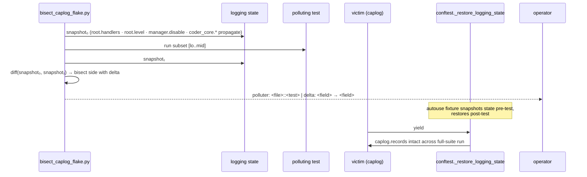

# Test harness reliability

## What it is

The infrastructure that keeps `coder-core`'s pytest suite deterministic
under full-suite ordering: a logging-state bisect script that names the
test or fixture polluting the global stdlib `logging` machinery, the
autouse restore fixture that absorbs the leak, and a permanent
regression tripwire that fails first if the leak ever re-introduces.
Replaces the four `pytest.mark.skip` markers PR #252 applied as the
2026-05-13 prod-recovery hotfix; the four affected tests now pass
under the full suite with the real fix in place.

## Architecture

### Parts

- **`scripts/bisect_caplog_flake.py`** — standalone harness invoked
  as `uv run python scripts/bisect_caplog_flake.py --failing-test
  <test_id>`. Per bisect step: snapshots `logging.root.handlers`
  (type + id + level), `logging.root.level`,
  `logging.root.manager.disable`, and per-logger
  `(level, propagate, handler_ids)` for every `coder_core.*` entry
  in `logging.Logger.manager.loggerDict`. Collects ordered test IDs
  via `pytest --collect-only -q`, runs the candidate range in a
  subprocess, re-snapshots after. If any field changed, bisects the
  left half; otherwise the right half. Terminates when the candidate
  range is one test. Output is a structured report naming file,
  test name, and specific mutation. Permanent infrastructure under
  `scripts/`; future caplog flakes reuse it without re-derivation.
- **Autouse restore fixture in `tests/conftest.py`** —
  `_restore_logging_state` snapshots root handlers, root level,
  `manager.disable`, and per-logger `propagate` flags before every
  test, restores on teardown. Subsumes the older narrower
  `_reset_coder_core_log_propagation` fixture (kept removed). The
  fallback path; preferred path is a per-file teardown when the
  bisect localises the polluter to one test file.
- **`tests/test_caplog_harness.py`** — regression tripwire test.
  Directly applies the identified polluting state mutation in
  isolation, asserts `caplog.records` continues to capture log
  records correctly across that mutation. Fails first if a future
  change re-introduces the leak — before any of the four
  originally-skipped tests would break.
- **`tests/SKIPPED.yml` cleanup.** The four entries added by the
  spec-0090 CI-resilience mechanism
  (`test_plan_create_shadow_mode_logs_but_writes_no_row`,
  `test_local_broker_issue_records_audit_log`,
  `test_parse_review_verdict_heuristic_fires_warning`,
  `test_preload_index_skips_on_404_and_logs`) are removed once
  the fix is confirmed green. The mechanism auto-cleans on entry
  deletion.

### Data flow

1. Operator runs the bisect script against a failing caplog test on
   `main`. The script collects test IDs, runs a halving subset in a
   subprocess, snapshots logging state pre- and post-, and bisects
   on the snapshot delta.
2. The script terminates with a structured polluter report.
3. Operator chooses the fix path: preferred source fix (autouse
   teardown scoped to the polluter's file) or fallback conftest
   snapshot (broader coverage when the polluter is third-party or
   spans fixtures).
4. The regression tripwire is added in the same PR; the four
   skip markers and `SKIPPED.yml` entries are removed.
5. Full suite passes deterministically; future caplog flakes
   re-run the bisect script first.

### Invariants

- **Suite serialisation is single-process.** `pytest-xdist` is not
  in use, so pollution is intra-process and ordering-deterministic;
  the bisect script's subprocess runner reproduces the same order.
  ADR [0011](../../../adrs/0011-orphan-dispatch-reaper.md) carries the
  related in-process serialisation guarantee.
- **The tripwire fails before the four canaries.** Any
  re-introduction of the logging leak surfaces on
  `test_caplog_harness.py` first; the four formerly-skipped tests
  remain a downstream signal.
- **The autouse fixture is bounded.** It snapshots and restores
  only `logging` state — root handlers, level, `manager.disable`,
  and per-`coder_core.*` propagate flags. No structlog state, no
  `os.environ`, no other globals.

## Interfaces

- **Script:** `scripts/bisect_caplog_flake.py` — self-contained,
  no extra deps beyond the existing test virtualenv.
- **Regression test:** `tests/test_caplog_harness.py` — part of
  the standard `uv run pytest tests/` run.
- **Conftest fixture:** `tests/conftest.py` `_restore_logging_state`
  (autouse).
- **Dependencies surface:**
  `coder_core.observability.configure_logging` — the
  handler-install path; the fix must remain compatible with its
  sentinel-based idempotence check.

## Where in code

- `coder-core/scripts/bisect_caplog_flake.py` — bisect runner +
  snapshot/diff
- `coder-core/tests/conftest.py` — `_restore_logging_state`
  autouse fixture
- `coder-core/tests/test_caplog_harness.py` — regression tripwire
- `coder-core/src/coder_core/observability/__init__.py` —
  `configure_logging` (handler-install sentinel)
- `coder-core/tests/SKIPPED.yml` — spec-0090 SKIPPED mechanism;
  4 entries removed on fix verification

## Evolution

- 2026-05-14 (spec 0091) — Component shipped: bisect script,
  conftest autouse restore fixture, regression tripwire,
  un-skipped four canary tests, removed `SKIPPED.yml` entries.
  Origin: the 2026-05-13 prod-recovery incident where four flaky
  caplog tests plus a migration wedge kept prod down ~9 hours;
  [coder-core#252](https://github.com/coder-devx/coder-core/pull/252)
  was the test-skip hotfix this component replaces.

## Links

- Specs: [test-harness-reliability](../../../product-specs/active/delivery/test-harness-reliability.md)
- Designs: [continuous-deployment](./continuous-deployment.md),
  [tenant-isolation](./tenant-isolation.md),
  [post-pr-ci-fix-loop](../pipeline/post-pr-ci-fix-loop.md),
  [developer-worker](../workers/developer-worker.md)
- ADRs: [0011](../../../adrs/0011-orphan-dispatch-reaper.md)
- Incident: [coder-core#252](https://github.com/coder-devx/coder-core/pull/252)
- Services: `coder-core`
