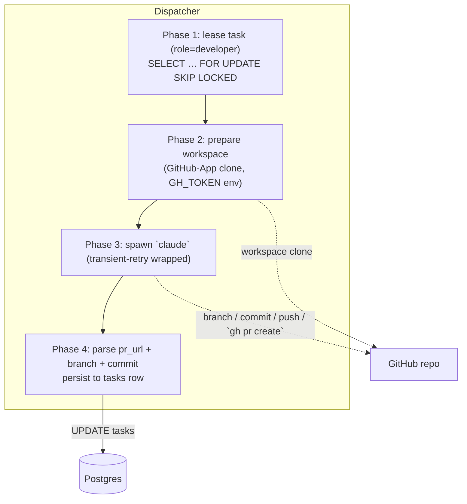

# Developer Worker

## What it is

The Developer worker turns an approved task plan into a shippable
pull request. Given a `role=developer` task carrying a prompt, a
target repo, and an optional `fix_context`, it spawns a `claude` CLI
subprocess inside a per-task workspace cloned from the project's
GitHub repo, lets Claude branch / commit / push / open a PR, and
records the resulting PR URL, branch name, and commit SHA on the
task row. Everything downstream in the pipeline (reviewer,
acceptance, merge, deploy) keys off the PR URL this worker produces.

## Architecture

### Parts

- **`workers/developer.py::run_developer_task`** — the subprocess
  runner. Builds the per-task workspace via `workers/workspace.py`,
  applies `GH_TOKEN` through `_github_env.apply_github_token_env`,
  and spawns `claude`. The system prompt is assembled per
  [0057-role-prompt-knowledge-layout](../wip/0057-role-prompt-knowledge-layout.md):
  `common_preamble` + `roles/developer/role.md` +
  `roles/developer/tasks/implement.md`. Mode is hardcoded to
  `"implement"`.
- **Result parsers — `parse_claude_json_envelope`, `parse_pr_url`**
  in the dispatcher. Phase 4 calls `parse_pr_url(result_text)` and,
  on success, writes `tasks.pr_url`. The `task/<slug>` branch name
  is captured by the dispatcher from `git rev-parse --abbrev-ref
  HEAD` and written to `tasks.branch_name` (only when it matches
  the `task/*` prefix — non-conforming branches do not block the
  task but are not GC-eligible).
- **No schema gate.** Unlike PM / Architect / Team-Manager, the
  developer's output is not JSON — it is a PR. The compliance gate
  is therefore a no-op for `role=developer`. Failure to produce a
  PR URL is treated as a hard failure (see Invariants).
- **Transient retry — `workers/_transient_retry.py::run_with_transient_retry`**
  wraps the claude spawn. Anthropic 429/529s, socket resets, and
  DNS blips re-spawn with full-jitter exponential backoff up to
  `worker_transient_retry_budget`. Budget exhaustion lands
  `failure_kind="transient"`; success-after-retry populates
  `tasks.transient_retry_history` (migration 0021) so the admin
  panel renders a "recovered after N transient retries" chip. The
  per-task deadline path (`TaskStatus.TIMED_OUT`) is distinct and
  not retried — see ADR [0013](../../adrs/0013-worker-level-transient-retry.md).
- **PR URL reconcile (orchestrator-side, spec 0054).** When the
  worker stdout omits the PR URL but the developer task otherwise
  succeeded, the orchestrator queries GitHub for the just-pushed
  branch's PR and patches `tasks.pr_url` itself — gated by
  `CODER_ORCHESTRATOR_PR_URL_RECONCILE_ENABLED`. The bot-identity
  check uses `pr.user.type == 'Bot'`, not login-match, per
  ADR [0016](../../adrs/0016-bot-identity-via-user-type.md).
- **Dispatcher registration.** `_RUNNERS["developer"] =
  run_developer_task` in the dispatcher; the
  `WorkerDispatcher` protocol (`coder_core/contracts.py`) is the
  extraction seam — see
  [coder-core-modular-monolith](./coder-core-modular-monolith.md).

### Data flow

1. PM / Team-Manager produces a `role=developer` task with prompt,
   repo, optional `fix_context`.
2. Dispatcher leases the task race-free (`FOR UPDATE SKIP LOCKED`),
   prepares a workspace cloned from the repo, exports `GH_TOKEN`,
   and spawns `claude`.
3. Claude branches `task/{slug}`, edits files, commits, pushes, and
   `gh pr create`s with a structured title/body referencing the
   task and spec.
4. Phase 4 parses PR URL + branch name + commit SHA from claude
   output, persists to the `tasks` row, and tears down the
   workspace via `try/finally`.
5. The reviewer worker picks up the next stage with the PR URL in
   its prompt.

### Invariants

- **No PR URL → failed task.** A successful claude exit with no
  parseable PR URL fails the task with `failure_kind="transient"`
  on the first attempt (workspace-side network blip is the dominant
  cause); persistent failure lands `failure_kind="schema"` so
  operators can re-prompt.
- **Workspace cleanup is unconditional.** The `try/finally` around
  `workspace.cleanup()` runs on success, failure, and timeout.
- **Branch capture is best-effort.** Only `task/*` branches land in
  `tasks.branch_name`; the [branch-cleanup](./branch-cleanup.md) GC
  uses that column to map remote branches back to task rows.
- **Concurrent leases are race-free.** `FOR UPDATE SKIP LOCKED` on
  the task queue guarantees no two workers claim the same row.

## Interfaces

- **Task API:** `role=developer`, prompt = task description, optional
  `fix_context` (reviewer feedback prefix on retry).
- **Writes:** `tasks.pr_url`, `tasks.branch_name`,
  `tasks.transient_retry_history`, `tasks.review_*` (downstream
  reviewer fills these), `task_logs` rows.
- **GitHub:** PR opened on the project repo via `gh pr create`.
- **System prompt path:** `system/roles/developer/role.md` +
  `system/roles/developer/tasks/implement.md` (per [design 0057](../wip/0057-role-prompt-knowledge-layout.md)).

## Evolution

- 0004 — in-process worker, race-free leasing, per-task workspace,
  JSONL transcript capture, `task_logs` table, `timed_out` state.
- 0020 — branch / commit / push / PR flow; `pr_url` column
  (migration 0016); reviewer prompt receives the PR URL; hard
  failure on missing PR.
- 0023 — `tasks.branch_name` capture (migration 0019) wired into
  branch-cleanup GC.
- 0027 — transient-failure retry around the claude spawn;
  `tasks.transient_retry_history` (migration 0021); ADR 0013
  documents why the loop lives inside the worker.
- 0054 — orchestrator-side PR URL reconcile; flag-gated via
  `CODER_ORCHESTRATOR_PR_URL_RECONCILE_ENABLED`. ADR 0016 for the
  bot-identity check.
- 0055 — `GH_TOKEN` injection routed through
  `_github_env.apply_github_token_env`; workspace token preferred,
  dispatcher-resolved `WorkerInput.github_token` as fallback.
- [design 0057](../wip/0057-role-prompt-knowledge-layout.md) — system prompt
  assembled from common preamble + role + task-mode files in the
  knowledge repo; mode hardcoded to `"implement"` for this worker.

## Links

- Specs: [developer-worker](../../product-specs/active/developer-worker.md),
  [task-orchestration](../../product-specs/active/task-orchestration.md),
  [branch-cleanup](../../product-specs/active/branch-cleanup.md)
- Designs: [worker-roles](./worker-roles.md),
  [worker-communication](./worker-communication.md),
  [branch-cleanup](./branch-cleanup.md)
- ADRs: [0013](../../adrs/0013-worker-level-transient-retry.md),
  [0016](../../adrs/0016-bot-identity-via-user-type.md)
- Services: `coder-core`
