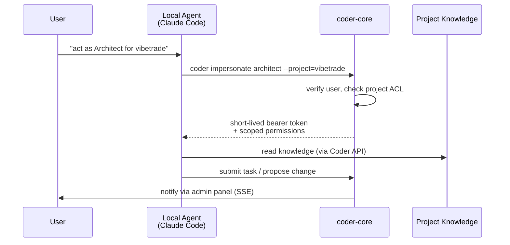

# Impersonation

## What it is

Impersonation lets a **local agent** — Claude Code, Cursor, or any
CLI-driven assistant running on the user's laptop — act as a specific
**role** for a specific **project**. The local agent obeys the same
role contract as a backend fleet worker: same capabilities, same
permissions, same escalation paths. The only difference is that the
loop runs on the user's machine instead of inside the Coder fleet.

This is the escape hatch that lets a human drive any role interactively
while the Coder system records everything through its normal API and
audit path.

## Architecture

### Parts

- **`coder` CLI** — `coder impersonate <role> --project=<id>`
  exchanges the user's credentials for a role-scoped bearer token.
- **Impersonation endpoint** in `coder-core` — verifies the user has
  permission to impersonate `role` on `project_id`, mints a
  short-lived token, records a session row.
- **Bearer auth middleware** — the same middleware that guards fleet
  worker calls; it unpacks `{project_id, role, session_id, expires_at}`
  from the token.
- **Session registry** — sessions are listed, inspectable, and
  revocable from the admin panel.

### Data flow

1. User runs `coder impersonate architect --project=vibetrade`.
2. CLI calls the impersonation endpoint, authenticating with the
   user's credentials.
3. `coder-core` checks the project ACL and the role grant, issues a
   short-lived token, opens a session row.
4. The local agent attaches the token on every API call. Requests
   land as if the fleet's architect worker made them — same ACL,
   same audit path.
5. When the token expires (or the user runs `coder revoke`), the
   session closes. The admin panel can force-revoke mid-session.

### Invariants

- Tokens are short-lived and role-scoped — never long-lived, never
  project-wide.
- Every impersonated call is auditable to `{user, role, project,
  session_id}`.
- The local agent has no more capability than a fleet worker in the
  same role; escalation still flows through the System Admin worker.
- Revoking a session immediately invalidates outstanding tokens.

## Interfaces

- CLI: `coder impersonate <role> --project=<id>`,
  `coder sessions`, `coder revoke <session>`.
- API: `POST /v1/impersonate`, `GET /v1/sessions`,
  `POST /v1/sessions/{id}/revoke`.
- Token: bearer token on `Authorization: Bearer <token>`.

## Evolution

- `0002-worker-roles-and-impersonation` — defined the impersonation
  flow alongside the role contract.
- Build plan step 7 (spec 0007) — shipped bearer auth, the `coder`
  CLI, sessions, and revocation end-to-end. Local Claude Code now
  impersonates `developer` for both `coder` and `vibetrade` projects.
- `0037` — audit log integration (shipped 2026-04-19):
  `CallerIdentity.actor` + `actor_method` are the authorship fields
  on every `audit_events` row fleet-wide, so a broker token's
  downstream mutations resolve back to the authorising human via the
  `token_id` chain. `impersonate.issue_token` and
  `sessions.revoke` themselves write audit rows. See
  [audit-log](./audit-log.md).

## Links

- ADRs: 0006 (per-role service accounts)
- Designs: worker-roles, system-overview
- Services: `coder-core`
