# Knowledge Freshness

## What it is

The freshness subsystem adds a per-artifact trust signal on top of
the [knowledge-write-api](./knowledge-write-api.md) and
[knowledge-repo-model](./knowledge-repo-model.md) designs. It is a
pure-function scorer, a read-time envelope, an attestation endpoint,
and a nightly audit loop that together answer "is this artifact
still true?" without asking a human to re-read the repo. The scoring
input set is strictly information artifacts already declare —
`last_verified_at`, `affects_*` targets, and cross-link fields — per
[ADR 0014](../../adrs/0014-freshness-from-declared-affects.md).

## Architecture

```mermaid
flowchart TB
  subgraph write [Write paths]
    create[POST knowledge/&#123;type&#125;<br/>sets last_verified_at = today] --> commit1[(commit)]
    verify[POST .../verify<br/>bumps last_verified_at] --> commit2[(commit)]
  end

  subgraph read [Read path]
    get[GET knowledge/&#123;type&#125;/&#123;id&#125;<br/>?min_freshness=N] --> svc
    svc[FreshnessService.score] -->|score >= N| ok[200 with freshness block]
    svc -->|score < N| stale[409 STALE with body + freshness block]
  end

  subgraph score [FreshnessService.score]
    age[age since last_verified_at] --> penalty[sum of penalties<br/>age + activity + dep]
    activity[list_commits on affects_* since verify] --> penalty
    deps[min score across declared deps] --> penalty
    penalty --> out[score = max&#40;0, 100 - sum&#41;]
  end

  subgraph audit [Nightly per-project audit]
    trigger[Cloud Scheduler<br/>POST /v1/_admin/knowledge-audit/run] --> picker
    picker[score all; pick bottom-N<br/>below floor] --> dispatch
    dispatch[dispatch knowledge-audit tasks] --> arch[Architect worker]
    arch -->|verified| callverify[consumer calls .../verify]
    arch -->|needs_rewrite| report[write decision + report<br/>onto audit-item row]
    arch -->|uncertain| report
  end

  write -.- read
  read -.- score
  audit -.-> write
  audit -.-> adminui[Admin Freshness tab<br/>histogram + Needs attention]
```

## Parts

- **Frontmatter schema.** `last_verified_at` (required ISO date) and
  `verified_by` (optional actor slug) on specs, designs, services,
  repos, roles, integrations, runbooks. ADRs are excluded
  (append-only). The validator (ADR 0008) enforces presence,
  parseability, and `<= today`. `scripts/backfill_last_verified.py`
  seeds the field from `git log -1 --format=%cs` on any artifact
  lacking it.
- **Scorer.** `coder_core.knowledge.freshness.score(FreshnessInputs)
  → FreshnessScore`. Pure, deterministic, no I/O. Three penalties —
  age per day, activity-first-commit + per-extra, and dependency
  deficit below threshold — summed and clamped. Reasons are sorted
  most-impactful-first so callers surface the top one or two without
  additional work.
- **Activity counter.** `GitHubClient.list_commits(org, repo, since,
  path=None)` returns a capped commit count; the
  `FreshnessService._count_target_activity` path resolves
  `affects_repos` directly, resolves `affects_services` through the
  services registry to hosting repo slugs, and narrows with
  `affects_surfaces` / `affects_interfaces` / `affects_paths` when
  present. A tiny in-process `FreshnessActivityCache` (TTL 10 min)
  shares counts across the burst of reads that typically hit a
  single artifact in admin-panel or worker contexts.
- **Dependency rot.** One level of transitive freshness: each
  declared `served_by_designs` / `implements_specs` /
  `implements_designs` / `related_*` cross-link is resolved, the
  target's own `last_verified_at` gets scored (age-only), and the
  minimum contributes a penalty. Deeper chasing would require
  unbounded GitHub reads; the signal isn't worth it at this depth.
- **Read envelope.** The Knowledge API's typed `GET .../{type}/{id}`
  response carries `freshness: {score, last_verified_at, verified_by,
  reasons: [{kind, detail}]}`. `min_freshness=N` on the query string
  causes below-threshold reads to return `409 STALE` with the stale
  artifact still present in the 409 detail body — the caller may
  consume it anyway. Absent param preserves the 200 legacy contract.
- **Verify endpoint.** `POST
  /v1/projects/{id}/knowledge/{type}/{id}/verify` requires a
  `summary` string; bumps `last_verified_at` to today, writes
  `verified_by`, and commits with a structured message
  `verify({type}/{id}): {summary}`. ADRs are refused (400
  `adrs_not_verifiable`). SHA conflict on the underlying file
  surfaces as 502 through the existing Write API contract.
- **Audit runner.** `coder_core.ops.knowledge_audit.run_once` walks
  every artifact via `KnowledgeService`, sorts by score, picks the
  bottom-N below the staleness floor, dispatches one
  `role=architect` task per pick (with a stable prompt header
  carrying `Artifact: {type}/{id}` and the top reasons), and writes
  one `KnowledgeAuditRunRow` + one `KnowledgeAuditItemRow` per
  evaluated artifact. Error rows are written for scoring failures
  and dispatch failures; the pass never aborts mid-flight.
- **Architect audit mode.** The `run_architect_task` worker inspects
  the prompt for the `# Knowledge audit` header; when detected, it
  swaps in `_AUDIT_PROMPT` instead of `_ARCHITECT_PROMPT`, keeping
  the same claude-CLI invocation pattern but emitting the
  three-decision JSON instead of a design envelope.
- **Consumer.** `coder_core.ops.knowledge_audit_consumer.consume_audit_task`
  parses the architect's result, and on `verified` calls
  `KnowledgeService.verify_artifact`; on `needs_rewrite` or
  `uncertain` stamps the decision and the canonical report JSON onto
  the originating `KnowledgeAuditItemRow`. Parser failures record
  the raw output verbatim so operators can debug without re-running
  the task.
- **Admin endpoints.** `POST /v1/_admin/knowledge-audit/run` triggers
  a pass (Cloud Scheduler nightly, operators for one-off diagnostics);
  `GET /v1/_admin/knowledge-audit/runs` and `/runs/{id}` drive the
  Freshness tab. `GET /v1/_admin/ops/freshness` returns the
  histogram + stale count + oldest-N report over the latest run per
  project. `GET /v1/_admin/ops/freshness/metrics` exposes the three
  spec-0043 counters as labelled rows.
- **Observability.** Process-memory counters (no Prometheus dep yet)
  mirror `knowledge_cache_hit/miss` pattern:
  `knowledge_stale_reads_total`,
  `knowledge_audit_outcome_total`, and the
  `knowledge_freshness_score` gauge that the audit runner refreshes
  at end-of-run per `(project, type)`. A scraper polling the
  metrics endpoint synthesises Prom samples from the JSON.
- **Runbook.** [`runbooks/knowledge-freshness-audit`](../../runbooks/knowledge-freshness-audit.md)
  describes the weekly operator pass over the `Needs attention`
  queue and the `uncertain` path.

## Data flow

**Happy read with threshold.**

1. Worker calls `GET .../knowledge/specs/0001?min_freshness=70`.
2. Handler loads the artifact, resolves cross-links, asks
   `FreshnessService._compute_freshness` to assemble inputs from
   age + activity + dep scores.
3. Score 82 ≥ 70 → 200 with body + `freshness` block including the
   top reasons.

**Stale read.**

1. Same call but score is 54 against threshold 70.
2. `409 STALE` with a structured `{code: "stale", artifact: {...}}`
   detail — the artifact body is in the 409 envelope so the caller
   can consume it if it chooses.
3. `knowledge_stale_reads_total{project, type, threshold=70}` is
   incremented.

**Audit pass.**

1. Cloud Scheduler hits `POST /v1/_admin/knowledge-audit/run` once
   per day per project (payload `{project_id}`, admin JWT).
2. `run_once` scores every artifact; picks the bottom-N below the
   floor; dispatches one `architect` task per pick.
3. Each task row lands in `tasks` with `role=architect,
   status=queued`, and a structured prompt.
4. The dispatcher runs the architect; on success it routes to
   `consume_audit_task` instead of the design-writer, because the
   prompt begins with `# Knowledge audit`.
5. `verified` → `verify_artifact` commits the new
   `last_verified_at`; `needs_rewrite` / `uncertain` stamps the
   report onto the audit-item row and the admin `Needs attention`
   widget renders it.

## Invariants

- Every non-ADR read returns a `freshness` block with a score, or a
  5xx. No path returns a body without a score.
- `last_verified_at` is monotonic — only `verify_artifact` or a
  future `PUT`-with-attestation moves it.
- The audit dispatcher is idempotent per pass: the item row's
  `task_id` link is unique (per dispatched task), and the consumer
  is keyed on `task_id` — replaying a single audit task updates the
  existing row rather than duplicating it.
- Error rows never dispatch tasks. A scoring failure on an artifact
  (malformed frontmatter, missing `last_verified_at`) writes one
  `action=error` item row with a truncated reason; the pass
  continues.

## Edge cases

- **Artifact with no `affects_*` fields.** Activity contribution is
  zero (no targets, no signal). Age penalty dominates; a quiet
  subsystem still needs periodic re-attestation — the score drops
  until someone calls `verify`.
- **Service slug not found in the services registry.** The resolver
  returns an empty repo list for that entry; the artifact scores as
  if the service declaration weren't there. No error surfaces —
  best-effort is the contract.
- **Dependency cycle.** The dependency walker is one level deep, so
  cycles are naturally bounded; each dep contributes only its own
  age-based score.
- **Architect emits malformed decision JSON.** The consumer records
  the raw output (truncated) on the item row with `decision=null`.
  A follow-up pass may re-dispatch; today the operator triages.
- **Staleness floor raised retroactively.** Existing item rows are
  not rescored — the floor is baked into each run row. The admin
  endpoint's `stale_below` query param computes a live stale count
  against any threshold without re-running the audit.
- **Cloud Scheduler firing before the previous run finished.** The
  runner opens a new run row each call; item rows link by run_id,
  not task_id, so concurrent runs are safe at the schema level.
  Practical mitigation: Scheduler stagger per project.

## Rollout

Shipped across four sequenced PRs in Phase 8:

1. Scorer + read envelope + verify endpoint (phase-2A).
2. Activity counting + nightly audit runner + admin trigger.
3. `/ops/freshness` endpoints, counters, gauge, and the Freshness
   tab in coder-admin.
4. Architect audit mode + consumer + decision columns on
   `knowledge_audit_items`.

Cloud Scheduler nightly trigger lands in the
[knowledge-freshness-audit runbook](../../runbooks/knowledge-freshness-audit.md).

## Links

- Spec: [knowledge-freshness](../../product-specs/active/knowledge-freshness.md).
- ADRs:
  [0008 — CI validation of the knowledge repo](../../adrs/0008-ci-validation-of-knowledge-repo.md),
  [0014 — freshness from declared affects, not semantic similarity](../../adrs/0014-freshness-from-declared-affects.md).
- Related designs:
  [knowledge-repo-model](./knowledge-repo-model.md),
  [knowledge-write-api](./knowledge-write-api.md),
  [architect-worker](./architect-worker.md),
  [observability-and-cost-tracking](./observability-and-cost-tracking.md).
- Peer spec / design: 0044 — write-through enforcement on ship
  (prevents one source of the rot this design surfaces).
