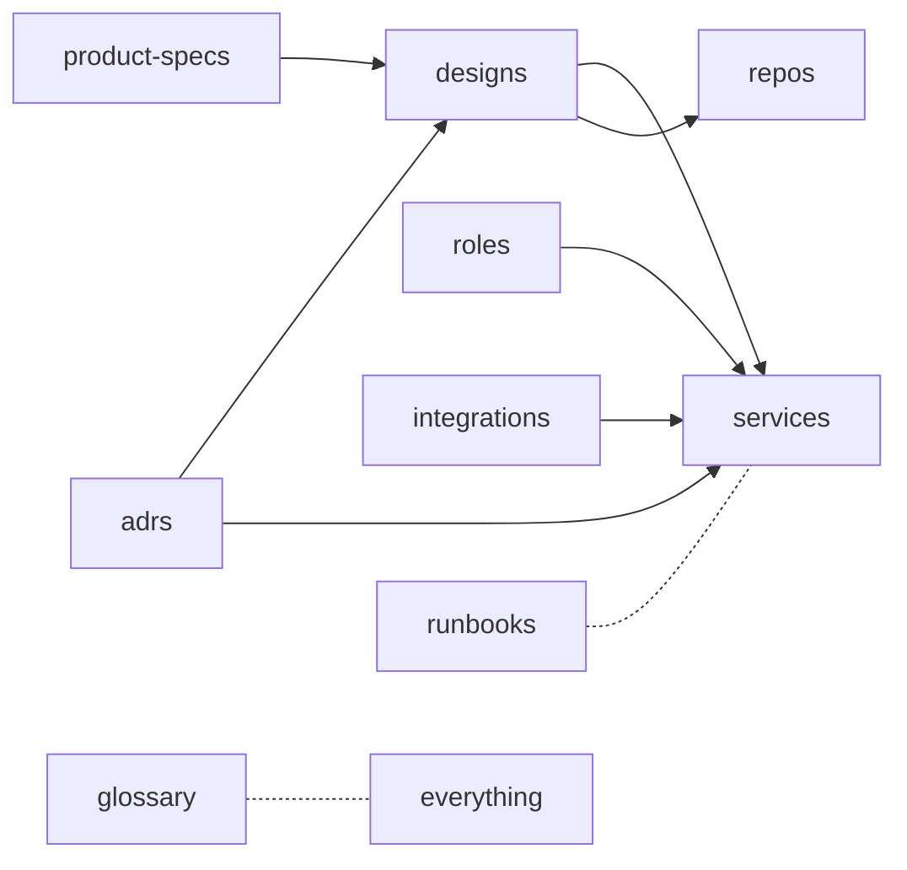

# Knowledge Repo Model

## What it is

Every project Coder manages has its own knowledge repo with the same
structure — human-readable Markdown, machine-readable YAML registries,
and cross-linkable frontmatter. The `coder-system` repo itself is two
things at once: Coder's own knowledge repo (under `system/`) and the
blueprint that per-project repos copy (under `template/`). The Coder
Core Knowledge API reads these repos and serves their contents to
workers and the admin panel.

The repo is the durable shared memory of the project. Stability over
time matters: ADRs are append-only, designs move rather than delete,
specs progress through `wip → active → deprecated`.

## Architecture



Layout:

```
coder-system/
├── system/      ← knowledge of Coder itself
└── template/    ← blueprint per-project repos copy
```

### Parts

| Type | Folder | Lifecycle |
|---|---|---|
| Service | `services/` | live |
| Repo | `repos/` | live |
| Design | `designs/{active,wip,deprecated}/` | wip → active → deprecated |
| ADR | `adrs/` | append-only, supersede |
| Product spec | `product-specs/{active,wip,deprecated}/` | wip → active → deprecated |
| Role | `roles/` | live |
| Integration | `integrations/` | live |
| Runbook | `runbooks/` | live |
| Glossary | `glossary.md` | live |

### Data flow

1. A worker or the admin panel requests an artifact through the
   Knowledge API (`GET /v1/projects/{id}/knowledge/{type}/{artifact_id}`).
2. `coder-core` fetches the file from GitHub (pull-on-read, TTL
   cache), parses its frontmatter, and resolves cross-links against
   the relevant `registry.yaml`.
3. Response includes the body, typed frontmatter, and resolved links,
   so clients can render a graph view without re-parsing.
4. Writes flow through the knowledge-write-api design, which updates
   the artifact and its `registry.yaml` entry atomically (per file)
   and validates cross-links before commit.
5. CI ([ADR 0008](../../adrs/0008-ci-validation-of-knowledge-repo.md))
   re-validates frontmatter, registries, and cross-link integrity on
   every PR.

### Invariants

- Every artifact MD file begins with YAML frontmatter. Required
  fields per type live in `_TEMPLATE.md`.
- Cross-link fields (`implements_specs`, `serves_spec`, `decided_by`,
  `affects_services`, `affects_repos`, `depends_on`,
  `related_designs`, `superseded_by`) must resolve.
- Every folder with multiple items has `registry.yaml` (source of
  truth) and `REGISTRY.md` (generated, do not hand-edit).
- ADRs are append-only; superseded ADRs are marked, not deleted.
- `AGENTS.md` at repo root is the single source of truth for agent
  behavior; `CLAUDE.md`, `.cursor/rules/coder-system.mdc`, and any
  future agent surfaces are thin pointers.

## Interfaces

- Knowledge API (read): `GET /v1/projects/{id}/knowledge/{type}`,
  `GET /v1/projects/{id}/knowledge/{type}/{artifact_id}`.
- Knowledge API (write): see knowledge-write-api design.
- Registry files: `{folder}/registry.yaml` — machine-readable truth.
- CI: `tofu validate` + registry/cross-link check on every PR.

## Evolution

- `0003-knowledge-repo-model` — established the two-section layout,
  artifact taxonomy, frontmatter contract, and registry contract.
- Build plan step 2 (spec 0002) — shipped the typed read API with
  cross-link resolution and TTL cache.

## Links

- ADRs: 0001 (layout), 0002 (yaml registries), 0003 (mermaid),
  0004 (agents.md), 0008 (CI validation)
- Designs: system-overview, knowledge-write-api
