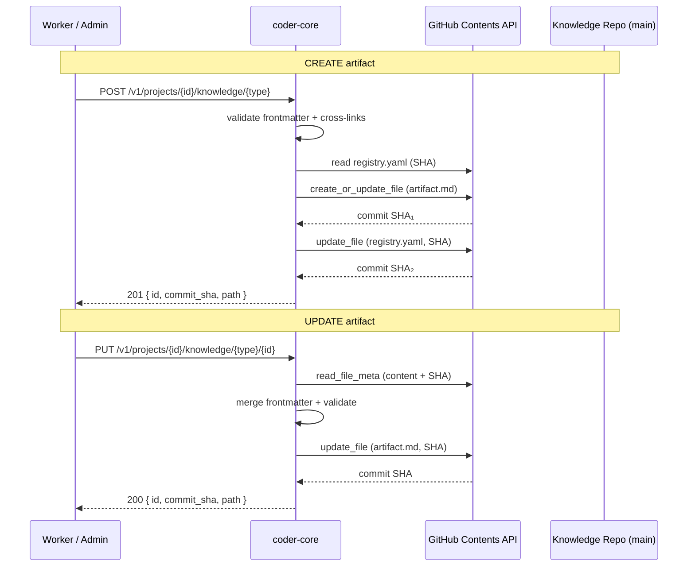

# Knowledge Write API

## What it is

The Knowledge Write API is the endpoint set that lets workers (and
admins) create and update knowledge-repo artifacts — specs, designs,
ADRs — without a manual `git commit`. It extends the read-only
knowledge surface so PM, Architect, and other authoring workers can
produce their outputs directly via the API. Writes go to the project's
GitHub-backed knowledge repo using the Contents API, with optimistic
SHA concurrency and automatic `registry.yaml` maintenance.

## Architecture

### Parts

- **Endpoints** — `POST /v1/projects/{id}/knowledge/{type}` and
  `PUT /v1/projects/{id}/knowledge/{type}/{artifact_id}`.
- **GitHub client additions** — `create_file` (PUT without SHA) and
  `delete_file` (for status-change file moves) on the existing
  `GitHubClient`.
- **Frontmatter validator** — reuses `validate_required_fields()` in
  `knowledge/schema.py`; additionally checks that `type` matches the
  URL path and `id` matches the URL parameter on PUT.
- **Cross-link validator** — for each `CROSS_LINK_FIELDS` entry,
  confirms referenced IDs exist in the target registry. Self-refs
  allowed. Registry parse failure → 502.
- **Commit formatter** — structured messages:
  `knowledge({type}): {verb} {id} — {title}` with `Actor:` and
  `Project:` trailers.

### Data flow

**Create.** Client POSTs `{id, frontmatter, body}`. The handler
infers `type` from the URL, merges frontmatter, validates required
fields and cross-links, confirms ID uniqueness in the registry, then
commits the artifact file at
`system/{folder}/{status}/{id}-{slug}.md` (status defaults to `wip`).
A second commit appends an entry to `{folder}/registry.yaml`.

**Update.** Client PUTs `{frontmatter?, body?}`. The handler reads
the current file and its SHA, shallow-merges frontmatter, blocks
`id`/`type` changes, validates, and commits. If `status` changes
(e.g. `wip` → `active`), the handler creates the file at the new
path, deletes the old one, and updates the registry entry's `file`
and `folder` fields — three commits total.

### Invariants

- `id` and `type` are immutable after creation.
- Every outbound cross-link must resolve (or 422) before commit.
- Concurrency is optimistic via GitHub's SHA — concurrent writes to
  the same file surface as 409.
- Every commit is auditable to `{actor_type, actor_id, project_id}`
  via the structured trailer.
- Partial failure (artifact committed, registry update fails) returns
  500 with the artifact commit SHA so the caller can retry the
  registry update. Git Trees API for atomic multi-file commits is a
  future optimisation.

## Interfaces

| Method | Path | Result |
|---|---|---|
| `POST` | `/v1/projects/{id}/knowledge/{type}` | 201 · `{id, commit_sha, path}` |
| `PUT` | `/v1/projects/{id}/knowledge/{type}/{artifact_id}` | 200 · `{id, commit_sha, path}` |

Errors: `400` (immutable field change / bad YAML), `404` (missing
artifact or project), `409` (SHA conflict or create-race),
`422` (validation / broken cross-link), `502` (registry unparseable).

## Evolution

- Checkbox PATCH endpoint (spec 0012) — proved the read-modify-write
  pattern with SHA concurrency.
- `0007-knowledge-write-api` (spec 0014) — generalized the pattern to
  full create/update across all artifact types and added cross-link
  validation.

## Links

- Specs: [`0014`](../../product-specs/wip/0014-knowledge-write-api.md)
- Designs: knowledge-repo-model, pm-worker, architect-worker
- Services: `coder-core`
