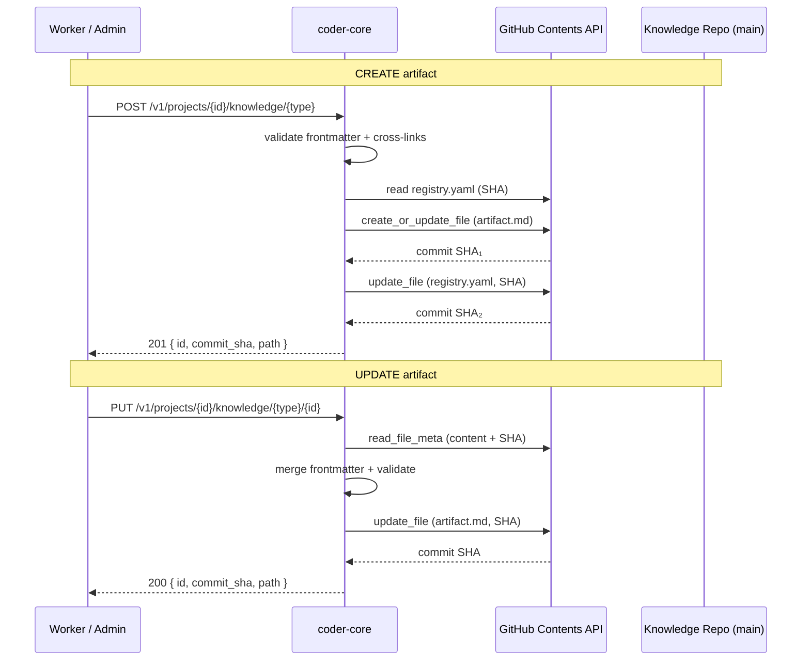

# Knowledge Write API

## What it is

The Knowledge Write API is the endpoint set that lets workers (and
admins) create and update knowledge-repo artifacts — specs, designs,
ADRs — without a manual `git commit`. It extends the read-only
knowledge surface so PM, Architect, and other authoring workers can
produce their outputs directly via the API. Writes go to the project's
GitHub-backed knowledge repo using the Contents API, with optimistic
SHA concurrency and automatic `registry.yaml` maintenance.

## Architecture



### Parts

- **Endpoints** — `POST /v1/projects/{id}/knowledge/{type}` and
  `PUT /v1/projects/{id}/knowledge/{type}/{artifact_id}`.
- **GitHub client additions** — `create_file` (PUT without SHA) and
  `delete_file` (for status-change file moves) on the existing
  `GitHubClient`.
- **Frontmatter validator** — reuses `validate_required_fields()` in
  `knowledge/schema.py`; additionally checks that `type` matches the
  URL path and `id` matches the URL parameter on PUT.
- **Cross-link validator** — for each `CROSS_LINK_FIELDS` entry,
  confirms referenced IDs exist in the target registry. Self-refs
  allowed. Registry parse failure → 502.
- **Commit formatter** — structured messages:
  `knowledge({type}): {verb} {id} — {title}` with `Actor:` and
  `Project:` trailers.

### Data flow

**Create.** Client POSTs `{id, frontmatter, body}`. The handler
infers `type` from the URL, merges frontmatter, validates required
fields and cross-links, confirms ID uniqueness in the registry, then
commits the artifact file at
`system/{folder}/{status}/{id}-{slug}.md` (status defaults to `wip`).
A second commit appends an entry to `{folder}/registry.yaml`.

**Update.** Client PUTs `{frontmatter?, body?}`. The handler reads
the current file and its SHA, shallow-merges frontmatter, blocks
`id`/`type` changes, validates, and commits. If `status` changes
(e.g. `wip` → `active`), the handler creates the file at the new
path, deletes the old one, and updates the registry entry's `file`
and `folder` fields — three commits total.

### Invariants

- `id` and `type` are immutable after creation.
- Every outbound cross-link must resolve (or 422) before commit.
- Concurrency is optimistic via GitHub's SHA — concurrent writes to
  the same file surface as 409.
- Every commit is auditable to `{actor_type, actor_id, project_id}`
  via the structured trailer.
- Partial failure (artifact committed, registry update fails) returns
  500 with the artifact commit SHA so the caller can retry the
  registry update. The **/ship** endpoint sidesteps this entirely by
  composing the whole write as a single Git Trees commit (see below).

### Ship endpoint (atomic WIP→active merge)

`POST /v1/projects/{id}/knowledge/ship` lands the full wip-to-active
merge in one GitHub commit via the **Git Trees API** rather than the
one-file-per-commit Contents path used by the rest of this design. The
handler builds a tree containing: every `active/` edit or create in
`merges[]`, the WIP file delete, and rewrites of both affected
`{folder}/registry.yaml` files — then writes a single commit pointing
the branch ref at the new tree. Either the whole set lands or the ref
is untouched; no partial ship state is representable on disk.

Body contract:

```json
{
  "wip_id": "0044",
  "wip_type": "spec" | "design",
  "merges": [
    {"artifact_type": "spec" | "design",
     "artifact_id": "<slug>",
     "action": "create" | "edit",
     "body": "<full post-merge markdown with frontmatter>"}
  ],
  "attestation": {
    "reviewer": "<actor-slug>",
    "acs": [
      {"ac": "<text>", "merged_into": "<artifact_id>", "section": "<heading>"},
      {"ac": "<text>", "dropped": true, "reason": "<text>"}
    ]
  },
  "commit_message": "<required>"
}
```

Pre-commit validator (everything runs in-memory against a HEAD
snapshot; any failure returns 4xx with no GitHub write):

- Parse the WIP's `## Acceptance criteria` from the HEAD snapshot and
  require every AC to appear in `attestation.acs` — by normalised
  whitespace match — under either `merged_into` + `section` or
  `dropped: true` + `reason`. Missing AC → 400 naming the offending
  text. Exact text or drop, no fuzzy match.
- Every `merged_into` must resolve to an existing `active/` artifact
  or to a `create` entry in the same request. Dangling refs → 400.
- Each merge body's frontmatter runs through the existing Write-API
  validator (required fields, `type`/`id` immutability, cross-link
  resolution **against the post-merge snapshot** so a `create` in the
  same request is visible to an `edit` in the same request). Any
  validation failure → 400.
- Ship calls whose touched paths include `template/` are rejected with
  a pointer to the template-migration path (spec 0047 territory).
- Both affected registries are rewritten (not hand-patched) so entry
  ordering and formatting stay stable.

Concurrency serialises on the branch ref SHA: two concurrent `/ship`
calls for the same WIP race on the ref update and the loser gets 409.
The endpoint is gated on `settings.ship_gate_enabled`.

### Orphan-WIP query

`GET /v1/projects/{id}/knowledge/wips?shipped=true` returns
`[{wip_id, wip_type, developer_task_id, pr_url, merged_at}, ...]` for
WIPs whose correlated developer task is `closed` + PR `merged` but
whose file still sits in `wip/`. Correlation path: `tasks.spec_id` /
`tasks.design_id` plus task status + PR state. No new schema. This is
the feed Team Manager's close-cycle backstop consults and the admin
ship-gate "needs attention" list renders.

## Interfaces

| Method | Path | Result |
|---|---|---|
| `POST` | `/v1/projects/{id}/knowledge/{type}` | 201 · `{id, commit_sha, path}` |
| `PUT` | `/v1/projects/{id}/knowledge/{type}/{artifact_id}` | 200 · `{id, commit_sha, path}` |
| `POST` | `/v1/projects/{id}/knowledge/ship` | 201 · `{commit_sha, paths[]}` |
| `GET` | `/v1/projects/{id}/knowledge/wips?shipped=true` | 200 · `[{wip_id, pr_url, merged_at, ...}]` |

Errors: `400` (immutable field change / bad YAML / AC gap / dangling
`merged_into` / template touch), `404` (missing artifact or project),
`409` (SHA conflict, create-race, or concurrent `/ship`),
`422` (validation / broken cross-link), `502` (registry unparseable).

## Evolution

- Checkbox PATCH endpoint (spec 0012) — proved the read-modify-write
  pattern with SHA concurrency.
- `0007-knowledge-write-api` (spec 0014) — generalized the pattern to
  full create/update across all artifact types and added cross-link
  validation.
- 0044 — write-through enforcement on ship: the Git Trees atomic
  multi-file commit (previously a "future optimisation") is the
  implementation of the new `POST /knowledge/ship` endpoint. Adds the
  orphan-WIP query, an AC-coverage validator against the WIP HEAD
  snapshot, post-merge cross-link resolution, template-path refusal,
  and ref-SHA-based concurrency. Gated on
  `settings.ship_gate_enabled`. ADR 0015 explains the pipeline-side
  gate placement.
- 0035 — inline knowledge editor: no backend changes; the existing
  `PUT /knowledge/{type}/{id}` handler is now driven from the admin
  panel's artifact view as well as the worker path. Save returns
  the new `commit_sha` directly from `GitHubClient.update_file` for
  the UI's "Saved · abc1234" badge. SHA-mismatch (concurrent edit)
  surfaces as 502 `github_upstream`; the editor's error branch
  turns this into a "Reload — content changed since you opened it"
  message. `knowledge_edited` structured log event
  (`{project_id, artifact_type, artifact_id, commit_sha}`) rides
  the existing module logger.
- 0037 — audit log wiring for knowledge mutations (shipped
  2026-04-19): `knowledge.create_artifact`, `update_artifact`,
  `update_checkboxes`, `approve`, and `reject` each call
  `record_audit_event(...)` inside the handler's transaction with
  a small `before` / `after` dict (frontmatter + path + commit_sha
  on create/update; status transition on approve/reject). The
  knowledge body is deliberately excluded — too large for the JSONB
  column, and the commit SHA already points at it. Audit rows share
  the request's correlation ID so one approve click surfaces every
  downstream write in a single filter. See
  [audit-log](./audit-log.md).

## Links

- Specs: knowledge-api (ship endpoint + orphan-WIP query)
- ADRs: [0015 — ship gate lives in the Coder pipeline](../../adrs/0015-ship-gate-in-coder-pipeline.md)
- Designs: knowledge-repo-model, pm-worker, architect-worker
- Services: `coder-core`
