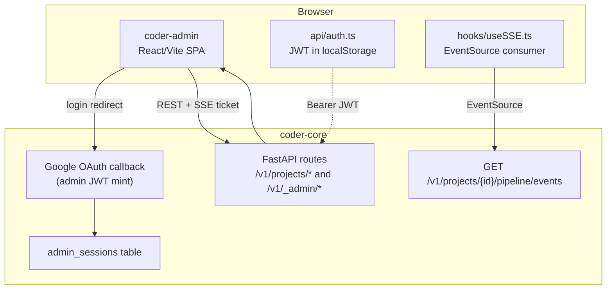

# Admin Panel

## What it is

`coder-admin` is the human operator's primary control surface — a
React/Vite SPA that talks exclusively to `coder-core`. It is the
admin-side render of every other component: the knowledge browser
shows what `knowledge-write-api` produced, the pipeline view streams
SSE from `worker-communication`, the metrics page renders
`observability-and-cost-tracking`'s rollups, the audit-log page
queries `audit-log`, the escalations page drives `escalations`'s
ack/resolve API, the ship-gate panel orchestrates the merge POST that
`knowledge-write-api` accepts. The admin panel itself owns no domain
logic — it is a thin renderer over coder-core's HTTP surface.

## Architecture

### Top-level routes

`coder-admin/src/main.tsx` registers, in order:

- `/` — Projects list.
- `/freshness`, `/metrics/regressions` — fleet observability views.
- `/admin/audit`, `/admin/secrets`, `/admin/isolation`, `/admin/escalations` — fleet admin pages, conditionally mounted based on feature flags returned by `api/client.ts`.
- `/projects/:projectId/*` — `ProjectDetail` shell with child routes: `Pipeline`, `Runs`, `ShipGate`, `Escalations`, `Plans`, `Registry`, `Audit`, `Metrics`. All bound to the selected project via the project switcher.

### Parts

- **Auth — `coder-admin/src/api/auth.ts`.** Backend-driven Google
  OAuth flow; the SPA receives the issued admin JWT and persists it
  to `localStorage` via `setAuth(token, email, expiresAt)`.
  `getToken()` returns the live token (or `null` past expiry);
  `clearAuth()` runs on logout or any 401. Sessions are recorded
  server-side in the `admin_sessions` table.
- **API client — `api/client.ts`.** Thin `fetch` wrapper that
  attaches the Bearer token, handles 401 → redirect-to-login, and
  surfaces feature flags (`escalationsEnabled`,
  `secretsManagerEnabled`, …) to gate route mounting.
- **SSE consumer — `hooks/useSSE.ts`.** Opens an `EventSource` to
  `/v1/projects/{projectId}/pipeline/events` after fetching a
  single-use SSE ticket from a `POST` endpoint (so the long-lived
  stream URL doesn't carry the JWT). Reconnects with exponential
  backoff. Handles the wire events from
  [worker-communication](../pipeline/worker-communication.md):
  `task_created`, `stage_changed`, `task_updated`, `message_created`.
- **Pipeline view — `pages/Pipeline.tsx` and `RunDetail.tsx`.**
  Live task list with role/status filters; per-task detail with
  streamed `task_logs`, branch / PR / commit links, and pause /
  resume / retry / skip / reject overrides. Mutations call back to
  the orchestrator and are immediately reflected via the next SSE
  event — there's no client-side optimistic state. Timed-out rows
  carry a secondary stage label in the status column when
  `timeout_stage` is non-null; PM, Architect, and Reviewer task rows
  render a `N reads` knowledge-read count badge when
  `knowledge_read_count > 0` (badge suppressed for legacy NULL).
- **Task detail — `pages/TaskDetail.tsx`.** Renders the structured
  callouts above the messages panel:
  - **`TimeoutCallout`** when `status === 'timed_out'` — shows
    `timeout_stage`, `timeout_total_elapsed_s`,
    `timeout_stage_elapsed_s` from the task payload plus a
    "Jump to transcript" anchor that scrolls to the final pre-timeout
    message.
  - **`WorkerKnowledgeReadsPanel`** — collapsible panel listing every
    `gh api repos/.../contents/...` Bash call: path, HTTP status,
    byte size, timestamp. Lazy-loads via
    `GET /tasks/{id}/tool-uses` on first expand; filters client-side
    on `tool_name === 'Bash'` and a `repos/{org}/{repo}/contents/`
    path. Resolvable paths (parseable as `{type, id}`) render as
    deep links into the knowledge browser; unresolvable as plain
    text. Zero-read tasks render an explicit "No knowledge reads
    recorded" message rather than an empty section. Collapse state
    persists per task in `sessionStorage` under
    `kr-expanded-{taskId}` (default expanded). Behind
    `VITE_KNOWLEDGE_READS_ENABLED`.
  - **`SecurityFindingsChip` / `PerformanceFindingsChip`** —
    rendered alongside the verdict chip for reviewer tasks when
    `security_finding_count` / `performance_finding_count` is
    non-null. Zero counts green; non-zero security amber. Behind
    `VITE_REVIEWER_FINDINGS_ENABLED`. See
    [reviewer-worker](../workers/reviewer-worker.md).
- **Ship-gate panel — `pages/ShipGate.tsx`.** Two-column render
  when `wips_pending_merge` is stamped on a pipeline run: left
  column is the architect-drafted `merges[]` (per-file diff +
  post-merge frontmatter); right column is the reviewer's
  `ship_attestation` (AC-by-AC mapping). The merge button POSTs to
  `/v1/projects/{id}/knowledge/ship`. The reviewer's attestation
  schema is enforced server-side in
  [reviewer-worker](../workers/reviewer-worker.md); the panel only renders.
- **Audit log — `pages/AuditLog.tsx`.** Project-scoped table from
  `GET /v1/projects/{id}/audit-events`; the fleet view at
  `/admin/audit` queries `/v1/_admin/audit-events`.
- **Escalations — `pages/Escalations.tsx`.** One component, two
  routes: `/projects/:pid/escalations` (project-scoped) and
  `/admin/escalations` (fleet). Renders open / acknowledged /
  resolved / expired rows from `GET /v1/projects/{id}/escalations`
  with inline `Ack` / `Resolve` actions. Behind
  `VITE_ESCALATIONS_ENABLED` (default on); when the server-side
  watcher gate is off, the empty state is the operator's signal.
- **Metrics — `pages/Metrics.tsx`.** Renders the cost / token /
  retry rollups from `GET /v1/projects/{id}/metrics` produced by
  [observability-and-cost-tracking](../pipeline/observability-and-cost-tracking.md).
- **Knowledge browser — `pages/Registry.tsx`.** Renders project
  registry YAMLs as nested lists; artifact detail pages use
  `react-markdown` with lazy-loaded Mermaid. Cross-links in
  frontmatter and bodies are rewritten to in-app router navigation
  so the browser never reads GitHub directly.

### Invariants

- **No domain logic in the SPA.** Every mutation goes through a
  coder-core endpoint that owns the transaction. The admin panel
  re-renders on the next SSE tick.
- **Auth is the request boundary.** A missing / expired token gets
  the user redirected to login; the SPA never falls back to
  unauthenticated reads.
- **SSE tickets are single-use.** The Bearer JWT is exchanged for a
  short-lived ticket so the long-lived stream URL is safe to
  log / proxy.
- **Feature-flagged pages are server-told.** Whether
  `/admin/escalations` etc. mount is decided by flags surfaced from
  `api/client.ts` — the SPA doesn't probe routes blindly.

## Interfaces

- **Backend:** every page consumes one or more `coder-core`
  endpoints under `/v1/projects/*` or `/v1/_admin/*`.
- **Auth:** Google OAuth via coder-core; admin JWT in
  `localStorage`; 401 → redirect-to-login.
- **Realtime:** SSE on `/v1/projects/{id}/pipeline/events` (single
  channel, multiplexed event types).
- **Mutations:** PATCH/POST on coder-core; admin panel never writes
  to GitHub directly.

## Evolution

- 0007 — initial admin shell, project switcher, knowledge browser.
- 0009 — pipeline live view, SSE consumer, task lifecycle overrides.
- 0028 — audit log page (fleet + project views).
- 0033 — metrics dashboard.
- 0036 — tenant-isolation admin page.
- 0041 — escalations admin page (project + fleet routes).
- 0044 — ship-gate two-column panel; merge POST.
- coder-core-modular-monolith — admin panel kept as the thin
  external surface while core's internal modules were re-shaped.
- 2026-05-20 — Timeout-stall visibility (spec 0096): `TimeoutCallout`
  on TaskDetail + pipeline-list stage annotation, backed by the
  three timeout columns on `tasks`.
- 2026-05-20 — Knowledge-reads transparency (spec 0099):
  `WorkerKnowledgeReadsPanel`, pipeline-list `N reads` badge,
  per-path deep-links into the knowledge browser; backed by
  `task_tool_uses` via `GET /tasks/{id}/tool-uses` (ADR 0041).

## Links

- Specs: [admin-panel](../../../product-specs/active/admin-panel.md),
  [audit-log](../../../product-specs/active/audit-log.md),
  [observability](../../../product-specs/active/observability.md)
- Designs: [system-overview](../system-overview.md),
  [worker-communication](../pipeline/worker-communication.md),
  [audit-log](../tenancy/audit-log.md),
  [escalations](../pipeline/escalations.md),
  [observability-and-cost-tracking](../pipeline/observability-and-cost-tracking.md),
  [knowledge-write-api](./knowledge-write-api.md)
- Services: `coder-admin`, `coder-core`
