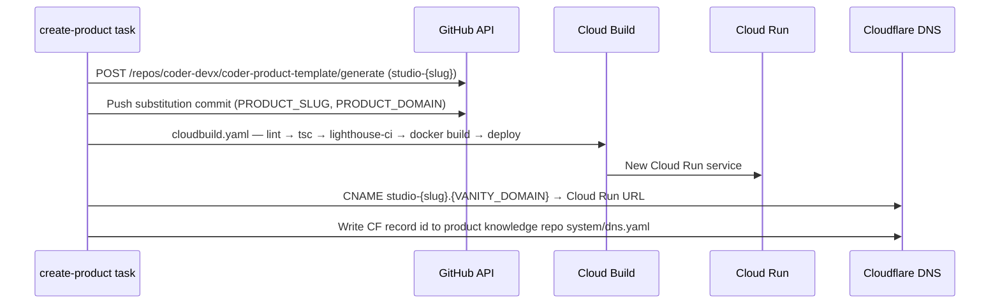

# Coder Studio — coder-product-template

## What it is

The repo every Coder Studio B2C product is instantiated from. This
design specifies what `create-product` produces: the eight-route page
set, the Lighthouse mobile cold-load LCP < 2 s budget enforced in CI,
the Stripe Connect + PostHog + Resend wiring with graceful degradation
on missing credentials, the `theme.config.ts` visual-identity isolation
layer, and the Cloudflare DNS provisioning path that lands a reachable
domain inside the same pipeline run. Template updates flow back into
already-instantiated products via the Renovate-style PR sync from ADR
0036.

## Architecture

### Parts

- **Page set.** Eight routes ship by default:
  `/` (landing — hero, value prop, primary CTA);
  `/pricing` (tiers linking to `/checkout`);
  `/checkout` (Stripe-hosted checkout redirect or 503);
  `/success` (post-checkout confirmation);
  `/sunset` (the "no longer maintained" notice used as
  `kill_pipeline`'s DNS target);
  `/contact` (Resend-backed form);
  `/legal/privacy` and `/legal/terms` (statically rendered, zero
  client-side JS, no PostHog bundle). Every page carries a
  "built by Coder" footer per charter.
- **Lighthouse perf budget.** `lighthouse-ci` step in
  `cloudbuild.yaml` runs three times; the median LCP is the gate
  verdict. A warm-up URL ping precedes each run to avoid cold-start
  spikes artificially failing the gate. Mobile cold-load LCP < 2 s
  enforced; regression fails the build and blocks merge. Next.js
  `<Image />` with explicit dimensions; fonts subsetted at build
  time; PostHog SDK excluded from `/legal/*` via Next.js static
  generation + CSP.
- **Stripe Connect wiring.** Reads `STRIPE_CONNECT_ACCOUNT_ID` from
  Cloud Run env at request time (Secret Manager backing path
  `coder/{project_id}/stripe_connect_account_id`). Absent →
  `/checkout` returns HTTP 503 "Checkout is being configured" — no
  silent redirect. `/api/stripe/webhook` verifies
  `Stripe-Signature` against `STRIPE_WEBHOOK_SECRET`. Both secrets
  mounted as Cloud Run env vars at deploy time.
  `/api/internal/stripe-status` returns
  `{ "state": "live" | "pending" | "disconnected" }` by calling the
  Stripe API; the Studio panel chip polls this endpoint.
- **PostHog wiring.** `POSTHOG_PROJECT_API_KEY` initialises the SDK
  in `app/layout.tsx`. `POSTHOG_EU_COMPLIANCE=true` overrides the
  SDK host to `eu.i.posthog.com` (EU cloud region — no event-
  buffering change). `/legal/*` excludes the PostHog bundle
  entirely. Tracking goes through `lib/analytics.ts` with frozen
  events: `signup`, `activate`, `checkout_start`,
  `checkout_complete`. Direct SDK calls banned by ESLint rule.
- **Resend wiring.** `RESEND_API_KEY` + `PRODUCT_DOMAIN`
  substituted at instantiation. `/api/contact` sends
  `from: noreply@{PRODUCT_DOMAIN}`. In-process sliding-window
  counter caps at 5 req/min/IP; excess returns HTTP 429.
- **Cloudflare DNS provisioning.** The `create-product` task
  registers a subdomain via the Cloudflare API, creates a CNAME
  pointing at the new Cloud Run service URL, and writes the DNS
  record id to `system/dns.yaml` in the project knowledge repo so
  `kill_pipeline` can revert it. Polls `dig {slug}.{VANITY_DOMAIN} CNAME`
  at 10 s intervals (60-attempt max) before reporting success.
- **Visual identity isolation.** `theme.config.ts` at the repo
  root exposes `primaryColor`, `secondaryColor`, `accentColor`
  (hex strings); `fontPair: { heading: string; body: string }`
  (Google Fonts family names); and `heroIllustrationSlot` (path to
  a static asset under `/public/`). All pages import from this
  config at build time — changing the file and redeploying is the
  complete Designer workflow.
- **Template version sync.** Per ADR
  [0036](../../../adrs/0036-renovate-style-pr-template-sync.md),
  template updates open Renovate-style PRs into each already-
  instantiated product; the operator merges or rejects per project.
  No silent forks; no in-band template-hash field on product rows.

### Data flow

1. `create-product` task receives an approved Idea Queue row with
   slugified title and domain. The task validates required
   template substitution vars before touching files; missing var
   → non-zero exit, task fails with
   `failure_reason: missing_template_vars`.
2. Task POSTs `/repos/coder-devx/coder-product-template/generate`
   creating `studio-{slug}`. Pushes a substitution commit
   (`PRODUCT_SLUG`, `PRODUCT_DOMAIN`).
3. Cloud Build runs lint → tsc → `lighthouse-ci` → docker build →
   deploy. Lighthouse gate failure blocks the build; the task
   surfaces `failure_reason: perf_budget`.
4. Cloud Run service comes up; task registers the Cloudflare CNAME
   and polls DNS. Timeout → `failure_reason: dns_propagation_timeout`;
   the Cloud Run service remains deployed for operator inspection.
5. Task commits `system/dns.yaml` to the product knowledge repo.
   Pipeline run proceeds; operator sees the live URL on the
   `b2c_product` project detail page.

### Invariants

- **Checkout fails closed when Stripe is unset.** `/checkout`
  returns 503 with a visible page; never silently redirects.
- **Legal pages carry no analytics.** `/legal/*` is static, no
  client JS, no PostHog bundle. CSP enforces.
- **Stripe webhook is idempotent.** `checkout_events.stripe_payment_intent_id`
  carries a UNIQUE constraint; Stripe retries are no-ops.
- **DNS record is recoverable.** The CF record id lives in the
  product knowledge repo's `system/dns.yaml`; `kill_pipeline`
  reads it to revert the CNAME.
- **`theme.config.ts` is the only Designer surface.** Pages
  import from it at build time; no per-page override allowed.

## Interfaces

- **Page routes:** `/`, `/pricing`, `/checkout`, `/success`,
  `/sunset`, `/contact`, `/legal/privacy`, `/legal/terms`.
- **Internal endpoints:** `/api/internal/stripe-status`
  (status chip poll), `/api/contact` (rate-limited),
  `/api/stripe/webhook` (signature-verified ingest).
- **Required env vars at boot:** `STRIPE_CONNECT_ACCOUNT_ID`,
  `POSTHOG_PROJECT_API_KEY`, `RESEND_API_KEY`, `PRODUCT_DOMAIN`,
  `POSTHOG_EU_COMPLIANCE` (optional).
- **Repo-root config files:** `theme.config.ts`,
  `system/dns.yaml`, `cloudbuild.yaml`, `lighthouserc.json`,
  `Dockerfile`.
- **CI surface:** `lighthouse-ci` LCP regression blocks merge.

## Where in code

- `coder-product-template/cloudbuild.yaml` — lint / tsc /
  lighthouse-ci / build / deploy pipeline
- `coder-product-template/lighthouserc.json` — perf budget config
- `coder-product-template/theme.config.ts` — Designer surface
- `coder-product-template/app/api/internal/stripe-status/route.ts`
  — Stripe state chip backing
- `coder-product-template/lib/analytics.ts` — frozen event names
- `coder-core/src/coder_core/studio/create_product.py` —
  template-generate + CF DNS + dig-poll bootstrap

## Evolution

- 2026-05-15 — Phase A ship (spec 0079): page set + Lighthouse
  budget + Stripe/PostHog/Resend wiring + Cloudflare DNS + theme
  config; first instantiated products use this contract end to
  end. ADR 0036 sets the Renovate-style template-sync policy.

## Links

- Specs: [coder-product-template](../../../product-specs/active/knowledge/coder-product-template.md)
- Designs: [studio](./studio.md),
  [studio-b2c-portfolio](../studio-b2c-portfolio.md),
  [studio-product-integrations](./studio-product-integrations.md),
  [admin-panel](./admin-panel.md)
- ADRs: [0032](../../../adrs/0032-extend-coder-core-rather-than-spin-up-a-sibling-service.md),
  [0036](../../../adrs/0036-renovate-style-pr-template-sync.md)
- External: Stripe Connect, PostHog (cloud), Resend, Cloudflare,
  Google Cloud Run
- Charter: `system/STUDIO_CHARTER.md`
- Services: `coder-core`
