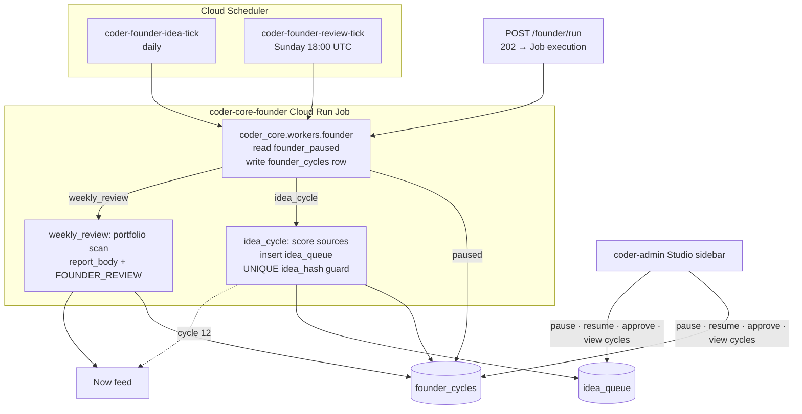

# Coder Studio — Founder role (Phase A)

## What it is

The first Studio role and the only Studio worker that exists in
Phase A. The Founder is a Cloud Run Job (`coder-core-founder`) — not
a dispatcher task — that two Cloud Scheduler triggers
(`coder-founder-idea-tick`, `coder-founder-review-tick`) invoke on
their own cadences. It scores product ideas against charter category
constraints into an `idea_queue`, runs a weekly portfolio review that
becomes a `FOUNDER_REVIEW` Now item, and surfaces a 12-cycle
calibration dogfood against the Coder project itself before any other
Studio role ships. Operator interface lives entirely in the Studio
sidebar (no separate Founder CLI).

## Architecture

### Parts

- **Cloud Run Job `coder-core-founder`.** Reuses the coder-core
  image. Entry module
  `coder_core.workers.founder` mirrors
  `coder_core.self_heal.watch` in shape; `concurrency=1`,
  `max-retries=0`. Reads `MODE` env var
  (`idea_cycle` | `weekly_review`), writes a `founder_cycles` row
  immediately, then checks `projects.founder_paused`; if `TRUE`,
  sets `outcome='paused'` and exits 0. Per ADR
  [0035](../../../adrs/0035-founder-as-a-recurring-job-over-a-normal-dispatcher-task.md).
- **Cloud Scheduler triggers.** `coder-founder-idea-tick` (daily)
  and `coder-founder-review-tick` (Sunday 18:00 UTC). The existing
  `coder-core-self-heal-tick` and `coder-core-auto-approve-tick`
  jobs continue unchanged.
- **Tables (one migration).**
  - `projects.founder_paused BOOLEAN NOT NULL DEFAULT FALSE`.
  - `founder_cycles(id uuid pk, cycle_type text, outcome text, ideas_scored int, reason text, report_body text, operator_top_pick_matched bool nullable, created_at timestamptz)`.
    The single `operator_top_pick_matched` bit drives
    `Cycle N of 12 · Top pick matched K of N` — no child
    feedback table needed in Phase A.
  - `idea_queue(id uuid pk, project_id uuid fk projects, title text, idea_hash text, cycle_id uuid fk founder_cycles, status text default 'pending', task_id uuid nullable, created_at timestamptz, UNIQUE(project_id, idea_hash))`.
- **Idea cycle path.** Inserts `idea_queue` rows inside
  `try/except UniqueViolation`; on full duplicate set, sets
  `outcome='no_candidate'`. The `UNIQUE(project_id, idea_hash)`
  collapses Scheduler-retry duplicates without inflating the
  queue.
- **Weekly review path.** Assembles one `##` section per live
  `b2c_product` project (MRR, MTD cost, PostHog funnel,
  kill-criteria status), writes to `founder_cycles.report_body`,
  and inserts a `FOUNDER_REVIEW` Now item in the same
  transaction. SLA: Now item must land within 15 minutes of
  `review_tick` firing (achievable at dogfood scale; re-evaluate
  before adding a second `b2c_product` project).
- **Calibration idempotency.** After the 12th
  `cycle_type='idea_cycle'` row, the entry module inserts
  `FOUNDER_CALIBRATION_COMPLETE` with
  `ON CONFLICT (type, project_id) DO NOTHING`.

### Data flow

1. Cloud Scheduler fires `idea-tick` or `review-tick`, or the
   operator hits `POST /v1/projects/{id}/founder/run?mode=…`.
   The endpoint calls Cloud Run Admin API
   `projects.locations.jobs.run` with `MODE` env override;
   returns 202. Blocked with 409 if a `founder_cycles` row for
   that project has no `completed_at` (overlap guard).
2. The Job writes a `founder_cycles` row, checks `founder_paused`,
   runs the mode (`idea_cycle` scores + inserts; `weekly_review`
   assembles + inserts FOUNDER_REVIEW), updates the row's
   `completed_at` and `outcome`.
3. Admin panel polls `/founder/cycles?limit=10` for the activity
   panel; SSE delivers fresh Now items as they land.
4. Operator pause/resume toggles `projects.founder_paused` via
   `POST /v1/projects/{id}/founder/pause` / `resume`, each
   recording an audit event (`founder_paused` / `founder_resumed`)
   with the JWT actor.
5. Idea approve dispatches a PM draft task with
   `repo='studio-{slugified-title}'` placeholder and writes
   `idea_approved` audit event carrying `cycle_id`.

### Invariants

- **Pause check is at Job entry only.** A pause issued mid-execution
  takes effect on the next tick — cycles are short, no in-flight
  cancellation needed.
- **Overlap guard is per-project, not per-Job.** The Cloud Run Job's
  `concurrency=1` is a Job-level setting; the
  `founder_cycles.completed_at IS NULL` check enforces per-project
  serialisation in the API layer.
- **All Founder side effects emit audit events.** Cycle outcomes,
  idea approve / reject, pause / resume — every operator-visible
  mutation has a row recoverable from the audit log page.
- **No FOUNDER_REVIEW row growth on Scheduler retry.** The
  `UNIQUE(project_id, idea_hash)` collapses retried
  `idea-tick`s to `outcome='no_candidate'`; the
  `FOUNDER_CALIBRATION_COMPLETE` insert uses `ON CONFLICT DO NOTHING`.

## Interfaces

- `POST /v1/projects/{id}/founder/run?mode=idea_cycle|weekly_review` — 202 on dispatch, 409 on overlap.
- `POST /v1/projects/{id}/founder/pause` and `/resume` — toggle
  `projects.founder_paused`, write audit event.
- `GET /v1/projects/{id}/founder/cycles?limit=10` — last N rows,
  `created_at desc`.
- `POST /v1/projects/{id}/ideas/{idea_id}/approve` — sets
  `status='approved'`, dispatches PM draft task,
  writes `idea_approved` audit with `cycle_id`.
- Cloud Scheduler jobs: `coder-founder-idea-tick` (daily),
  `coder-founder-review-tick` (Sunday 18:00 UTC).
- Now feed: `FOUNDER_REVIEW` and `FOUNDER_CALIBRATION_COMPLETE`
  required-review items.

## Where in code

- `coder-core/src/coder_core/workers/founder.py` — Job entry module
- `coder-core/src/coder_core/api/studio.py` — `/founder/*`,
  `/ideas/*` endpoints
- `coder-core/migrations/versions/00NN_founder_phase_a.py` —
  `founder_paused`, `founder_cycles`, `idea_queue`
- `coder-core/infra/cloudrun/coder-core-founder.yaml` — Job spec
- `coder-admin/src/pages/Studio/FounderHeader.tsx` — sidebar
  header + Run-now button + calibration card
- `coder-admin/src/pages/Studio/IdeaQueue.tsx` — Idea Queue table
  + approve action

## Evolution

- 2026-05-15 — Phase A ship (spec 0077): Cloud Run Job + daily idea
  tick + weekly review tick + sidebar header + activity panel +
  Idea Queue cycle chip + approve audit event + pause/resume with
  banner + twelve-cycle calibration dogfood against the Coder
  project. ADR 0035 carries the recurring-job-over-task choice.

## Links

- Specs: [coder-studio-founder](../../../product-specs/active/knowledge/coder-studio-founder.md)
- Designs: [studio](./studio.md),
  [studio-b2c-portfolio](../studio-b2c-portfolio.md),
  [admin-panel](./admin-panel.md),
  [self-healing](../pipeline/self-healing.md),
  [worker-dispatch-durability](../pipeline/worker-dispatch-durability.md),
  [audit-log](../tenancy/audit-log.md)
- ADRs: [0035](../../../adrs/0035-founder-as-a-recurring-job-over-a-normal-dispatcher-task.md)
- Charter: `system/STUDIO_CHARTER.md`
- Services: `coder-core`, `coder-admin`
