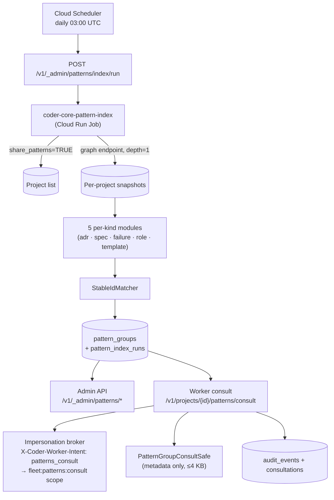

# Cross-project pattern surfacing

## What it does today

A daily offline indexer (Cloud Run Job) computes structural similarity
across opted-in projects' knowledge artifacts (ADRs, specs, failure
logs, role prompts, templates) using Jaccard matching, publishes
stable-ID pattern groups to `pattern_groups`, and exposes them via an
admin API plus a worker consult endpoint. Architect workers call the
consult endpoint to surface cross-project precedents before drafting
designs; responses are audit-logged and redacted to structural
metadata only — no body content crosses tenant lines.

## Architecture

### Parts

- **`coder_core/patterns/indexer.py`** — entry point; dispatches per-kind compute; applies stable-ID matcher; writes `pattern_groups`.
- **`coder_core/patterns/kinds/`** — five pure `compute()` modules: `adr.py`, `spec_problem.py`, `failure_taxonomy.py`, `role_prompt_delta.py`, `template_drift.py`.
- **`coder_core/patterns/stable_id.py`** — `StableIdMatcher`: reuses prior ID on ≥60% member overlap; mints deterministic new ID on first appearance.
- **`coder_core/patterns/runner.py`** — Cloud Run Job wrapper: filters `share_patterns=TRUE` projects; fetches snapshots via graph endpoint; manages `pattern_index_runs` lifecycle.
- **`coder_core/api/patterns.py` + `_brokers/patterns_consult.py`** — admin + worker routers; token-overlap match; `share_patterns` re-check; redaction; audit logging.
- **Tables**: `pattern_groups`, `pattern_index_runs` (mig 0057); `consultations`, `projects.fleet_patterns_enabled` (mig 0058); `projects.share_patterns` (mig 0059).

### Data flow

**Indexer (daily):** scheduler triggers admin endpoint → job dispatches
→ snapshots fetched via graph endpoint → per-kind modules compute
candidates (Jaccard for ADRs/specs, exact-match for failures, etc.) →
`StableIdMatcher` assigns IDs → one `pattern_groups` row per group.
**Worker consult:** architect calls `GET /patterns/consult?topic=…`
with project token + `X-Coder-Worker-Intent: patterns_consult` → broker
attaches `fleet:patterns:consult` scope → handler tokenises topic,
matches against latest run, re-verifies members' `share_patterns=TRUE`,
truncates to `PatternGroupConsultSafe`, writes `consultations` + audit
row. Worker injects response into the `# Cross-project precedent` prompt
block; cited patterns appear in `informed_by_patterns:` frontmatter.

### Invariants

- **No body content crosses tenant lines.** `PatternGroupConsultSafe` (`extra='forbid'`) excludes `body`, raw `frontmatter`, freshness detail. Schema test enforces.
- **`share_patterns=TRUE` is the only contribution gate.** `NULL` or `FALSE` projects never enter any pattern group.
- **Serve-time re-check** prevents stale opt-outs: a `share_patterns=FALSE` after indexing is reflected at next consult without re-index.
- **Admin scope does not bypass `share_patterns`.** Admin tokens see the same filter as project tokens.
- **Indexer is read-only** — never opens a PR, mutates repos, or writes beyond its own audit event.
- **Stable IDs are deterministic** — candidates iterated in sorted order ⇒ same input ⇒ same IDs.
- **`fleet:patterns:consult` scope grants exactly one endpoint** — broker whitelist rejects it elsewhere.

## Interfaces

| Surface | Effect |
|---|---|
| `GET /v1/_admin/patterns?kinds=&since=&page=` | Paginated group list (latest run default) |
| `GET /v1/_admin/patterns/{id}` | Single group detail + member full bodies + history |
| `GET /v1/_admin/patterns/index/runs` | Run history (status, counts, errors) |
| `POST /v1/_admin/patterns/index/run` | Manual trigger; enqueues Cloud Run Job |
| `GET /v1/projects/{id}/patterns/consult?topic=&kinds=&max_results=` | Worker consult; rate-capped, audit-logged, safe-shape only |
| `informed_by_patterns: [pattern_id, …]` (frontmatter) | Citation trail on architect-authored artifacts |

## Where in code

- `src/coder_core/patterns/indexer.py` — `compute_index` (per-run entry)
- `src/coder_core/patterns/stable_id.py` — `StableIdMatcher` (id reuse on overlap)
- `src/coder_core/patterns/runner.py` — Cloud Run Job wrapper
- `src/coder_core/api/patterns.py` — admin + consult HTTP routers
- `src/coder_core/api/_brokers/patterns_consult.py` — consult handler + `PatternGroupConsultSafe` redaction
- `src/coder_core/impersonation/broker.py` — `patterns_consult` intent → scope attachment

## Evolution

Sealed per spec 0048; multi-tenancy tightened to `projects.share_patterns BOOLEAN NULL` (opt-out). Reuses [graph-aware-retrieval](./graph-aware-retrieval.md)'s endpoint for snapshot fetch.

## Links

- Spec: [0048-cross-project-patterns](../../../product-specs/wip/0048-cross-project-patterns.md)
- ADRs: [0022](../../../adrs/0022-structural-jaccard-for-pattern-discovery.md) (why Jaccard, no embeddings), [0023](../../../adrs/0023-admin-api-and-consult-endpoint-as-pattern-surfaces.md) (surface design), [0024](../../../adrs/0024-share-patterns-column-as-enforcement-boundary.md) (tenancy boundary)
- Related: [graph-aware-retrieval](./graph-aware-retrieval.md), [mcp-agent-interface-design](./mcp-agent-interface-design.md), [impersonation](../tenancy/impersonation.md), [audit-log](../tenancy/audit-log.md)
- Repos: coder-core, coder-admin
