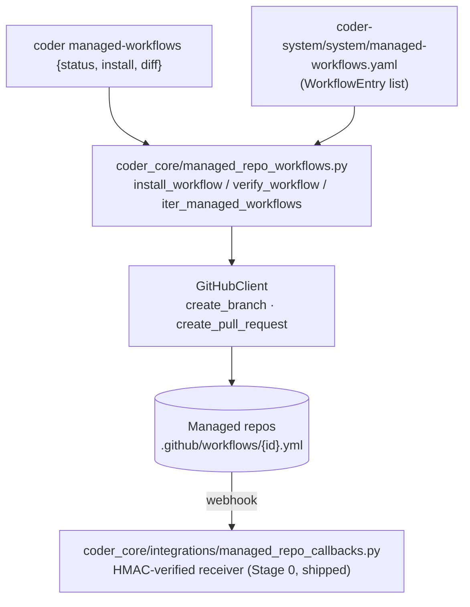

# Managed-repo GitHub Action distribution

## What it does today

Distributes shared GitHub Actions (e.g. the post-PR CI fixup webhook,
the cold-start provenance flipper, the template-migration recorder)
into every managed code repo by opening PRs against
`.github/workflows/`. Three helper functions and a CLI subcommand
verify-or-install workflows from a central manifest. Stage 0 receiver
(HMAC-signed inbound callbacks from these workflows back to
coder-core) is already shipped; Stage 1 (this design) adds the
install/verify side.

## Architecture

### Parts

- **Manifest (`coder-system/system/managed-workflows.yaml`)** — list of `WorkflowEntry` records: `id`, `template_path`, `receiver_endpoint`, `consuming_spec`, `introduced`.
- **Helpers (`coder_core/managed_repo_workflows.py`)** — `install_workflow`, `verify_workflow`, `iter_managed_workflows`; pure-ish functions over the manifest + GitHub Contents API.
- **CLI subcommand (`coder managed-workflows`)** — `status` (verify-only), `install` (sync + open PRs), `diff` (show drift).
- **`GitHubClient` extensions** — `create_branch(org, repo, branch, from_sha)` and `create_pull_request(org, repo, title, head, base, body)`.
- **Receiver (`coder_core/integrations/managed_repo_callbacks.py`)** — Stage 0; HMAC-verified inbound webhook handler with a registry pattern that other components (CI fix loop, cold-start provenance, template migration) register handlers against.

### Data flow

Operator runs `coder managed-workflows install`. CLI loads the
manifest and the project list (`GET /v1/projects`). For each
`(project, workflow)`, `install_workflow` reads the template,
computes its expected Git blob SHA, fetches the file metadata from
the managed repo's `.github/workflows/{id}.yml`. If missing →
opens an install PR; if present and SHA matches →
`UpdatedExisting` (no GitHub writes); if divergent and `--force=False`
→ `SkippedDivergent` with a warning.

### Invariants

- **Idempotent on match.** Second call with file present + matching SHA returns `UpdatedExisting` (no GitHub writes).
- **Deterministic ordering.** `iter_managed_workflows` yields by `(project_id, workflow_id)` sort → CLI output is stable.
- **`verify_workflow` is read-only.** Never mutates, opens branches, or commits.
- **SHA identity** uses the Git blob hash (`SHA1(b"blob " + len + b"\0" + content)`) — matches GitHub Contents API `sha` field; no extra API calls.
- **Divergent-file policy** is skip-with-warning by default (per ADR 0018); `--force` opens an overwrite PR.
- **Exit codes** are stable: 0 all-in-sync, 1 transport/auth error, 2 drift/missing (no I/O failure), 3 install failures.

## Interfaces

| Surface | Effect |
|---|---|
| `install_workflow(client, org, repo, entry, manifest_dir, force, base_branch)` | Returns `Created` / `UpdatedExisting` / `SkippedDivergent`; may open PR |
| `verify_workflow(client, org, repo, entry, manifest_dir)` | Returns `Installed` / `Missing` / `Drifted`; read-only |
| `iter_managed_workflows(config: SyncConfig)` | Yields `(project_id, org, repo, WorkflowEntry)` tuples |
| `coder managed-workflows status [--project] [--workflow]` | Exit 0 if all-in-sync, 2 if drift/missing |
| `coder managed-workflows install [--force] [--dry-run]` | Opens PRs for missing (or divergent if `--force`) files |
| `GitHubClient.create_branch(org, repo, branch, from_sha)` | POST `/repos/{org}/{repo}/git/refs`; 422 if exists |
| `GitHubClient.create_pull_request(org, repo, title, head, base, body)` | POST `/repos/{org}/{repo}/pulls`; returns `{pr_url, pr_number}` |
| `POST /v1/managed-workflows/callbacks/{endpoint}` | Receiver; HMAC-verified; dispatches to registered handler (Stage 0, shipped) |

## Where in code

- `coder-system/system/managed-workflows.yaml` — manifest (registry of workflows to distribute)
- `coder-system/template/.github/workflows/{id}.yml` — template files referenced by manifest
- `src/coder_core/managed_repo_workflows.py` — `install_workflow` / `verify_workflow` / `iter_managed_workflows` / `WorkflowEntry` / `SyncConfig`
- `src/coder_core/integrations/managed_repo_callbacks.py` — HMAC-verified receiver (Stage 0)
- `src/coder_core/cli.py` — `coder managed-workflows` subcommand group
- `src/coder_core/integrations/github.py` — `create_branch`, `create_pull_request`

## Evolution

Stage 0 (receiver + empty manifest) shipped in coder-system #9 +
coder-core #33. Stage 1 (install/verify/CLI, this design) under
implementation. Consumers ([cold-start-ingestion](./cold-start-ingestion.md),
[template-schema-migration](./template-schema-migration.md),
[post-pr-ci-fix-loop](../pipeline/post-pr-ci-fix-loop.md)) register
handlers and populate manifest entries in their own PRs.

## Links

- Spec: [0052-managed-repo-action-distribution](../../../product-specs/wip/0052-managed-repo-action-distribution.md)
- ADR: [0018](../../../adrs/0018-managed-workflows-divergent-file-policy.md) (skip-or-force on divergence)
- Designs: [cold-start-ingestion](./cold-start-ingestion.md), [template-schema-migration](./template-schema-migration.md), [knowledge-write-api](./knowledge-write-api.md), [post-pr-ci-fix-loop](../pipeline/post-pr-ci-fix-loop.md)
- Repos: coder-core, coder-system
