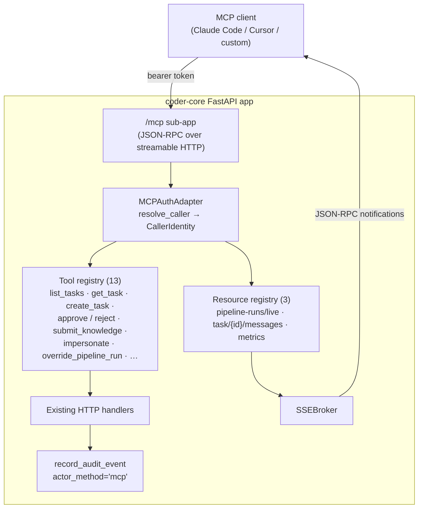

# MCP agent interface

## What it does today

Mounts a Python MCP SDK server at `/mcp` on `coder-core` as a transport
and schema layer bridging external agents (Claude Code, Cursor, custom
clients) to the existing FastAPI handlers and SSE streams. Every tool
call delegates directly to an existing handler using a `CallerIdentity`
resolved by the auth adapter — no business logic lives in the MCP
layer. Three v1 resources (live pipeline runs, task messages, project
metrics) stream over SSE via the existing `SSEBroker`. Audit rows
inherit the downstream handler's behaviour, stamped
`actor_method='mcp'`.

## Architecture

### Parts

- **MCP sub-app (`coder_core/mcp/app.py`)** — Python MCP SDK server mounted at `/mcp` on boot; `CODER_MCP_ENABLED=false` deregisters entirely (no routes, no health, no surface).
- **Auth adapter (`coder_core/mcp/auth.py`)** — single function `resolve_caller(authz) -> CallerIdentity | None`; tries admin JWT, broker JWT, then API key (same short-circuit as HTTP middleware).
- **Tool registry (`coder_core/mcp/tools/`)** — 13 modules, one per tool; each declares a `Tool` + `handler` that delegates to an existing HTTP handler.
- **Resource registry (`coder_core/mcp/resources/`)** — three subscribable resources bridged to existing SSE streams via `SSEBroker`.
- **Audit hook** — no new table; `mcp.session_opened` row on first `initialize`; tool calls inherit downstream audit with `actor_method='mcp'`.

### Data flow

Client sends `initialize` with a bearer token. Auth adapter resolves
it to a `CallerIdentity` and writes one `mcp.session_opened` audit
row. Client calls `tools/list` (filtered by what the caller could
access on HTTP), then `tools/call` (e.g. `list_tasks`); the tool
delegates to the existing handler with the same `CallerIdentity`, the
handler runs its own ACL + mutation + audit, and the response is
shaped by the tool schema and returned. For subscriptions, the
resource reader opens an SSE subscription and yields events as
JSON-RPC notifications.

### Invariants

- **Every MCP tool call lands in an existing handler.** No business logic in the MCP layer; schema tests assert the tool return shape matches the HTTP response.
- **Auth is resolved once per request.** No tool may re-resolve or fabricate `CallerIdentity`.
- **MCP audit rows are HTTP-equivalent** apart from `actor_method='mcp'`; correlation IDs flow unchanged.
- **Flag off → no surface.** `/mcp` is absent (not 404, not 503); backout is guaranteed.
- **Tool visibility matches authorisation.** If a caller would get 403 on HTTP, the tool is absent from their `tools/list` (no "invoke, get error" footgun).
- **Project-scoped gating.** Per-project `mcp_enabled` tri-state (`NULL` = inherit fleet, `false` = disabled, `true` = enabled); admin JWT bypasses; other token types receive `project_mcp_disabled` when disabled.

## Interfaces

| Surface | Effect |
|---|---|
| `POST /mcp` (JSON-RPC) | `initialize`, `tools/list`, `tools/call`, `resources/list`, `resources/read`, `resources/subscribe`, `resources/unsubscribe`, `ping` |
| `GET /mcp/health` | Plain-text health check |
| `resolve_caller(authz)` → `CallerIdentity \| None` | Auth adapter; called once per request |
| 13 tools | `handler(caller, args, session) -> dict`; one per existing HTTP handler |
| 3 resources | `coder://projects/{project_id}/{resource}`; subscribable for live runs + task messages |
| `record_audit_event(..., actor_method='mcp')` | Audit parity with HTTP |
| `CODER_MCP_ENABLED` (env) + `projects.mcp_enabled` (per-project tri-state) | Flag-gated rollout |

## Where in code

- `src/coder_core/mcp/__init__.py` — `register_mcp(app, settings)` hook
- `src/coder_core/mcp/auth.py` — `resolve_caller` + middleware
- `src/coder_core/mcp/tools/*.py` — 13 tool modules wrapping HTTP handlers
- `src/coder_core/mcp/resources/__init__.py` — resource registry + reader functions
- `src/coder_core/config.py` — `mcp_enabled`, `mcp_max_subscriptions_per_session`
- `src/coder_core/audit.py` — `MCP_SESSION_OPENED` action type

## Evolution

Spec 0049. Phase 2 defers session-swap handoff and shared-stream multiplexing. Internal worker-to-MCP use revisited post-adoption (phase 5). Current scope: external-agent interface only, stateless sessions, per-session subscription cap (10).

## Links

- Spec: [0049](../../../product-specs/wip/0049-mcp-agent-interface.md)
- Designs: [system-overview](../system-overview.md), [impersonation](../tenancy/impersonation.md) (broker JWT reused), [worker-communication](../pipeline/worker-communication.md) (SSE shared), [audit-log](../tenancy/audit-log.md), [knowledge-write-api](./knowledge-write-api.md)
- External: MCP spec at modelcontextprotocol.io
- Repos: coder-core, coder-system
