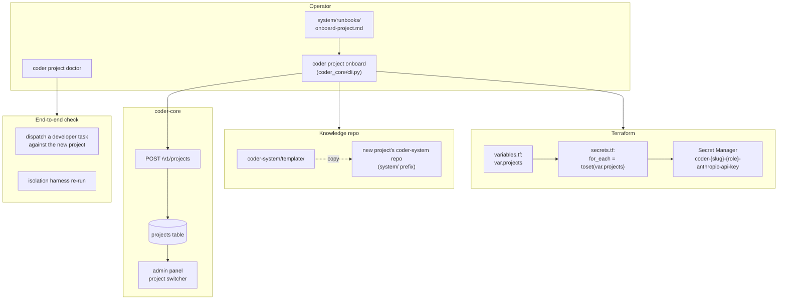

# Project Onboarding

## What it is

Onboarding is the path by which a new project becomes a first-class
tenant in Coder: a knowledge repo built from
[`coder-system/template/`](../../../template/), a Terraform variable
addition that provisions per-project secrets with per-secret IAM
bindings, a registration call against the Core API, and an end-to-end
developer task proving isolation from existing projects. The runbook
is the canonical procedure; the `coder project onboard` CLI automates
the mechanical first half so humans only run the verification steps.
VibeTrade and Coder (dog-fooding) are the two live projects today.

## Architecture

### The runbook

`system/runbooks/onboard-project.md` is the single source of truth.
Ten steps, in order:

1. Pick a kebab-slug (≤40 chars, `[a-z][a-z0-9-]*`).
2. Add the slug to `var.projects` in
   `coder-core/infra/terraform/variables.tf`; `tofu plan` then
   `tofu apply` provisions per-project Secret Manager entries
   (`coder-{slug}-{role}-anthropic-api-key`) with IAM bindings to
   the matching role SA. See
   [service-accounts](../tenancy/service-accounts.md).
3. Create the project's `coder-system` repo from
   `coder-system/template/` (CLI does this).
4. Populate `system/repos.yaml` with the project's code repo(s),
   their GitHub orgs, and CI status.
5. Configure roles (per-role prompts, capability matrix entries)
   if the project diverges from defaults.
6. `POST /v1/projects` to register the project against `coder-core`
   (CLI does this).
7. Set a per-project Anthropic key in Secret Manager
   (`gcloud secrets versions add`).
8. Verify the project is visible in the admin panel project
   switcher.
9. Dispatch an end-to-end developer task and confirm the PR opens
   on the project's GitHub org with no cross-bleed in secrets,
   logs, or audit rows.
10. Re-run the [tenant-isolation](../delivery/tenant-isolation.md) harness
    to confirm the new project ↔ existing projects matrix is
    closed.

### CLI commands

- **`coder project onboard <slug>`** —
  `coder_core/cli.py::cmd_project_onboard`. Automates steps 1, 3,
  4, 6, 8 of the runbook (variable add, knowledge-repo bootstrap
  from template, repos.yaml stub, project registration, admin-panel
  visibility check). Steps 2, 7, 9, 10 still require operator
  judgment.
- **`coder project doctor <slug>`** —
  `cmd_project_doctor`. An 8-point health check: project row
  exists, API key works, Secret Manager entries readable through
  the broker, knowledge repo reachable, recent audit rows
  scoped, isolation matrix green, etc. Used both during
  onboarding and as a cron-able status probe later.

### Data flow

1. Operator runs `coder project onboard <slug> --name=… --github-org=…`.
2. CLI mutates `variables.tf`, runs `tofu plan` and prints the
   diff for human approval. After human runs `tofu apply`,
   secrets exist in GCP.
3. CLI clones `coder-system/template/` into the project's new
   `coder-system` repo (or branch), prefixes content under
   `system/`, populates `repos.yaml`.
4. CLI calls `POST /v1/projects` with the slug, name, GitHub org,
   knowledge repo URL, and GCP project. The response includes a
   freshly-minted per-project API key — printed once, never
   stored by the CLI.
5. Operator stores the API key out-of-band, runs `gcloud secrets
   versions add` to seed an Anthropic key, dispatches a smoke
   developer task, and re-runs the isolation harness.
6. `coder project doctor` confirms the 8-point health check; the
   project is live.

### Invariants

- **No bespoke onboarding.** Anything that worked for VibeTrade
  must work for Coder (and vice versa) without code changes —
  the runbook is portable, parameterized only on the slug.
- **Terraform is authoritative for IAM.** Hand-clicked Secret
  Manager bindings drift; `tofu plan` catches it.
- **Isolation is a CI-blocking gate, not a release note.**
  Onboarding is incomplete until the harness confirms zero
  cross-bleed (see [tenant-isolation](../delivery/tenant-isolation.md)).
- **API key is shown once.** The onboarding response includes the
  raw key; the database stores only the hash. Lost keys are
  rotated, not recovered.

## Interfaces

- **CLI:** `coder project onboard <slug>`,
  `coder project doctor <slug>`.
- **HTTP:** `POST /v1/projects`, `GET /v1/projects` (visibility
  check), all knowledge read/write endpoints — every endpoint is
  project-scoped per [multi-tenancy](../tenancy/multi-tenancy.md).
- **Terraform:** `var.projects` in
  `coder-core/infra/terraform/variables.tf`; default
  `["vibetrade", "coder"]`.
- **Knowledge template:** `coder-system/template/`.
- **Runbook:** `system/runbooks/onboard-project.md`.

## Evolution

- 0007 — multi-tenant `coder-core` makes a "project" a first-class
  thing.
- 0019 — onboard-project runbook drafted; first parallel project
  (Coder dog-fooding) onboarded successfully.
- 0042 — `coder project onboard` CLI automates the mechanical
  steps; `coder project doctor` health-check follows.
- knowledge-template — `coder-system/template/` becomes the
  blueprint copied per project; future schema migrations to the
  template land via spec [0047](../wip/0047-template-schema-migration.md).

## Links

- Specs: [onboarding](../../product-specs/active/onboarding.md),
  [multi-tenancy](../../product-specs/active/multi-tenancy.md)
- Designs: [multi-tenancy](../tenancy/multi-tenancy.md),
  [service-accounts](../tenancy/service-accounts.md),
  [knowledge-repo-model](./knowledge-repo-model.md),
  [tenant-isolation](../delivery/tenant-isolation.md)
- Runbooks: `system/runbooks/onboard-project.md`
- Services: `coder-core`
