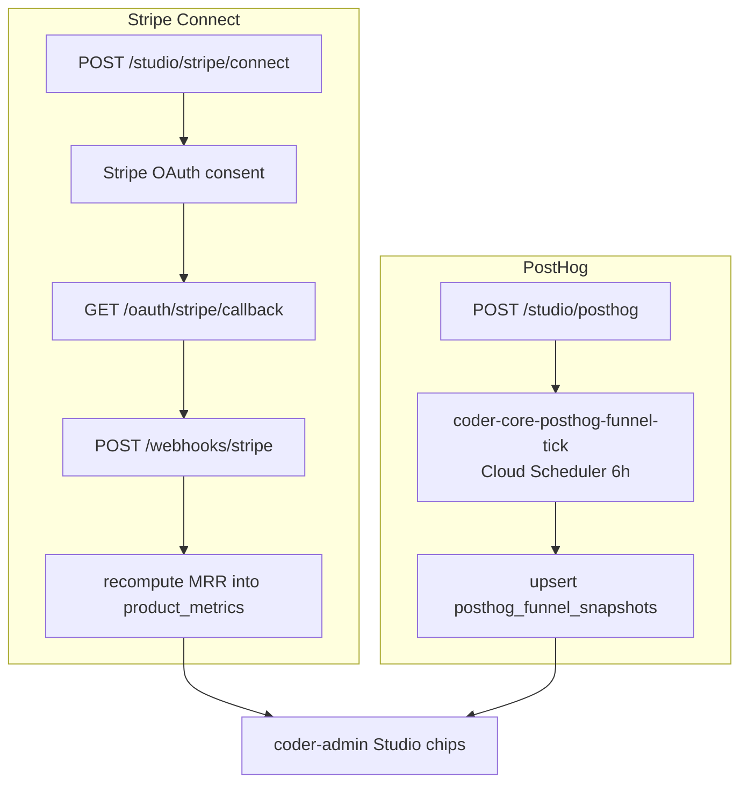

# Studio product integrations

## What it is

coder-core's backend for the Studio per-product integration surface:
the Stripe Connect Express OAuth flow, the `/v1/webhooks/stripe`
ingest endpoint with signature verification and MRR computation, the
PostHog credential store + 6-hour funnel poll, and the disconnect
paths for both. The admin-side chips that drive operator visibility
live in [admin-panel](./admin-panel.md); this design owns the
server-side wiring. MRR is additive on top of the existing budget
read path — `project_budget_period` and `budget.py` are untouched
(canonical reads per ADR 0031 still hold).

## Architecture

### Parts

- **`stripe_integrations`** —
  `(project_id PK FK, connected_account_id, oauth_state, status ∈ {disconnected, pending, live}, connected_at, disconnected_at)`.
  Transitions: `disconnected → pending` on OAuth initiation;
  `pending → live` on first webhook from the account;
  back to `disconnected` on operator disconnect.
- **`stripe_events`** —
  `(id, connected_account_id, stripe_event_id UNIQUE, event_type, payload_jsonb, received_at)`.
  Unique on `(connected_account_id, stripe_event_id)` so duplicate
  webhook deliveries upsert no-op.
- **`posthog_integrations`** —
  `(project_id PK FK, region ∈ {us, eu}, api_key_secret_name, verified_at, last_poll_at, disconnected_at)`.
  `api_key_secret_name` =
  `coder/{project_id}/posthog_project_api_key`.
- **`posthog_funnel_snapshots`** —
  `(project_id PK FK, signup, activate, checkout_start, checkout_complete, captured_at)`.
  One upsert-latest row per project; per-day time-series is a
  Phase C Analyst concern.
- **`product_metrics`** —
  `(project_id FK, period_yyyymm, mrr_cents, updated_at)`,
  PK `(project_id, period_yyyymm)`. Additive to the budget schema;
  `project_budget_period` and `budget.py` are unchanged.
- **API surface in `src/coder_core/api/studio.py`.** Routes:
  `POST /v1/projects/{id}/studio/stripe/connect` (initiate OAuth;
  writes HMAC nonce to `oauth_state`; returns Stripe redirect),
  `GET /v1/oauth/stripe/callback` (verify HMAC, exchange code,
  Secret Manager write, status → `pending`),
  `POST /v1/webhooks/stripe` (Stripe-Signature verify;
  `customer.subscription.*` triggers
  `_recompute_mrr(project_id)`; invalid sig → 401;
  disconnected account → 410),
  `DELETE /v1/projects/{id}/studio/stripe` (disconnect; SM
  version disabled; audit),
  `POST /v1/projects/{id}/studio/posthog` (verify key against
  `https://{region}.posthog.com/api/projects/`; on 200 SM write +
  row; on auth failure return `{"status": "auth_failed"}` inline
  with no SM write),
  `DELETE /v1/projects/{id}/studio/posthog` (disconnect; SM
  version disabled; audit),
  `GET /v1/projects/{id}/studio/integrations` (both chip states:
  Stripe status + MRR + dashboard link; PostHog verified +
  snapshot + `last_poll_at`).
- **`_recompute_mrr`** reads `connected_account_id` from
  `stripe_integrations`, calls Stripe
  `GET /v1/subscriptions?status=active`, sums
  `plan.amount_decimal × quantity`, upserts `product_metrics` for
  the current `period_yyyymm`. Runs synchronously in the webhook
  handler — satisfies the ≤5 min MRR refresh target without a
  polling loop.
- **PostHog funnel tick.** `coder-core-posthog-funnel-tick` Cloud
  Scheduler job every 6 h. For each
  `posthog_integrations.disconnected_at IS NULL`: reads key from
  Secret Manager, calls
  `/api/projects/{ph_project_id}/query` for the four funnel
  steps, upserts `posthog_funnel_snapshots`, sets `last_poll_at`.
  Per-project 30 s timeout — on timeout the previous snapshot
  remains, `last_poll_at` is unchanged, the chip's stale-since
  indicator surfaces.
- **Secret Manager paths.**
  `coder/{project_id}/stripe_connect_account_id`,
  `coder/{project_id}/stripe_webhook_secret` (per-account signing
  secret; joins the
  [automated-secret-rotation](../tenancy/automated-secret-rotation.md)
  registry at 90 d cadence),
  `coder/{project_id}/posthog_project_api_key` (written on
  successful verify; SM version disabled on disconnect).

### Data flow

1. Operator clicks `[Connect Stripe]` on a `b2c_product` project.
   coder-core resets `stripe_integrations` to `pending`, writes an
   HMAC nonce, returns the Stripe Connect Express OAuth redirect.
2. After consent, Stripe calls back to
   `/v1/oauth/stripe/callback`. coder-core verifies HMAC,
   exchanges the code for `connected_account_id`, writes Secret
   Manager, status stays `pending` until the first webhook.
3. `/v1/webhooks/stripe` verifies `Stripe-Signature`; on
   `customer.subscription.*` calls `_recompute_mrr`; status moves
   `pending → live` on first valid webhook. The chip transitions
   within 60 s of webhook confirmation.
4. PostHog tick runs every 6 h; the chip renders the latest
   snapshot (≤ 6 h old) with the four funnel counts and a
   `last_updated` timestamp.
5. Disconnect paths set `disconnected_at`, disable the Secret
   Manager version, write `audit_event`; future webhooks for a
   disconnected account return 410; the next poll skips.

### Invariants

- **Stripe signature is mandatory.** Invalid signature → 401 with
  zero persistence (no `stripe_events` insert, no MRR recompute).
- **OAuth nonce is single-use.** Callback verifies HMAC and
  clears the `oauth_state` row; replay returns 400.
- **Unknown `connected_account_id` on webhook → 400.** Never
  silently 200 — mis-routed webhooks surface immediately.
- **Disconnect during poll is safe.** Tick checks
  `disconnected_at` before reading Secret Manager; skips the
  project cleanly. No retained SM read for a disconnected
  account.
- **Budget read path unchanged.** `product_metrics` is net-new;
  canonical budget reads in `budget.py` still satisfy ADR 0031.
  Spec AC7 budget regression suite runs on every PR.

## Interfaces

- `POST /v1/projects/{id}/studio/stripe/connect`
- `GET /v1/oauth/stripe/callback`
- `POST /v1/webhooks/stripe`
- `DELETE /v1/projects/{id}/studio/stripe`
- `POST /v1/projects/{id}/studio/posthog`
- `DELETE /v1/projects/{id}/studio/posthog`
- `GET /v1/projects/{id}/studio/integrations`
- Cloud Scheduler: `coder-core-posthog-funnel-tick` (6 h).
- Secret Manager paths listed above.

## Where in code

- `coder-core/src/coder_core/api/studio.py` — Stripe + PostHog
  endpoints
- `coder-core/src/coder_core/studio/stripe_mrr.py` —
  `_recompute_mrr` synchronous handler
- `coder-core/src/coder_core/studio/posthog_poll.py` —
  funnel-tick Job entry
- `coder-core/migrations/versions/00NN_studio_integrations.py` —
  five additive tables
- `coder-admin/src/pages/Studio/IntegrationChips.tsx` — Stripe +
  PostHog chip render

## Evolution

- 2026-05-15 — Phase A ship (spec 0080): Stripe Connect Express
  OAuth flow + webhook MRR pipeline + PostHog credential store +
  6 h funnel poll + disconnect paths for both. ADR 0009 enforces
  per-project credential isolation; webhook secret rotation joins
  the managed-secret registry at 90 d cadence.

## Links

- Specs: [studio-product-integrations](../../../product-specs/active/knowledge/studio-product-integrations.md)
- Designs: [studio](./studio.md),
  [studio-b2c-portfolio](../studio-b2c-portfolio.md),
  [automated-secret-rotation](../tenancy/automated-secret-rotation.md),
  [admin-panel](./admin-panel.md),
  [observability-and-cost-tracking](../pipeline/observability-and-cost-tracking.md),
  [audit-log](../tenancy/audit-log.md)
- ADRs: [0009](../../../adrs/0009-per-managed-project-cloud-account-and-github-org.md)
- Services: `coder-core`, `coder-admin`
