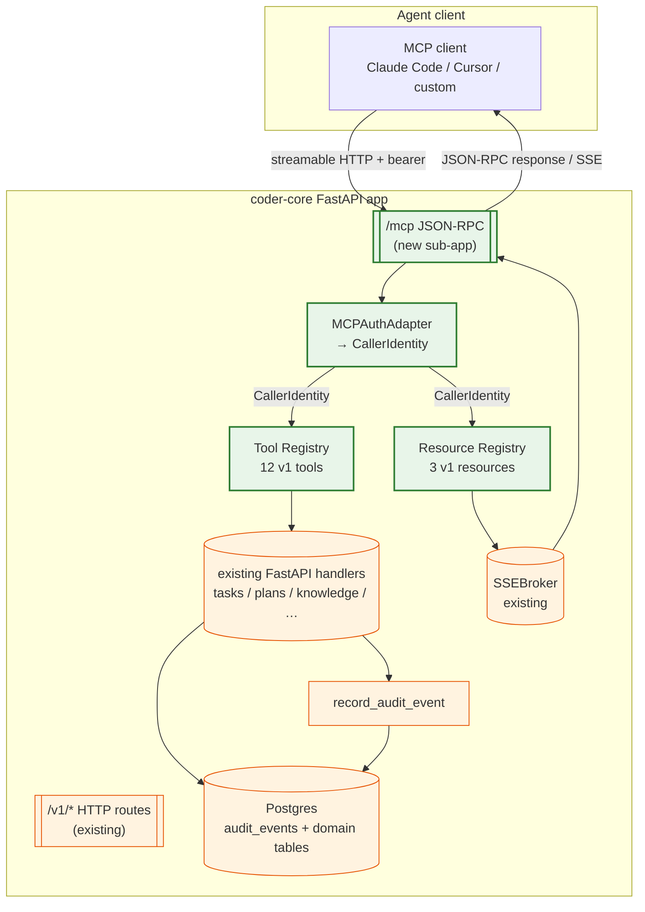

# 0049 — MCP agent interface (design)

## Context

Spec [0049](../../product-specs/wip/0049-mcp-agent-interface.md) scopes a
Model Context Protocol server as a peer of the existing HTTP API on
`coder-core`. This design describes the mount point, the auth adapter,
the tool + resource registries, the impersonation flow, and the
rollout stages.

The core architectural insight is that MCP is a *transport and schema
layer*, not a new domain. Every tool call's business logic already
lives in a FastAPI handler; every resource's data already flows
through an existing SSE stream or Postgres query. The design's job is
to make that fact true in code — no duplicated handlers, no parallel
permission model, no bespoke audit path.

## Goals / non-goals

### Goals

- One FastAPI sub-app mounted at `/mcp` on the existing coder-core
  service. Zero new services, zero new deployment targets.
- Single auth adapter that produces a `CallerIdentity` (existing type)
  from the MCP request's `Authorization` header. All downstream
  authorisation is unchanged.
- Tool handlers are thin shims over existing HTTP handlers. No new
  business logic in the MCP layer.
- Resources over SSE: reuse the existing `SSEBroker` that the admin
  panel already consumes.
- Flag-gated: `/mcp` routes register conditionally on boot;
  `CODER_MCP_ENABLED=false` deregisters the prefix entirely.

### Non-goals

- stdio transport (streamable-HTTP only in v1).
- Bespoke MCP session persistence (each request is stateless on the
  server; the MCP SDK's session machinery stays in its default shape).
- A separate MCP-only database table (audit + existing mutation tables
  are sufficient).
- SSE fan-out optimisation beyond per-session caps (phase 2 concern
  — OQ4).

## Architecture



## Parts

### 1. MCP sub-app: `coder_core.mcp.app`

FastAPI mounts the Python MCP SDK server on `/mcp` via
`app.mount("/mcp", mcp_server.streamable_http_app())` when
`settings.mcp_enabled` is true. Conditional registration means the
route is *absent* (404) when the flag is off — no flag-check
middleware, no dead endpoint.

```python
# coder_core/mcp/app.py

from mcp.server import Server
from mcp.server.streamable_http import streamable_http_app

def build_mcp_server(settings: Settings) -> Server:
    server = Server("coder-core", version=CODER_CORE_VERSION)
    _register_tools(server)
    _register_resources(server)
    _install_auth_middleware(server)
    return server
```

The server singleton is built once at FastAPI startup and mounted
before requests begin; tool + resource handlers are registered via
the SDK's decorator pattern.

### 2. Auth adapter: `coder_core.mcp.auth`

Single function `resolve_caller(authorization: str | None) ->
CallerIdentity | None`. The adapter short-circuits on the same logic
as the existing HTTP middleware:

```python
async def resolve_caller(authz: str | None, session: AsyncSession) -> CallerIdentity | None:
    if not authz or not authz.lower().startswith("bearer "):
        return None
    token = authz[7:].strip()

    # Try admin JWT first (admin tokens are the highest-privilege).
    admin = await verify_admin_jwt(token, settings)
    if admin:
        return CallerIdentity.admin(admin.email, token_id=admin.jti)

    # Then broker-issued role JWT (impersonation).
    broker = await verify_broker_jwt(token, settings)
    if broker:
        return CallerIdentity.broker(
            project_id=broker.project_id,
            role=broker.role,
            actor=broker.actor,
            token_id=broker.jti,
        )

    # Finally project API key (hash lookup, constant-time compare).
    project = await lookup_project_by_api_key(session, token)
    if project:
        return CallerIdentity.api_key(project_id=project.id, actor="api_key")

    return None
```

`CallerIdentity` is the same type the HTTP middleware uses. Tool
handlers accept it as a parameter (via a contextvar set by MCP
middleware) and pass it straight through to the wrapped handler.

Unknown or expired tokens → the MCP middleware raises a JSON-RPC
`-32001 unauthenticated` error before dispatch; the tool handler
never runs.

### 3. Tool registry: `coder_core.mcp.tools`

Each tool is a module that declares:

```python
# coder_core/mcp/tools/list_tasks.py

from mcp.types import Tool
from coder_core.api.tasks import list_tasks as _http_handler

TOOL = Tool(
    name="list_tasks",
    description="List tasks for a project. Filter by role or status.",
    inputSchema={
        "type": "object",
        "properties": {
            "project_id": {"type": "string"},
            "role": {"type": "string", "enum": [...], "default": None},
            "status": {"type": "string", "enum": [...], "default": None},
            "limit": {"type": "integer", "default": 50, "maximum": 200},
        },
        "required": ["project_id"],
    },
    required_role=None,   # reads: any authenticated caller
    required_admin=False,
)

async def handler(caller: CallerIdentity, args: dict, session: AsyncSession):
    # Delegate to the existing HTTP handler, passing through the
    # resolved caller. The handler's existing `require_project_auth`
    # check runs against `caller` — same permission story, same 4xx.
    return await _http_handler(caller=caller, session=session, **args)
```

The registry enumerates all 12 tools on boot. Each tool advertises
its own authorisation shape (`required_role`, `required_admin`,
`required_scope`) so `tools/list` can filter server-side without
calling handlers.

The 12 tools in v1:

| Tool | Tier | Delegates to |
|------|------|--------------|
| `list_tasks` | any | `api/tasks.py::list_tasks` |
| `get_task` | any | `api/tasks.py::get_task` |
| `list_pipeline_runs` | any | `api/pipeline_runs.py::list_pipeline_runs` |
| `get_pipeline_run` | any | `api/pipeline_runs.py::get_pipeline_run` |
| `list_knowledge` | any | `api/knowledge.py::list_artifacts` |
| `get_knowledge` | any | `api/knowledge.py::get_artifact` |
| `get_metrics` | any | `api/metrics.py::get_metrics` |
| `create_task` | project | `api/tasks.py::create_task` |
| `approve_task_plan` | project | `api/task_plans.py::approve_plan` |
| `reject_task_plan` | project | `api/task_plans.py::reject_plan` |
| `submit_knowledge` | project | `api/knowledge.py::create_artifact` + `update_artifact` |
| `impersonate` | admin | `api/impersonate.py::issue_token` |
| `override_pipeline_run` | admin | `api/pipeline_runs.py::override_pipeline_run` |

(13 in the table; `submit_knowledge` covers both create + update so
the spec's "12 tools" figure is tools-by-name. Either count is fine;
pick one on ship.)

### 4. Resource registry: `coder_core.mcp.resources`

Three v1 resources, each backed by an existing read path:

```python
RESOURCES = [
    Resource(
        uri_template="coder://projects/{project_id}/pipeline-runs/live",
        name="Live pipeline runs",
        description="SSE-backed subscription to pipeline_run.changed events",
        subscribable=True,
        read_fn=_stream_live_runs,
    ),
    Resource(
        uri_template="coder://projects/{project_id}/tasks/{task_id}/messages",
        name="Task message feed",
        description="Live feed of worker output messages for a running task",
        subscribable=True,
        read_fn=_stream_task_messages,
    ),
    Resource(
        uri_template="coder://projects/{project_id}/metrics",
        name="Project metrics rollup",
        description="Latest metrics block (tokens, costs, approval rates, by-tier)",
        subscribable=False,
        read_fn=_read_metrics,
    ),
]
```

Subscriptions bridge to the existing `SSEBroker`:

```python
async def _stream_live_runs(caller: CallerIdentity, project_id: str):
    _require_project_match(caller, project_id)  # 404 on cross-tenant
    async for event in sse_broker.subscribe(f"project:{project_id}:pipeline_run"):
        yield event
```

A per-session cap (`MCP_MAX_SUBSCRIPTIONS_PER_SESSION=10`) caps fan-out
concurrency at the session boundary. Phase 2 addresses shared-stream
multiplexing (OQ4).

### 5. Audit integration

No new audit actions except one: `mcp.session_opened`, written by the
MCP middleware on the first successful `initialize` for a given
session. Carries the resolved caller's `actor` + `actor_method='mcp'`
and `before=None`, `after={"protocol_version": "..."}`.

Every tool call inherits the downstream handler's existing audit
behaviour. The only change: the existing handlers already pull
`caller.actor_method` into the audit row; MCP sets it to `"mcp"` via
the adapter so the log distinguishes MCP from HTTP mutations.

### 6. Impersonation flow

`tools/call impersonate(project_id, role)` with an admin-JWT caller:

1. MCP adapter verifies the caller is `admin` (raises
   `-32002 forbidden` otherwise).
2. Handler calls `coder_core.api.impersonate.issue_token(project_id,
   role, admin_actor)` — the existing HTTP handler, unchanged.
3. That path mints a broker JWT, writes an
   `impersonate.issue_token` audit row, returns the token.
4. Tool response: `{token, role, project_id, exp}`.
5. Client opens a new MCP session with the returned token as
   bearer. Tool visibility is now role-scoped.

The session-swap handoff (OQ3) is deliberately deferred — forcing a
new session makes audit attribution unambiguous (each session has
exactly one caller identity).

### 7. Flag + project gating

```python
# coder_core/mcp/__init__.py

def register_mcp(app: FastAPI, settings: Settings) -> None:
    if not settings.mcp_enabled:
        logger.info("mcp disabled: not registering /mcp")
        return
    server = build_mcp_server(settings)
    app.mount("/mcp", server.streamable_http_app())
```

Per-project gating lives in `resolve_caller`: after the caller is
resolved, if the project_id scope of the request doesn't satisfy the
project's `mcp_enabled` tri-state (NULL = fleet-inherit, false =
disabled, true = enabled), the adapter returns a
`-32003 project_mcp_disabled` error. Admin-JWT callers bypass this
check (admin sees everything).

## Invariants

1. **Every MCP tool call lands in an existing handler.** No business
   logic in the MCP layer. Schema tests assert the tool handler's
   return is the same shape as the HTTP handler's response body.
2. **Auth is resolved once per request, by the adapter.** No tool
   may re-resolve or fabricate a `CallerIdentity`.
3. **Audit rows written via MCP tools are indistinguishable from
   HTTP rows** except for `actor_method='mcp'`. Correlation IDs
   flow through unchanged (the MCP middleware stamps one per JSON-
   RPC request if the client didn't provide one).
4. **`/mcp` is absent when flag is off.** No `/mcp/health`, no
   `/mcp` JSON-RPC endpoint, no routes registered. Backout is
   guaranteed.
5. **Tool visibility matches authorisation.** If a caller would get
   a 403 on the equivalent HTTP call, the tool is absent from
   `tools/list` for that caller. Prevents the "invoke, get error"
   footgun.

## Data flow

### Scenario A — admin agent lists tasks across a project

1. Admin runs Claude Code with MCP config pointing at
   `https://coder-core.../mcp` with their admin JWT.
2. Client sends `initialize`. MCP adapter resolves the bearer →
   admin CallerIdentity. Session opens. `mcp.session_opened`
   audit row written.
3. Client calls `tools/list`. Server returns all 13 tools
   (admin sees everything).
4. Client calls `tools/call list_tasks(project_id='acme',
   status='failed', limit=20)`. Adapter confirms admin identity,
   handler runs, returns 20 task rows. No audit (read).
5. Client displays the list; operator picks a task to retry.

### Scenario B — developer-role agent opens an impersonation session

1. Admin caller connects, calls `impersonate(project_id='acme',
   role='developer')`. Returns `{token: "eyJ...", exp: ...}`.
   `impersonate.issue_token` audit row written with admin actor,
   role=developer.
2. Client disconnects and reconnects with the new JWT as bearer.
   `initialize` → broker-JWT CallerIdentity with role=developer,
   project=acme.
3. `tools/list` returns 7 tools (reads + `create_task`).
4. Client calls `create_task(role='developer', prompt='...',
   repo='coder-core')`. Handler runs, creates task row, writes
   `tasks.create` audit row with `actor='broker:developer:acme'`,
   `actor_method='mcp'`.
5. Client subscribes to
   `coder://projects/acme/tasks/{id}/messages` to watch the run.

### Scenario C — cross-tenant attempt (isolation)

1. Project `bravo`'s API key holder opens MCP session.
2. Client calls `get_task(project_id='acme', task_id='<bravo-task>')`
   attempting to read across tenants.
3. Handler's existing `require_project_auth` rejects: caller's
   project_id=bravo, path's project_id=acme. Returns JSON-RPC
   `-32004 not_found` (same obfuscation as the HTTP 404).
4. The `tests/isolation/` matrix has an MCP-path entry
   (`mcp::get_task`) that asserts this behaviour on every PR. The
   drift check blocks any new MCP tool that doesn't extend the
   matrix.

### Scenario D — SSE subscription backpressure

1. Client subscribes to
   `coder://projects/acme/pipeline-runs/live`.
2. MCP server opens an SSE subscription on `SSEBroker` keyed
   `project:acme:pipeline_run`.
3. A pipeline run advances; SSEBroker emits `pipeline_run.changed`.
4. MCP server forwards the event as a JSON-RPC notification on
   the subscribed session.
5. Client's 11th subscribe request on the same session: MCP
   returns `-32005 subscription_cap_reached`. Existing 10 keep
   flowing.

## Interfaces

### New files

- `coder-core/src/coder_core/mcp/__init__.py` — registration hook.
- `coder-core/src/coder_core/mcp/app.py` — `build_mcp_server()`.
- `coder-core/src/coder_core/mcp/auth.py` — `resolve_caller()` +
  middleware.
- `coder-core/src/coder_core/mcp/tools/__init__.py` — registry.
- `coder-core/src/coder_core/mcp/tools/{list_tasks,get_task,
  list_pipeline_runs,get_pipeline_run,list_knowledge,get_knowledge,
  get_metrics,create_task,approve_task_plan,reject_task_plan,
  submit_knowledge,impersonate,override_pipeline_run}.py` — one
  module per tool.
- `coder-core/src/coder_core/mcp/resources/__init__.py` — registry +
  `live_runs,task_messages,metrics.py`.
- `coder-core/tests/test_mcp_auth.py`
- `coder-core/tests/test_mcp_tools.py` (one test class per tool)
- `coder-core/tests/test_mcp_resources.py`
- `coder-core/tests/isolation/isolation_manifest.yaml` — MCP-path
  entries per tool.

### Modified files

- `coder-core/src/coder_core/main.py` — call `register_mcp(app,
  settings)` after the existing `/v1/*` mount.
- `coder-core/src/coder_core/config.py` — `mcp_enabled: bool =
  False`, `mcp_max_subscriptions_per_session: int = 10`.
- `coder-core/src/coder_core/audit.py::Actions` — new
  `MCP_SESSION_OPENED = "mcp.session_opened"`.
- `coder-core/src/coder_core/auth.py::CallerIdentity` — add
  `"mcp"` as a recognised `actor_method` value.
- `coder-core/migrations/versions/0051_projects_mcp_enabled.py` —
  tri-state `projects.mcp_enabled` column.
- `coder-core/pyproject.toml` — add `mcp` Python SDK dependency.

### New config / env

- `CODER_MCP_ENABLED` — fleet gate (default false).
- `MCP_MAX_SUBSCRIPTIONS_PER_SESSION` — default 10.
- No new secrets; reuses `BROKER_SIGNING_KEY` and the existing
  admin-JWT signing key.

### New endpoints / protocol methods

- `GET /mcp/health` — health-check (plain HTTP, not JSON-RPC).
- `POST /mcp` — streamable-HTTP JSON-RPC endpoint (MCP spec).
- Handled JSON-RPC methods: `initialize`, `tools/list`,
  `tools/call`, `resources/list`, `resources/read`,
  `resources/subscribe`, `resources/unsubscribe`, `ping`.

### Admin surfaces

- `/admin/mcp-sessions` (behind `VITE_MCP_ADMIN_ENABLED`) —
  fleet view of currently-open MCP sessions (actor, project,
  role, connected_at, subscription count). Phase-2 if the
  admin-panel needs it; v1 observes via `audit_events` rows with
  `actor_method='mcp'`.

## Rollout

### Stage 1 — schema + tool registration (dark), week 1

- Migration 0051 applied. `CODER_MCP_ENABLED=false` fleet-wide.
- Routes don't register. `/mcp` returns 404.
- Integration tests run against a locally-enabled server.

### Stage 2 — admin-only on `coder` canary, week 2

- Flip `CODER_MCP_ENABLED=true` fleet.
- All projects default `mcp_enabled=NULL` = fleet-inherit.
- `coder` project opt-in: `PATCH /v1/projects/coder mcp_enabled=true`.
- Only admin-JWT callers can authenticate end-to-end until a
  project is opted in (project API keys resolve but hit the
  `project_mcp_disabled` error for non-opted projects).
- Operator connects Claude Code to `/mcp`, runs a few tool calls,
  confirms audit rows appear with `actor_method='mcp'`.

### Stage 3 — project-opt-in for non-canary projects, week 3+

- Per-project opt-in via admin endpoint. Each project reviews:
  who should hold its API key for MCP use? Is the broker
  rotation shape (0038) sufficient?

### Stage 4 — full tool set + adoption KPIs

- Measure `audit_events.count WHERE actor_method='mcp'` as a
  leading indicator. Target > 10% of total mutations within 30
  days of Stage 2 to justify keeping the surface.

### Stage 5 — dogfood (deferred)

- OQ5 revisited: do workers themselves use MCP internally? Only
  after external adoption validates the shape.

## Backout

- `CODER_MCP_ENABLED=false` — route deregisters, all MCP clients
  see 404. Existing HTTP surface unaffected.
- Per-project opt-out: `PATCH /v1/projects/{id} mcp_enabled=false`.
  Next request on that project's scope returns
  `project_mcp_disabled`.
- Table `projects.mcp_enabled` column is nullable and independent;
  dropping it never affects other feature rows.
- No new secrets to rotate; MCP failures can't cascade into
  `coder-core`'s core auth path.

## Invariants verified in CI

- `tests/isolation/isolation_manifest.yaml` lists one entry per
  MCP tool path (`mcp::list_tasks`, `mcp::get_task`, etc.); the
  cross-tenant matrix asserts each rejects cross-project access.
  The manifest drift check blocks any new MCP tool without
  coverage.
- `tests/test_mcp_tools.py` asserts each tool's return shape
  matches the equivalent HTTP handler's response model (same
  Pydantic model; same field names).
- `tests/test_mcp_auth.py` asserts token-type → caller-method
  mapping is exhaustive and that a rejected token never reaches a
  handler.

## Links

- Spec: [0049](../../product-specs/wip/0049-mcp-agent-interface.md)
- Related designs:
  [system-overview](../active/system-overview.md) (middleware slot),
  [impersonation](../active/impersonation.md) (token minting reused),
  [worker-communication](../active/worker-communication.md) (SSE
  fan-out shared with the admin panel),
  [audit-log](../active/audit-log.md) (audit parity),
  [knowledge-write-api](../active/knowledge-write-api.md)
  (submit_knowledge tool wraps it)
- MCP spec: https://modelcontextprotocol.io
