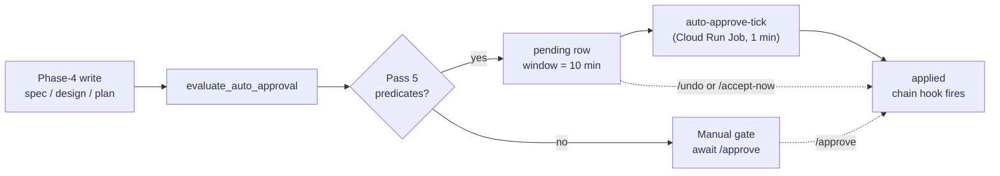

# Confidence-scored auto-approval

## What it does today

Auto-approves low-risk worker artifacts (specs, designs, task plans)
without waiting for human review. After a worker's Phase-4 write, an
evaluator applies five deterministic predicates (flag on, project
opted-in, score ≥ threshold, no risk flags, historical approval rate ≥
95%). Eligible artifacts enter a 10-minute `pending` window; a
1-minute Cloud Run Job finalises if no operator intervenes. Operators
can undo (spawns a revision task) or accept-now via break-glass
endpoints.

## Architecture

### Parts

- **`auto_approvals` table** — pending / applied / undone rows; carries worker score, predicate snapshot, historical rate, timestamps.
- **`evaluate_auto_approval`** — pure evaluator; called inside the Phase-4 transaction; returns `Manual(reason)` or `EligibleForAuto(...)`.
- **Three gate handlers** — `on_phase4_{spec,design,plan}_write` call the evaluator and conditionally insert the row + emit `auto_approval_pending` SSE.
- **`coder-core-auto-approve-tick`** — 1-minute Cloud Run Job; bulk-claims expired pending rows via `SELECT … FOR UPDATE SKIP LOCKED`; per-row `_finalize` runs the chain hook.
- **Break-glass endpoints** — `/undo` and `/accept-now`; per-row `FOR UPDATE` lock races safely against the tick.

### Data flow

Worker completes Phase-4 write. Gate handler calls the evaluator; on
eligibility, inserts an `auto_approvals` row (`pending`,
`window_expires_at = now + 600s`), emits `auto_approval_pending` SSE
(not `knowledge_approved` yet), returns. Admin UI shows a countdown
card. At window close, the tick acquires the row, transitions it to
`applied`, runs the chain hook, and publishes `knowledge_approved`.

### Invariants

- Chain hook fires **exactly once** per artifact. Mutually exclusive paths: manual approve, tick finalize, or accept-now.
- Status transitions are one-way: `pending → {applied, undone}`. No pending→pending.
- Undo is inert post-application: `applied` rows return 409 on `/undo`.
- Evaluator is deterministic given `(artifact, history, settings, now)`. All inputs logged for post-mortem reproducibility.
- Race safety is two-phase: bulk claim uses `SKIP LOCKED`; per-row finalize uses plain `FOR UPDATE` to block and read final status.

## Interfaces

| Surface | Effect |
|---|---|
| `evaluate_auto_approval(db, project_id, gate_kind, artifact_body, worker_confidence, settings)` | Returns `Manual` or `EligibleForAuto`; called once per Phase-4 write inside its transaction |
| `POST /v1/projects/{id}/auto-approvals/{id}/undo` | Pending → undone; spawns revision task; publishes `knowledge_rejected` SSE |
| `POST /v1/projects/{id}/auto-approvals/{id}/accept-now` | Pending → applied; runs chain hook; publishes `knowledge_approved` SSE |
| `PATCH /v1/projects/{id}` (`auto_approve_{spec,design,plan}_enabled`) | Tri-state per-project; `NULL` = inherit fleet |
| `AUTO_APPROVE_ENABLED` (env) | Master fleet flag; default off |
| `CODER_AUTO_APPROVE_THRESHOLD_{SPEC,DESIGN,PLAN}` | Per-gate confidence threshold (defaults 85 / 90 / 80) |
| SSE `auto_approval_pending` | Emitted on eligible row write; admin UI mounts countdown |
| SSE `knowledge_approved` | Published on finalize, not on initial pending write |

## Where in code

- `src/coder_core/approvals/auto.py` — `evaluate_auto_approval` (predicate evaluator)
- `src/coder_core/approvals/tick.py` — `tick` (Cloud Run entry) + `_finalize` (shared finalize logic)
- `src/coder_core/api/auto_approvals.py` — `undo` / `accept-now` handlers
- `src/coder_core/api/knowledge.py` — `on_phase4_spec_write` (gate-integration exemplar)
- `migrations/0044-auto-approvals.sql` — `auto_approvals` table + indices

## Evolution

Lands from spec 0040 directly (no prior ADR). The two-phase lock
strategy (bulk-claim `SKIP LOCKED` + per-row `FOR UPDATE`) emerged from
AC12 mid-development; full lock rationale lives in the implementing PR.

## Links

- Spec: [0040-confidence-auto-approve](../../../product-specs/wip/0040-confidence-auto-approve.md)
- Designs: [worker-communication](./worker-communication.md), [worker-roles](../worker-roles.md), [audit-log](../tenancy/audit-log.md), [observability-and-cost-tracking](./observability-and-cost-tracking.md)
- Repos: coder-core, coder-admin
