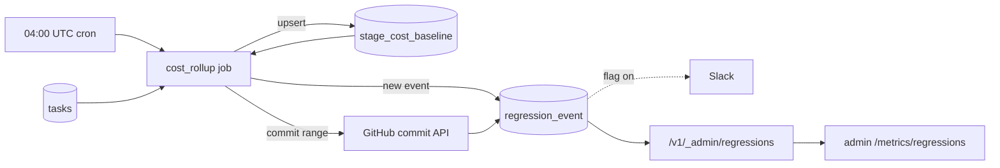

# Prompt & cost regression alerts

## What it does today

A nightly detector (04:00 UTC) compares per-stage cost / token medians
(yesterday vs rolling 7-day baseline). Delta over threshold writes a
`regression_event` row, captures suspect commit SHAs and authors from
[continuous-deployment](../delivery/continuous-deployment.md), and
(when enabled) notifies Slack. Operators acknowledge via the admin tab
with a reason; events auto-close after 3 consecutive days under
threshold.

## Architecture

### Parts

- **`stage_cost_baseline` table** — one row per `(role, task_kind, model_id, day_utc)`; stores daily medians, p95, input/output token splits. 7-day rolling median computed on-the-fly.
- **`regression_event` table** — fields: `dedupe_key`, `baseline_value`, `current_value`, `delta_pct`, `threshold_pct`, suspect `commit_shas` / `authors`, `acknowledged_at` / `by` / `reason`, `closed_at`. `dedupe_key` UNIQUE.
- **Nightly rollup (`coder_core/workers/cost_rollup.py`)** — APScheduler `04 00 * * *` UTC. SQL `percentile_cont` over `tasks`, upserts baseline, compares against 7d median, fires regression on threshold breach, queries GitHub for commits since last clean day.
- **Commit attributor (`coder_core/ops/regression_attribution.py`)** — paged GitHub API for the relevant commit range; cached per night.
- **Admin API + UI** — `GET /v1/_admin/regressions`, `POST /v1/_admin/regressions/{id}/ack`; UI tab renders table + detail view with sparklines and commit diff links.

### Data flow

Cron fires at 04:00 UTC. Job rolls yesterday's per-stage medians (~12
stages × 3 models = 36 rows), upserts `stage_cost_baseline`, computes
the 7d median (excluding the day under test), compares each stage
against thresholds. On breach: `regression_event` row inserted with
dedupe key, suspect commits + authors attributed from GitHub, Slack
notified if `regression_alerts_enabled`. Auto-close runs the same job:
events with 3 consecutive days under threshold get `closed_at` set.

### Invariants

- **One event per `(stage, day, metric)`** — `dedupe_key` UNIQUE makes retries idempotent.
- **Baseline excludes day under test** — rolls days N-8 through N-1, prevents self-masking.
- **Ack sticks until regression widens** — a new day crossing threshold creates a new event (new dedupe_key).
- **Auto-close requires 3 clean days** — conservative; one-day dip doesn't close.
- **Skip low-volume stages** — stages with < 10 tasks/day are skipped to avoid noisy medians.

## Interfaces

| Surface | Effect |
|---|---|
| `GET /v1/_admin/regressions` | Open + last 30d closed events |
| `POST /v1/_admin/regressions/{id}/ack` | Set `acknowledged_at` / `by` / `reason`; silence Slack |
| Slack message | `role.task_kind`, delta%, baseline vs current, suspect SHAs + authors, admin link |
| Admin tab row | Table (date · stage · metric · delta · commits · ack); detail = sparkline + GitHub diff links |
| Settings: `regression_alerts_enabled`, `regression_cost_delta_threshold` (0.25), `regression_input_tokens_delta_threshold` (0.30), per-role overrides | Fleet config |

## Where in code

- `src/coder_core/workers/cost_rollup.py` — `cost_rollup` APScheduler job; SQL percentile_cont; threshold logic; auto-close
- `src/coder_core/ops/regression_attribution.py` — `attribute_commit_range(since, until, settings)` GitHub pager
- `src/coder_core/api/admin_regressions.py` — `GET /_admin/regressions`, `POST /ack`
- `migrations/00NN_cost_regression.sql` — `stage_cost_baseline` + `regression_event` schema
- `coder-admin/src/pages/metrics/Regressions.tsx` — table + detail UI

## Evolution

Builds on [observability-and-cost-tracking](./observability-and-cost-tracking.md).
Phase 1 shipped in shadow (alerts off, events landed in table). Phase
2 enables Slack once thresholds are tuned.

## Links

- Spec: [0032-cost-regression-alerts](../../../product-specs/wip/0032-cost-regression-alerts.md)
- Designs: [observability-and-cost-tracking](./observability-and-cost-tracking.md), [prompt-caching-architecture](./prompt-caching-architecture.md), [model-tier-routing](./model-tier-routing.md), [token-budgets-and-cost-gates](./token-budgets-and-cost-gates.md), [continuous-deployment](../delivery/continuous-deployment.md), [worker-communication](./worker-communication.md)
- Repos: coder-core, coder-admin
