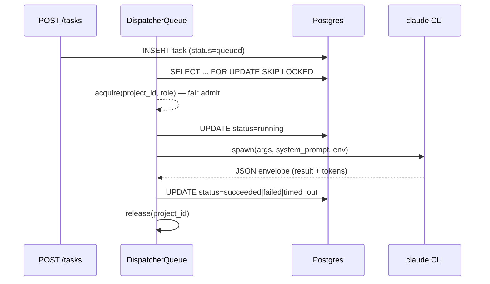

# Task dispatcher

## What it is

Bridge between HTTP task creation and worker subprocess execution.
Leases queued rows race-safely, assembles the worker prompt, spawns the
`claude` CLI, records the terminal outcome. A per-project fair queue
sits in front of the global concurrency cap so no project monopolises
worker slots.

## Architecture

### Parts

- `dispatch_task` — single-stage entry; one lease attempt, exits cleanly on lease miss.
- `orchestrate_task` — multi-stage wrapper; loops through pipeline stages until terminal.
- `DispatcherQueue` — in-memory per-project FIFO in front of a process-wide concurrency semaphore; round-robins on release so no project starves.
- `_build_workspace` — assembles `WorkspaceConfig` from project row + selected repo + minted GitHub token.

### Data flow

Caller posts to `/v1/projects/{id}/tasks` → row inserted `queued`.
Dispatcher leases via SKIP LOCKED, fair queue admits, semaphore slot
opens, worker spawns. On exit, JSON envelope parses, outcome persists,
queue releases, next admit triggers.

### Invariants

- Exactly one dispatcher wins each lease (SKIP LOCKED); losers see None and return without error.
- Fair-queue state is per-process; crash recovery relies on the orphan reaper (spec 0042) to mark abandoned rows `timed_out`.
- Project archive is re-checked after the `running` transition; mid-task archive is honoured.
- Legacy tasks with `stage=NULL` are not admitted for new stage transitions.

## Interfaces

| Symbol | Surface |
|---|---|
| `POST /v1/projects/{id}/tasks` | Create task; row enters `queued` |
| `dispatch_task(task_id)` | Single-stage entry |
| `orchestrate_task(task_id)` | Multi-stage stage loop |
| `settings.worker_concurrency` | Process-wide hard limit |
| `projects.worker_concurrency_soft` | Per-project soft cap |

## Where in code

- `src/coder_core/workers/dispatcher.py` — `dispatch_task` (lease → run → record; SKIP LOCKED at top)
- `src/coder_core/workers/_dispatcher_queue.py` — `DispatcherQueue` (per-project fair queue; `acquire` / `release`)
- `src/coder_core/workers/orchestrator.py` — `orchestrate_task` (stage loop)
- `src/coder_core/workers/dispatcher.py` — `_build_workspace` (workspace config assembly)

## Evolution

- Initial in-process dispatcher (spec 0014).
- Per-project fair queue added (spec 0028).
- Cloud Run Jobs migration in flight (design `worker-dispatch-durability`, spec 0056).

## Links

- Specs: pipeline-operations
- Designs: worker-communication, worker-dispatch-durability, pipeline-operations
- Repos: coder-core
