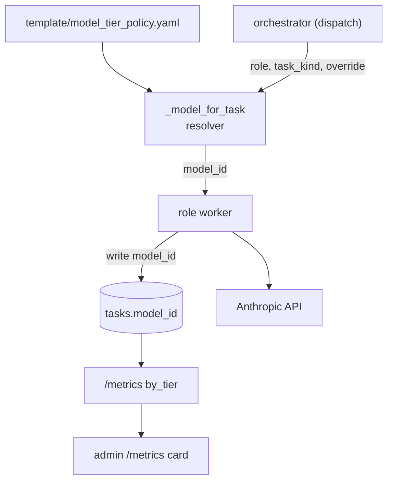

# Model tier routing

## What it does today

Routes worker tasks to Anthropic model tiers (Opus, Sonnet, Haiku)
based on `(role, task_kind)` lookup against a per-project policy file.
Replaces hard-coded model constants. Cost reduction on safe,
high-approval tasks; quality preserved via per-project opt-out and
automatic escalation on schema-failure retries (low → mid → top).

## Architecture

### Parts

- **`template/model_tier_policy.yaml`** — per-project YAML: `defaults` (top/mid/low tier model IDs) + `routes` mapping `role.task_kind` → tier alias. Validated at project load; missing entries default to top tier with a warning.
- **`_model_for_task` resolver** — single function called once per dispatch. Resolution order: explicit override → `projects.pin_top_tier` → fleet flag → policy lookup → fallback `defaults.top_tier`.
- **`tasks.model_id`** — set at dispatch time (not post-response); primary source-of-truth for which model actually ran.
- **`tasks.model_tier_override`** — nullable TEXT; populated by the retry dispatcher when a task fails with `failure_kind=schema`, signalling the next-tier escalation for the retry row.
- **`projects.pin_top_tier`** — BOOLEAN, default FALSE; per-project opt-out that always routes to `defaults.top_tier`.
- **Metrics + admin card** — `GET /v1/projects/{id}/metrics` returns `by_tier` (count, approval rate, avg cost, duration); admin renders a Recharts stacked bar.

### Data flow

Dispatcher calls `_model_for_task(role, task_kind, override, project,
settings)` → receives concrete `model_id` → writes to `tasks.model_id`
at dispatch (not post-response). Worker dispatches with that ID;
Anthropic response echoes it (mismatch logged, requested value
retained). On `failure_kind=schema`, retry dispatcher reads
`tasks.model_id`, resolves the next tier up, sets
`model_tier_override = <next_tier>` on the new task row; new dispatch
resolves via that override.

### Invariants

- **One row, one decision.** `tasks.model_id` is set at dispatch; retries produce *new rows*. Escalation is visible as a separate row with populated `model_tier_override`.
- **Policy miss is safe.** Missing `routes[role][task_kind]` → `defaults.top_tier`. No task ever runs on a cheaper tier without explicit policy.
- **Per-project opt-out wins.** `pin_top_tier=true` always routes to `defaults.top_tier`, regardless of fleet flag.
- **Retries only escalate, never loop.** low → mid → top; top retry stays top.
- **Model-tier mismatch is logged.** If Anthropic echoes a different model, log `model_mismatch` but keep the requested value as the record of intent.
- **Fleet flag is a single config flip.** `tier_routing_enabled=false` → everything routes to `defaults.top_tier`; backout in < 1 min.

## Interfaces

| Surface | Effect |
|---|---|
| `_model_for_task(project_id, role, task_kind, override, settings, project) → str` | Returns concrete model ID for dispatch |
| `template/model_tier_policy.yaml` | Declarative per-project policy; ships via template adoption |
| `tasks.model_id` (column) | Dispatch-time write; source-of-truth |
| `tasks.model_tier_override` (column) | Retry escalation signal; NULL = policy-routed |
| `projects.pin_top_tier` (column) | Per-project opt-out |
| `GET /v1/projects/{id}/metrics?period=1d\|7d\|30d` | Returns `by_tier`: count, approval rate, avg cost, duration |
| `settings.tier_routing_enabled` | Fleet flag; off → always top tier |

## Where in code

- `src/coder_core/workers/routing.py` — `_model_for_task` resolver
- `coder-system/template/model_tier_policy.yaml` — example policy
- `src/coder_core/workers/dispatcher.py` — dispatch-time write of `tasks.model_id`
- `src/coder_core/workers/orchestrator.py` — retry escalation on `failure_kind=schema`
- `migrations/00NN_model_routing.sql` — `tasks.model_id`, `tasks.model_tier_override`, `projects.pin_top_tier`
- `src/coder_core/api/metrics.py` — `by_tier` rollup
- `coder-admin/src/components/MetricsTierCard.tsx` — UI

## Evolution

Builds on [prompt-caching-architecture](./prompt-caching-architecture.md)'s cost-baseline infrastructure (cache-key
stability across tier flaps within a pipeline run).

## Links

- Spec: [0030-model-tier-routing](../../../product-specs/wip/0030-model-tier-routing.md)
- Designs: [prompt-caching-architecture](./prompt-caching-architecture.md), [observability-and-cost-tracking](./observability-and-cost-tracking.md), [token-budgets-and-cost-gates](./token-budgets-and-cost-gates.md), [worker-roles](../worker-roles.md), [worker-communication](./worker-communication.md)
- Repos: coder-core, coder-admin, coder-system
