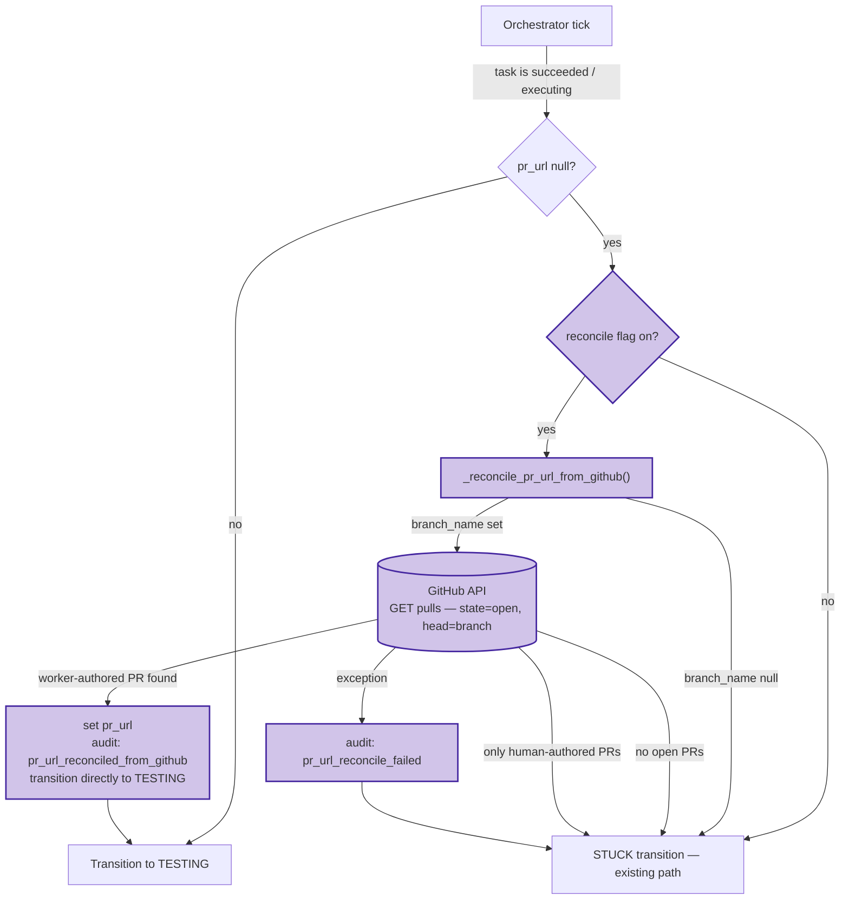

# 0054 — Orchestrator GitHub-state reconciliation

## Context

See [spec 0054](../../../product-specs/wip/0054-orchestrator-github-state-reconciliation.md)
for the problem framing. This design covers the technical shape of the
reconciliation path. All components are implemented in `coder-core` behind the
`coder_orchestrator_pr_url_reconcile_enabled` flag (default `False`).

## Goals / non-goals

Match the spec one-for-one. No expansion at the design layer.

## Architecture

## Parts

All components are implemented in `coder-core`:

- **`coder_core/workers/orchestrator.py`** (existing, edited) — `_reconcile_pr_url_from_github`
  helper (lines 715–777) and call site inside `_after_dispatch` (lines 842–895),
  in the `succeeded|executing|no pr_url` branch. No new file needed.
- **`coder_core/integrations/github.py`** — `GitHubClient.list_pulls` (line 678)
  already accepts `org`, `repo`, `head`, and `state` parameters and auto-qualifies
  a bare branch name as `{org}:{branch}`. No new method needed.
- **`coder_core/audit.py`** — `Actions.TASK_PR_URL_RECONCILED` and
  `Actions.TASK_PR_URL_RECONCILE_FAILED` registered (lines 78–79).
- **`coder_core/config.py`** (existing, edited) — `coder_orchestrator_pr_url_reconcile_enabled: bool = False`
  at line 343.
- **`tests/workers/test_orchestrator_reconcile.py`** (new) — six unit tests per AC5.
- **`tests/workers/test_orchestrator.py`** (existing, edited) — AC6 integration test.

## Data flow — happy path (worker-authored PR found)

1. Orchestrator tick fires for a task in `succeeded|executing|pr_url=null`.
2. Flag check: `settings.coder_orchestrator_pr_url_reconcile_enabled` is `True` → enter
   reconciliation. (`False` → existing STUCK path, no GitHub call.)
3. Helper checks `task_row.branch_name`. `None` or empty → return `None` → STUCK.
4. Helper resolves `project.github_org` via the existing `projects` table lookup and
   the task's `repo` field to construct the full `org/repo` identifier.
5. Helper calls `GitHubClient.list_pulls(org, repo, head=branch_name, state="open")`.
   `list_pulls` auto-qualifies the bare branch name as `{org}:{branch}` before sending
   `GET /repos/{org}/{repo}/pulls`. Returns a list of open PR dicts.
6. Filter to worker-authored PRs via `pr["user"]["type"] == "Bot"` — a stable GitHub
   API invariant: `True` for all GitHub App (bot) PRs, `False` for human accounts.
   See [ADR 0016](../../../adrs/0016-bot-identity-via-user-type.md) for why a login-name
   match was rejected (no `bot_login` field in settings; misconfiguration risk;
   `type=Bot` is more robust).
7. Pick the most recently created from the bot-authored list (sort by `created_at` desc,
   index 0). Read `pr["html_url"]`.
8. Write audit row: `action='task.pr_url_reconciled_from_github'`, `target_id=task_id`,
   `after={'pr_url': url, 'branch_name': branch, 'commit_sha': sha}`.
9. Return URL to `_after_dispatch`.
10. `_after_dispatch` (same tick, no second orchestrator tick needed):
    - Sets `row.pr_url = url`.
    - Logs `executing → executing` with `outcome='pr_url_reconciled_from_github'`
      and commits. *(Self-loop entry: marks the reconciliation event in `task_logs`.)*
    - Sets `row.stage = TESTING`, logs `executing → TESTING` with `outcome='succeeded'`,
      and commits.
    - Returns `TESTING`.

    > **Note:** spec AC2 described returning the current stage and letting the next
    > orchestrator tick handle the `executing → testing` transition. The implementation
    > performs both the reconciliation log and the stage transition in the same
    > `_after_dispatch` call, avoiding an extra DB round-trip. The observable outcome
    > is identical.

## Data flow — fail-soft cases

- **`branch_name` is None.** Helper returns `None` immediately, no GitHub call.
  STUCK transition runs.
- **GitHub returns no open PRs.** Helper returns `None`, no audit row (not a failure,
  nothing to reconcile). STUCK transition runs.
- **GitHub returns only human-authored PRs.** Helper returns `None`, no audit row.
  STUCK transition runs. Operator may have opened a recovery PR separately; we don't
  conflate.
- **GitHub call raises (rate limit, network, auth).** Helper catches, writes
  `task.pr_url_reconcile_failed` audit row with error metadata, returns `None`.
  STUCK transition runs.
- **GitHub returns a malformed response.** Same fail-soft path as raised exception.

## Invariants

- **Fail-soft.** The helper never raises. Any error returns `None` → the existing STUCK
  path runs unchanged. We never block a task because reconciliation failed.
- **Read-only.** One `GET /repos/.../pulls` call per reconciliation attempt. Never opens,
  comments on, or closes a PR.
- **Idempotent.** On a successful reconciliation, `_after_dispatch` transitions the task
  to TESTING in the same tick, so a subsequent orchestrator call sees `stage=TESTING`
  and never re-enters the reconciliation path. If the flag check races with a concurrent
  tick that already populated `pr_url`, the outer `if not row.pr_url` guard in
  `_after_dispatch` exits before calling the helper.
- **Backward compatible.** When the flag is off OR when `parse_pr_url` already extracted
  a URL from worker stdout, the new code path is bypassed entirely.
- **Only on the success path.** Gated on `status == SUCCEEDED` AND `stage == EXECUTING`.
  Failed and timed-out tasks have different recovery semantics (out of scope).

## Interfaces

- **No new HTTP endpoints.** Internal orchestrator change only.
- **GitHub call:** `GET /repos/{org}/{repo}/pulls?head={org}:{branch_name}&state=open`.
  Uses the per-project GitHub PAT already available to the dispatcher.
- **Audit:** two new action strings registered in `coder_core/audit.py`:
  `task.pr_url_reconciled_from_github` and `task.pr_url_reconcile_failed`.
- **Settings:** `coder_orchestrator_pr_url_reconcile_enabled: bool = False` in
  `coder_core/config.py`.

## Open questions

Inherited from spec — see [spec 0054 § Open questions](../../../product-specs/wip/0054-orchestrator-github-state-reconciliation.md#open-questions).

## Rollout

- **Stage 0 — code lands behind flag.** All components are shipped with
  `coder_orchestrator_pr_url_reconcile_enabled = False`. The new code path is
  unreachable in prod until the flag is flipped.

- **Stage 1 — flip on `coder` project only.** Set
  `CODER_ORCHESTRATOR_PR_URL_RECONCILE_ENABLED=true` via Cloud Run env update
  (no code change, no rollout race — the change only activates a previously
  unreachable code path). Observe for a few days. Headline metric: count of
  `task.pr_url_reconciled_from_github` audit rows; each represents a task that
  would have been mis-marked stuck under the old behaviour.

- **Stage 2 — fleet flip.** No project-scoped opt-in needed; this is
  orchestrator-side behaviour, uniform across all projects.

## Backout plan

- **Off via flag.** Set `coder_orchestrator_pr_url_reconcile_enabled=false`. Immediate
  effect: new code path bypassed; existing STUCK transition runs as before. No state
  cleanup required.
- **Wholesale removal.** Helper, call-site delta, audit actions, and settings field can
  be dropped at the next major version. No migrations to revert; no external state to undo.

## Links

- Spec: [0054](../../../product-specs/wip/0054-orchestrator-github-state-reconciliation.md)
- ADR: [0016 — bot-identity-via-user-type](../../../adrs/0016-bot-identity-via-user-type.md)
- Related designs:
  [worker-roles](../worker-roles.md),
  [worker-communication](./worker-communication.md)
- Realised pain: [coder-core#36](https://github.com/coder-devx/coder-core/pull/36)
