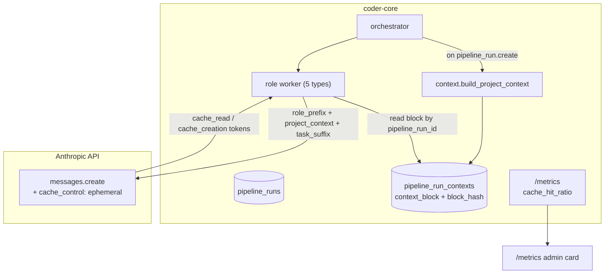

# Prompt caching & shared context reuse

## What it does today

Reduces token cost and latency by marking stable prompt prefixes (role
system prompt + AGENTS.md + project context) with Anthropic's
`cache_control: {"type": "ephemeral"}`. Role workers reuse the same
cached prefixes fleet-wide; all sibling tasks in one pipeline run
share an identical project-context block materialised once at run
creation. Per-role and aggregate cache-hit ratio is tracked on
`/metrics`.

## Architecture

### Parts

- **`pipeline_run_contexts` table** — one row per run; stores the materialised `context_block` (AGENTS.md + active designs body) and SHA256 `block_hash`. Written once at pipeline creation.
- **`context.build_project_context(project_id, spec_id)`** — constructs the prefix: reads Knowledge API with `min_freshness=40`, resolves `affects_services` / `affects_repos` / `served_by_designs` to active designs, concatenates in stable order.
- **Role worker prompt split** — three blocks with `cache_control`: role system prefix (cached fleet-wide), project context (cached per-run), task-specific suffix (uncached).
- **`tasks` row fields** — `cache_read_input_tokens`, `cache_creation_input_tokens` (captured from Anthropic response, recorded unconditionally).
- **Metrics** — `GET /v1/projects/{id}/metrics` returns `cache_hit_ratio: {over_window, by_role}`; rolling-24h Slack alert via `SLACK_CACHE_HIT_FLOOR`.

### Data flow

Pipeline orchestrator calls `build_project_context(project_id, spec_id)`
at run creation, persists `(context_block, block_hash)` to
`pipeline_run_contexts`. Each role worker fetches the block by
`pipeline_run_id`, builds the three-part prompt with cache markers,
sends to Anthropic, and writes `cache_read_input_tokens` +
`cache_creation_input_tokens` to its `tasks` row on completion.

### Invariants

- **Byte-identical prefix across siblings** — sibling tasks in one `pipeline_run_id` send identical project-context bytes (materialised block, not recomputed).
- **Role prefix is fleet-wide** — role system prompt is the same across all projects, so hits amortise across tenants.
- **Metric capture is unconditional** — `prompt_caching_enabled` flag gates `cache_control` *emission* but not response *parsing*; counters always recorded for baseline.
- **Cache TTL is 5 min** — shorter than a typical pipeline run; sibling dispatch within TTL yields high hit ratio in aggregate.
- **`min_freshness=40`** is the default in `build_project_context`; per-run override exists for rewrite runs.

## Interfaces

| Surface | Effect |
|---|---|
| `build_project_context(project_id, spec_id, freshness_floor_override=None)` | Returns `(context_block, block_hash)` |
| `POST /v1/projects/{id}/pipeline-runs` | Orchestrator writes row + persists context to `pipeline_run_contexts` |
| Role worker loader | Queries `pipeline_run_contexts` by `pipeline_run_id`; injects block into prompt |
| `GET /v1/projects/{id}/metrics` | Returns `cache_hit_ratio: {over_window, by_role}` |
| `SLACK_CACHE_HIT_FLOOR` (env) | Fleet alert if rolling-24h ratio drops below threshold |
| `apply_cache_prefix(system_prompt, project_context_block, enabled)` | Worker helper; flag-gated cache_control emission |

## Where in code

- `src/coder_core/workers/context.py` — `build_project_context`, `apply_cache_prefix`
- `src/coder_core/workers/orchestrator.py` — calls `build_project_context` on pipeline-run creation
- `src/coder_core/workers/{pm,architect,team_manager,developer,reviewer}.py` — prompt builders split into three blocks with `cache_control`
- `src/coder_core/api/metrics.py` — `cache_hit_ratio` computation
- `migrations/0032-pipeline_run_contexts.sql`, `0033-tasks_pipeline_run_id.sql`, `0034-projects_prompt_caching_enabled.sql`
- `coder-admin/src/components/MetricsCard.tsx` — cache-hit visualisation

## Evolution

Canary enabled 2026-04-19 on the `coder` project; fleet enabled the
same day. `SLACK_CACHE_HIT_FLOOR` remains 0 pending fleet-median
measurement. Backout: flip `prompt_caching_enabled = False` (no
migration needed).

## Links

- Spec: [0029-prompt-caching](../../../product-specs/wip/0029-prompt-caching.md)
- ADR: [0014](../../../adrs/0014-affects-services-and-repos-as-design-frontmatter.md) (freshness from declared affects)
- Designs: [observability-and-cost-tracking](./observability-and-cost-tracking.md), [worker-roles](../worker-roles.md), [worker-communication](./worker-communication.md), [model-tier-routing](./model-tier-routing.md)
- Repos: coder-core, coder-admin
