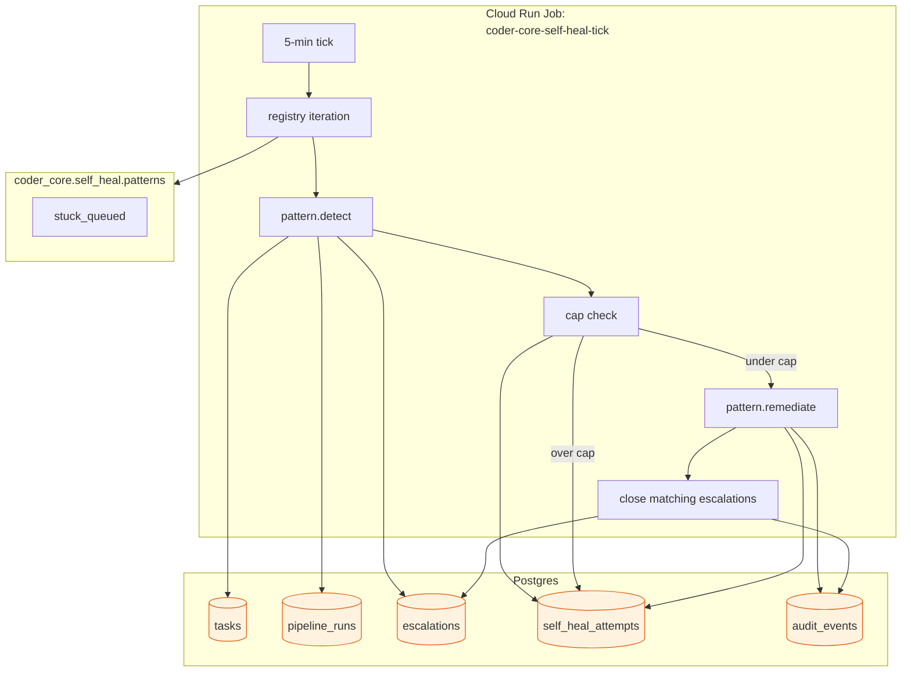

# Self-healing stuck pipelines

## What it is

One Cloud Run Job (`coder-core-self-heal-tick`), one table
(`self_heal_attempts`), one registry of `Remediator`
implementations, one tick function. Every 5 minutes `tick()` runs
each registered remediator's `detect` against DB state, checks the
per-pattern-per-target daily cap, either invokes `remediate` (in
`apply` mode) or records a `dry_run` row (in `dry_run` mode), and
on success closes any matching open escalation.

The design constraint is **safety, not cleverness.** A remediator
is allowed to ship only if its worst-case behaviour is no change —
i.e. a spurious detect invokes an idempotent operator recovery that
has no side effect on an already-healthy target. No "best-effort"
remediations, no "probably safe if the run is in state X"
heuristics. If we can't prove safety, it stays a human page.

## Architecture

## Parts

- **`Remediator` protocol** (`self_heal/protocol.py`). Minimal
  async interface: `pattern_id: str`, `target_type: str`,
  `async detect(session, now) -> list[Target]`, `async
  remediate(target) -> Outcome`. Outcome classes:
  `Remediated(detail)`, `Failed(detail)`, `Skipped(reason)`. Each
  target carries `(project_id, target_id, summary)` for attempt
  logging and escalation resolution.
- **Registry** (`self_heal/registry.py`). A simple list mapping
  enabled remediators. v1: `[StuckQueuedRemediator()]`. Adding a
  pattern is a one-line import + append.
- **Watcher entrypoint** (`self_heal/watch.py`,
  `python -m coder_core.self_heal.watch`). Main loop:
  1. If `settings.self_healing_enabled` is false → return early.
  2. For each remediator: resolve its mode (`off`/`dry_run`/`apply`).
  3. `await remediator.detect(session, now)` → list of targets.
  4. For each target: check cap (`_cap_hit`). If over → record
     `skipped_cap` row, no audit, continue.
  5. If mode=`dry_run` → record `dry_run` row, no remediate, no
     audit.
  6. If mode=`apply` → `await remediator.remediate(target)` →
     outcome. Record attempt row + audit event. On `Remediated`,
     call `_close_related_escalations(target)`.
- **Cap check** (`_cap_hit`). `SELECT count(*) FROM
  self_heal_attempts WHERE pattern_id=? AND target_id=? AND
  attempted_at >= now() - interval '1 day'`. Cap default is 1 per
  day per (pattern, target). Second hit lands `skipped_cap`.
- **Attempt recording** (`_record_attempt`). One
  `self_heal_attempts` row inside a short transaction; audit event
  written atomically for `remediated` and `failed` outcomes only
  (`skipped_cap` and `dry_run` are row-only).
- **Escalation close** (`_close_related_escalations`). After a
  successful remediation, find every open `escalations` row whose
  `pipeline_run_id` or `task_id` matches the target, call
  `.../resolve` with the system actor. Idempotent — if the row is
  already acknowledged or resolved, the resolve call is a no-op
  per [escalations](./escalations.md) invariant 4.

### v1 pattern — `stuck_queued`

- **Detect.** `SELECT * FROM tasks WHERE status='queued' AND
  updated_at <= now() - interval '15 min'` → candidates. For each,
  check `DispatcherQueue.depth(project_id) == 0` and the project's
  `worker_concurrency_soft` is not artificially pinned to 0.
- **Remediate.** Re-enqueue via the existing override path
  (`launch_re_enqueue(task_id)` →
  `_orchestrate_safe(task_id)`). Idempotent: if the task has
  already progressed, the override is a no-op.
- **Safety proof.** A spurious detect on a task that's actually
  progressing: the override path checks `status` again and bails
  if it's no longer `queued`. Worst case: an extra attempt row +
  audit event, no wrong action.

## Invariants

1. **Every target gets at most one attempt per day per pattern.**
   Enforced by the cap check; `skipped_cap` rows preserve the
   attempt-to-page alignment.
2. **Remediators are idempotent.** A re-run of `remediate` on the
   same target produces the same outcome or a trivially different
   one (no divergent side effects). New patterns must demonstrate
   this in their tests.
3. **Escalation close is best-effort but auditable.** If the
   `.../resolve` call fails (e.g. escalation already resolved), the
   watchdog logs + moves on — remediation is not rolled back. The
   subsequent tick sees the remediated target as healthy and won't
   re-attempt.
4. **Watchdog is stateless.** Crash mid-tick leaves DB consistent;
   next tick resumes from DB state.
5. **Flag default off.** Both the fleet flag and new-pattern
   defaults lean safe. No pattern lands in `apply` without a soak
   in `dry_run` first.

## Data flow

### Scenario A — stuck_queued remediation closes an escalation

1. Task `xyz` sits in `queued` for 20 min. Project's
   `DispatcherQueue` depth is 0; worker concurrency is not pinned.
2. An 0041 stall escalation has already opened against `xyz`'s
   pipeline_run at L0 (Slack channel).
3. 5-min tick: `stuck_queued.detect()` returns `xyz`. Cap check
   passes. Pattern is in `apply` mode.
4. `remediate(xyz)` calls the override re-enqueue path; task
   transitions to `executing`.
5. Watcher writes `self_heal_attempts` row
   (`outcome='remediated'`), emits `self_heal.remediated` audit.
6. `_close_related_escalations(xyz)` finds the open stall
   escalation, POSTs `/escalations/{id}/resolve` with
   `resolved_by_id='self_healing'`. Audit row on the escalation
   side (`escalation.resolved`, `actor_id='self-healing-watchdog'`).
7. 0041 L1 / L2 never fire.

### Scenario B — cap prevents a remediation loop

1. Same setup. Remediation runs, but the re-enqueue doesn't stick
   (e.g. worker crashes immediately; task goes back to `queued`).
2. Next tick detects `xyz` again. Cap check hits — there's already
   an attempt row today.
3. Watcher writes `outcome='skipped_cap'` attempt row (no audit).
   Escalation ladder continues as normal — L1 / L2 fire as
   designed.

### Scenario C — `dry_run` soak

1. New pattern `zombie_executing` ships in mode `dry_run`.
2. Each tick: detect runs, attempts row recorded with
   `outcome='dry_run'`, no remediate, no escalation touched.
3. Operator reviews attempt rows for a week; if detect's
   false-positive rate is <5% and detection coverage matches
   operator expectations, mode flips to `apply`.

## Interfaces

### Files shipped (c992a7b)

- `coder-core/src/coder_core/self_heal/{__init__,models,protocol,
  registry,watch}.py`
- `coder-core/src/coder_core/self_heal/patterns/{__init__,
  stuck_queued}.py`
- `coder-core/src/coder_core/domain/self_heal_attempt.py`
- `coder-core/migrations/versions/0049_self_heal_attempts.py`
- `coder-core/tests/test_self_heal_watch.py` (556 LoC)
- `coder-core/src/coder_core/audit.py` — two new actions:
  `self_heal.remediated`, `self_heal.failed`.
- `coder-core/src/coder_core/config.py` — `self_healing_enabled`
  setting and per-pattern mode config.

### Shipped 2026-04-25 — `zombie_executing` v1.1 (timestamp-based)

Pattern at `patterns/zombie_executing.py`. Detects rows in
`status='running'` whose `started_at` is older than
`zombie_executing_min_minutes` (default 25). Remediates by
CAS-updating `status` from `running` → `queued` (so an in-flight
worker that legitimately races us across the tick wins the CAS
and emits a benign `action='already_moved'`) then re-invoking
`orchestrate_task` via the same launcher hook `stuck_queued` uses.
Same mode flag conventions (`off` / `dry_run` / `apply`) and same
attempt-row + audit shape — the watch loop doesn't need to know
this is a different pattern.

This shipped in place of the heartbeat-based design below because
the operationally-felt symptom is "rows stuck for hours/days after
a Cloud Run instance died mid-dispatch", not "rows stuck for
minutes" — the timestamp signal is fine for the slow case and
needs zero schema work.

### Watchdog infra deployed 2026-04-25

The Cloud Run Job `coder-core-self-heal-tick` was created in prod
on 2026-04-25 along with a matching Cloud Scheduler entry that
triggers it every minute. Job runs `python -m coder_core.self_heal.watch`
under the `coder-core-sa` service account against the prod database
via the Cloud SQL Connector — same shape as the existing
`coder-core-auto-approve-tick` job (image, env, secrets, network).
Without this, `tick()` had no callsite — the patterns + master flag
were inert. Verified: scheduled run at 15:06:36 UTC succeeded;
empty `remediated`/`dry_runs` lists confirm no false positives on
the (already-clean) dogfood project.

### Not yet shipped (v1 deferred)

- `zombie_executing` heartbeat-based variant — would replace the
  timestamp signal with `tasks.heartbeat_at` for sub-minute
  detection. Needs the column, the `PATCH /tasks/{id}/heartbeat`
  endpoint, and the `with_heartbeat` supervisor wrapper in
  `coder_core/workers/_runtime.py`. Lands when "row stuck for 25
  min" stops being the dominant symptom.
- `orphan_chain_hook` pattern — requires
  `POST /v1/_admin/pipeline-runs/{id}/replay-chain` endpoint.
- Admin UI `/admin/self-heal` + `VITE_SELF_HEAL_ENABLED` flag —
  deferred until fleet flag flips on and there's attempt data
  worth surfacing.

## Rollout

1. **Stage 1 — schema + watcher shadow (shipped).** Migration
   0049 applied. Watcher deployed with
   `CODER_SELF_HEALING_ENABLED=false` — short-circuits before
   pattern registry iteration. Confirms Cloud Run Job + Scheduler
   provisioning is healthy.
2. **Stage 2 — `stuck_queued` in `dry_run`.** Fleet flag flips on;
   pattern mode stays `dry_run`. Attempt rows collected; operator
   reviews detect accuracy before flipping to `apply`.
3. **Stage 3 — `stuck_queued` in `apply`.** Flip pattern mode to
   `apply` for `coder` first. Soak + measure capture rate (open
   escalations resolved by the watchdog before L1). Expand to
   fleet when capture rate is sane and no false-positive
   remediation is observed.
4. **Stage 4 — expand pattern registry.** Each new pattern ships
   in `dry_run` first, follows the same soak-then-apply path.

## Backout

- `CODER_SELF_HEALING_ENABLED=false` — watcher short-circuits.
- Per-pattern mode → `off` — pattern ignored even when flag is on.
- `self_heal_attempts` rows are pure diagnostic; no downstream
  dependency on the row set. Table can be truncated at will.

## Open questions

- **Remediation that needs more than one pass.** Some patterns
  (e.g. replay-chain) might require retry with exponential backoff.
  v1's 1-per-target-per-day cap is too coarse if retry is part of
  normal operation. Revisit when the second pattern needs it —
  likely add a per-pattern override to the cap.
- **Attempt-row retention.** No GC yet; same shape as audit
  events. 1-year retention stamp is the natural default once the
  audit-events eviction cron ships.

## Links

- Spec: [self-healing](../../../product-specs/active/self-healing.md)
- Related designs: [escalations](./escalations.md),
  [worker-communication](./worker-communication.md),
  [worker-roles](../worker-roles.md),
  [audit-log](../tenancy/audit-log.md)
