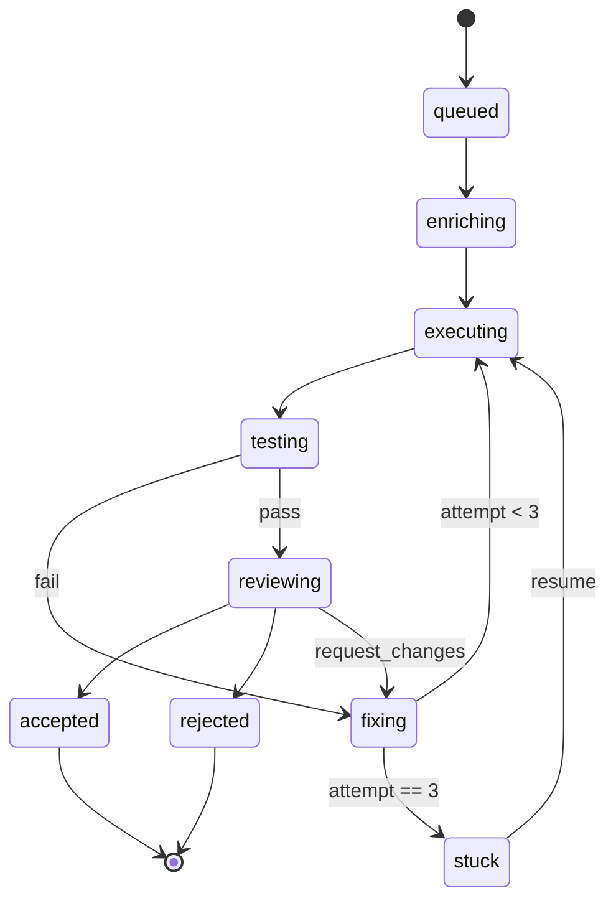

# Task lifecycle and overrides

## What it is

Two orthogonal state axes on a task: a worker-status machine tracking
subprocess lifecycle and a pipeline-stage machine tracking position in
the multi-step Developer pipeline. The orchestrator advances stages on
verdict messages; admins override via five named actions sent to a
single endpoint.

## Architecture

### Parts

- `TaskStatus` — worker-lifecycle enum (`queued / running / succeeded / failed / timed_out / cancelled`); orthogonal to stage.
- `TaskStage` — pipeline-position enum (`blocked / queued / enriching / executing / testing / fixing / reviewing / accepted / rejected / stuck`); `NULL` on legacy pre-orchestration rows.
- `fix_attempts` — counter capped at `MAX_FIX_ATTEMPTS=3`; exceeding it moves the task to `stuck`.
- `TaskOverride` — operator-issued mutation; carries `action` and (for `skip_to_stage`) `target_stage`.

### Data flow

Status flips at lease + completion (dispatcher). Stage flips on verdict
messages (orchestrator). Override actions write directly inside a
transaction that emits an audit event.

### Invariants

- Status and stage are independent: a task can be `running` and `stuck` simultaneously (mid-work, operator paused).
- `MAX_FIX_ATTEMPTS=3` exceeded → `stuck` (non-terminal). Operator must explicitly `resume` or `reject`.
- `skip_to_stage` does **not** validate the target is reachable — direct jump; operator owns consequences.
- Legacy `stage=NULL` rows accept `retry`, `skip_to_stage`, `reject`; `pause` / `resume` require a real stage.

## Interfaces

| Field / Action | Values |
|---|---|
| `status` | queued · running · succeeded · failed · timed_out · cancelled |
| `stage` | blocked · queued · enriching · executing · testing · fixing · reviewing · accepted · rejected · stuck · NULL |
| `OverrideAction` | pause · resume · retry · skip_to_stage · reject |
| `POST /v1/projects/{id}/tasks/{tid}/override` | Apply an action; `target_stage` required iff action is `skip_to_stage` |

## Where in code

- `src/coder_core/domain/task.py` — `TaskStatus` (worker-status enum)
- `src/coder_core/domain/task.py` — `TaskStage` (pipeline-stage enum)
- `src/coder_core/domain/task.py` — `TaskOverride` dataclass (`action` + `target_stage`)
- `src/coder_core/workers/orchestrator.py` — `MAX_FIX_ATTEMPTS` constant
- `src/coder_core/tasks/override_service.py` — override action dispatch

## Evolution

- Stage machine added to model spec 0014 dispatch pipeline.
- Override actions extended with `skip_to_stage` (spec 0036).

## Links

- Specs: pipeline-operations
- Designs: pipeline-operations, worker-communication, dispatcher
- Repos: coder-core
