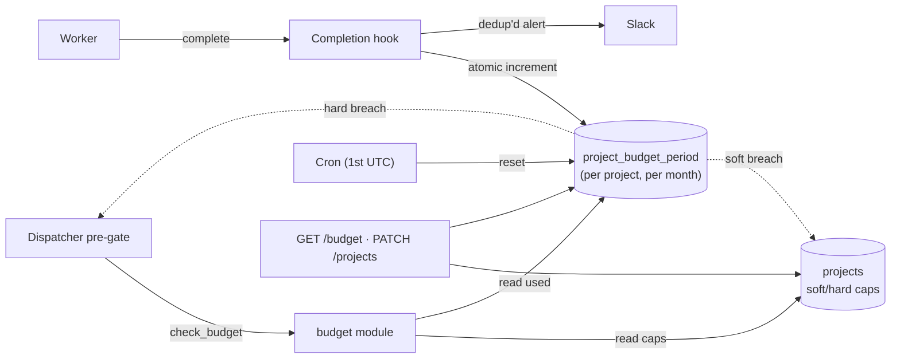

# Per-project token budgets & cost gates

## What it does today

Enforces per-project monthly token budgets via a pre-dispatch gate and
a post-completion rollup. One `project_budget_period` row per project
per month holds the month's spend, soft/hard breach timestamps, and
override audit trail. Dispatcher checks the hard cap before spawning
workers; completion hook increments usage and fires Slack alerts. Soft
breach flips the downshift flag that the [model-tier-routing](./model-tier-routing.md)
resolver respects; hard breach blocks dispatch unless an operator
overrides per-task.

## Architecture

### Parts

- **`projects` columns** — `budget_soft_tokens`, `budget_hard_tokens` (BIGINT, NULL → fleet default), `budget_downshift_active_until_month_end` (BOOLEAN).
- **`project_budget_period` table** — PK `(project_id, period_yyyymm)`; columns: `tokens_used`, `soft_breach_at`, `hard_breach_at`, `downshift_activated_at`, `last_slack_alert_at`, `last_override_at`, `override_granted_by`.
- **`tasks` additions** — `budget_override_granted_at` (TIMESTAMPTZ NULL); `failure_kind` enum extended with `"budget"`.
- **`coder_core/budget.py`** — `check_budget`, `record_usage`, `reset_budget_period`.
- **Dispatcher pre-gate + completion hook** — embedded in worker pipeline; calls `budget` module; fires Slack; sets downshift flag.

### Data flow

Task enters QUEUED → dispatcher calls `check_budget()` → returns
`allow` → worker spawns → completes → hook calls `record_usage()`
(atomic increment) → post-increment compared to caps → no breach,
done. Soft breach: hook flips `budget_downshift_active_until_month_end`,
which model-tier-routing observes on next dispatch. Hard breach:
`check_budget()` returns `hard_block`; task transitions to
`budget_blocked` and waits for operator override (per-task).

### Invariants

- **Single row is the only writable counter** — all task completions serialise on one `project_budget_period` row via atomic UPDATE.
- **Dispatch and rollup are separate transactions** — race acceptable; the next task after overflow will hard-block.
- **Override is per-task, not per-window** — each blocked task needs its own operator override.
- **Calendar month is the period** — UTC 00:00 on the 1st; no DST or tenant-local calendars.
- **Fleet default is a floor, not a ceiling** — per-project non-NULL fully overrides.
- **Cache tokens counted at proxy rates** — cache-creation at 1.25×, cache-read at 0.1× (matches Anthropic billing).

## Interfaces

| Surface | Effect |
|---|---|
| `check_budget(project_id) → BudgetDecision` | Pre-dispatch; returns `allow` / `soft_warn` / `hard_block` |
| `record_usage(project_id, period, tokens) → (used, soft, hard)` | Atomic increment; returns post-state for alert logic |
| `GET /v1/projects/{id}/budget` | JSON: period, caps, used, breach timestamps, downshift flag |
| `PATCH /v1/projects/{id}` (`budget_soft_tokens`, `budget_hard_tokens`) | Operator-set per-project caps |
| `POST /v1/projects/{id}/tasks/{tid}/budget-override` | Operator grants single-task override |
| Admin budget card | Recharts progress bar; override modal on `budget_blocked` |

## Where in code

- `src/coder_core/budget.py` — `check_budget`, `record_usage`, `reset_budget_period`
- `src/coder_core/workers/dispatcher.py` — pre-gate call site
- `src/coder_core/workers/pipeline_chain.py` — post-completion hook
- `src/coder_core/api/budget.py` — `GET /budget`, `PATCH /projects`, override endpoint
- `migrations/00NN_projects_budget.sql` + `00NN_project_budget_period.sql`
- `coder-admin/src/components/BudgetCard.tsx` — UI

## Evolution

Builds on spec 0031 and [observability-and-cost-tracking](./observability-and-cost-tracking.md). Cache-token
multiplier matches Anthropic billing (1.25× create, 0.1× read).

## Links

- Spec: [0031-token-budgets](../../../product-specs/wip/0031-token-budgets.md)
- Designs: [observability-and-cost-tracking](./observability-and-cost-tracking.md), [model-tier-routing](./model-tier-routing.md), [prompt-caching-architecture](./prompt-caching-architecture.md), [worker-communication](./worker-communication.md)
- Repos: coder-core, coder-admin
