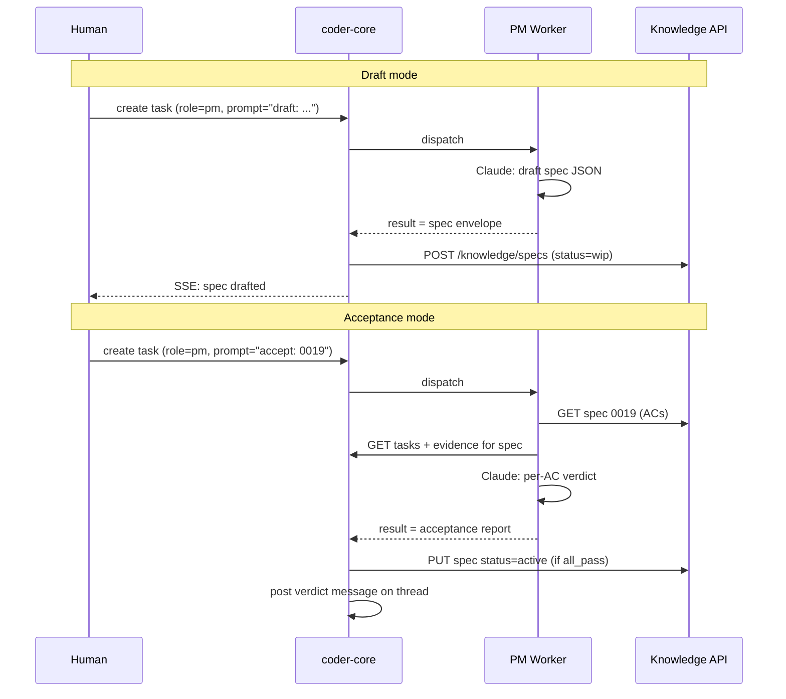

# PM Worker

## What it is

The PM worker automates the two most human-intensive parts of the
product lifecycle: **drafting specs** from a problem statement, and
**acceptance-testing** delivered work against its ACs. It follows the
same subprocess pattern as the Developer, Reviewer, and Team Manager
workers — receive a task, call Claude, parse the JSON envelope, write
the result back. Humans stay in the loop: they approve every draft
spec and the PM's acceptance verdict is visible on the task thread.

## Architecture

### Parts

- **`workers/pm.py`** — `run_pm_task(task)` parses `mode` from the
  prompt prefix (`draft:` or `accept:`) and branches to
  `_run_draft` / `_run_accept`.
- **System prompt** — `system/roles/pm.md` with role definition,
  embedded spec template, output-format instructions for both modes,
  and AC quality criteria.
- **Schema gate** — `workers/_compliance.py::validate_and_retry`
  wraps the Claude output with `workers/schemas/pm_draft.json` or
  `workers/schemas/pm_accept.json` before Phase 4 runs. On validation
  failure, re-prompts Claude with the schema, validator errors, and
  last raw output verbatim, up to `worker_output_compliance_budget`
  (default 2). On exhaustion returns `SchemaFailure`; Phase 4
  short-circuits and the dispatcher writes `failure_kind="schema"`.
- **Transient retry** — `workers/_transient_retry.py::run_with_transient_retry`
  wraps the `claude` subprocess spawn. `workers/_transient.py::classify`
  tags the spawn result as `transient` / `permanent` / `unknown`
  based on envelope subtype + stderr substring + exit code. Transient
  failures re-spawn with full-jitter exponential backoff up to
  `worker_transient_retry_budget` (default 3). Budget exhaustion
  returns `TransientFailure`; the dispatcher writes
  `failure_kind="transient"`. Recovered runs carry a
  `RetryHistory` the dispatcher persists on `tasks.transient_retry_history`.
- **Dispatcher Phase 4 for PM** — on succeeded PM tasks, parses the
  result and calls `_create_spec_from_draft` (via knowledge write
  API) or `_process_acceptance` (status transition + verdict
  message on thread). Only runs on the `ValidatedOutput` branch —
  schema-failed tasks produce zero Phase 4 side effects.
- **Configuration** — `pm_system_prompt_path` in `Settings`;
  `_system_prompt_path_for("pm")` wired.
- **Pipeline routing** — PM tasks are **not** orchestrated:
  `pipeline_roles = frozenset({"developer", "reviewer"})`. PM runs
  once and completes — no test/review stages.

### Data flow

**Draft.** Prompt = `draft: <problem statement>`. Claude emits a
JSON envelope `{id, title, frontmatter, body}`. Phase 4 POSTs it to
the knowledge write API at `status=wip`. The human reviews in the
knowledge browser.

**Acceptance.** Prompt = `accept: <spec_id>`. The worker loads the
spec's ACs and the task evidence (results, PR URLs, test output),
then Claude emits a report `{spec_id, verdicts[], all_pass}` where
each verdict is `pass | fail | partial` with cited evidence. Phase 4
posts a decision message on the originating task thread; if
`all_pass`, it PUTs the spec to `status=active` via the knowledge
write API.

### Invariants

- Humans approve every drafted spec (drafts land in `wip/`).
- Each AC gets an explicit verdict with cited evidence.
- PM tasks don't enter the orchestrated developer/reviewer pipeline.
- PM writes through `tasks`, `task_messages`, and the knowledge
  write API; `failure_kind` / `failure_detail` / `output_schema_version`
  columns on `tasks` (migration 0020) carry schema-failure state.
- Malformed Claude output triggers the `validate_and_retry` re-prompt
  loop; on budget exhaustion the task row alone is mutated
  (`failure_kind="schema"`) — zero partial spec files, zero
  acceptance reports written.

## Interfaces

- Task API: `role=pm`, prompt prefix `draft:` or `accept:`.
- Knowledge write API (consumed): creates `specs/wip/*`, promotes
  `specs/wip → specs/active` on acceptance.
- Task messages (consumed): verdict summary posted on the spec's
  originating task thread.
- SSE: inherits existing task events — no new event types.

## Evolution

- `0009-pm-worker` (spec 0016) — introduced the two-mode PM worker,
  its system prompt, and Phase 4 integration. Dog-fooded by having
  PM draft a real spec and run acceptance on a delivered one.
- `0025` — worker output compliance: `pm_draft.json` and
  `pm_accept.json` schemas, `validate_and_retry` gate before Phase 4,
  schema-failure lifecycle via migration 0020's task columns. See
  ADR 0012 for the re-prompt-only remediation choice.
- `0027` — transient-failure retry: the claude spawn is wrapped in
  `run_with_transient_retry` with worker-level budget and backoff.
  ADR 0013.
- 0055 — `GH_TOKEN` injection through the shared
  `_github_env.apply_github_token_env` helper, populated from the
  dispatcher-resolved `WorkerInput.github_token`. PM tasks no
  longer need a workspace clone to authenticate `gh` commands.
  See [worker-roles](./worker-roles.md).

## Links

- Specs: [`0016`](../../product-specs/wip/0016-pm-worker-v1.md)
- Designs: team-manager-worker, knowledge-write-api,
  worker-communication, worker-roles
- Services: `coder-core`
