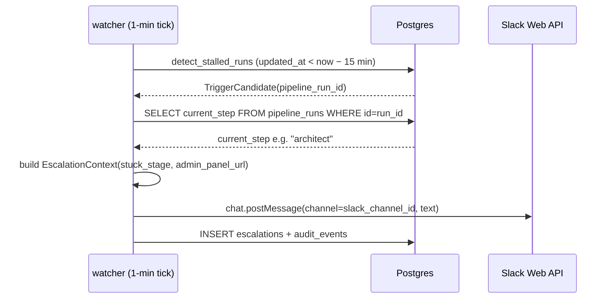

# Enable stuck-pipeline Slack paging at 15-minute threshold

## Context

The `escalations` design (c992a7b) shipped the full stall-detection and Slack/DM/PagerDuty
ladder but left three production gaps:

1. `CODER_ESCALATIONS_ENABLED` defaults to `false` — the watcher short-circuits on every tick.
2. `sla_stall_minutes` defaults to 60 — too loose for the ≤ 16-minute stall-to-page SLA.
3. The L0 Slack dispatcher (`dispatch_slack_channel`) posts to the fleet-wide Incoming Webhook
   rather than the per-project `escalation_slack_channel_id`; the message template omits
   the stuck step name and admin-panel deep-link required by AC2.

## Goals / non-goals

Close the three gaps. No new watchdog, no PagerDuty wire-up, no auto-remediation.

## Design



### Components

**`EscalationContext` — `escalations/models.py`**
Two new optional fields:
- `stuck_stage: str | None` — `pipeline_runs.current_step` for stall triggers (`"architect"`,
  `"pm_draft"`, etc.); `None` for failure-streak / sla-breach triggers.
- `admin_panel_url: str | None` — `{CODER_ADMIN_PANEL_URL}/projects/{project_id}/runs/{run_id}`
  for run-keyed escalations; `…/tasks/{task_id}` for task-keyed ones; `None` when
  `CODER_ADMIN_PANEL_URL` is unset.

`context_from_row` accepts both as optional kwargs (defaulting to `None`) so `advance_rungs`
(L1+) callers need no change; the L1 DM and L2 PagerDuty templates don't require them.

**`open_escalation` — `escalations/watcher.py`**
For stall-trigger candidates, add a single `SELECT current_step FROM pipeline_runs WHERE
id = candidate.pipeline_run_id` before building the context. Guard `if run is None` —
escalation still opens with `stuck_stage=None`. Construct `admin_panel_url` from
`settings.admin_panel_url` + run id.

**`dispatch_slack_channel` — `escalations/dispatchers/slack.py`**
Replace the fleet Incoming Webhook with `chat.postMessage` via `post_slack_chat_message`
(already used by the L1 DM dispatcher, no new dependency):
- Use `ctx.slack_channel_id` as channel target.
- Null `slack_channel_id`: log `WARNING escalation.dispatch_skipped reason=no_channel`;
  return `skipped:no_channel`. Ladder advances to L1 — no crash, no cross-project delay (AC5).
- Unset `SLACK_BOT_TOKEN`: return `skipped:no_web_api_token` (mirrors existing L1 guard).

**`_render_channel_text` — `escalations/dispatchers/slack.py`**
New template (all three AC2 fields present):
```
:rotating_light: stall — *{project_name}* stuck at *{stuck_stage}*
run={pipeline_run_id}  escalation={escalation_id}
<{admin_panel_url}>
```
Absent `stuck_stage` or `admin_panel_url` fields are omitted; message still sends.

**`config.py`**
Add `admin_panel_url: str | None = None` (env `CODER_ADMIN_PANEL_URL`).

**Ops — `coder` project row**
```
PATCH /v1/projects/coder
  { "sla_stall_minutes": 15,
    "escalation_slack_channel_id": "<channel_id>",
    "escalation_policy": "standard" }
```

**Ops — Cloud Run env** (`coder-core-escalation-watch` + `coder-core`)
```
CODER_ESCALATIONS_ENABLED=true
CODER_ADMIN_PANEL_URL=https://coder-admin-<hash>-ew.a.run.app
```

### Edge cases

- **`slack_channel_id` null**: dispatcher returns `skipped:no_channel` at WARNING level;
  L1 DM still fires at `next_rung_due_at`. No crash, no delay to other projects (AC5).
- **`admin_panel_url` config missing**: URL line omitted; run/escalation IDs in the message
  allow manual navigation without a code change.
- **`pipeline_runs` row absent for stall candidate**: defensive `if run is None` guard;
  `stuck_stage=None`, escalation still opens and L0 fires.
- **Concurrent ticks on same stall**: partial unique index on
  `(project_id, trigger_kind, pipeline_run_id) WHERE status='open'` blocks second insert;
  watcher catches `IntegrityError`, bumps `last_observed_at`, no re-page (AC3).

## Open questions

- **Admin-panel run-detail route**: spec assumes `/projects/{id}/tasks/{id}`; the stall
  trigger keys on `pipeline_run_id` — likely correct route is `/projects/{id}/runs/{run_id}`.
  Confirm from `coder-admin/src/App.tsx` before shipping the URL construction.

## Rollout

1. **Soak baseline** (current): watcher logs `would_open` without inserting rows. Confirm
   < 5 events/day on the `coder` project before proceeding.
2. **Code ship**: PR touching `models.py`, `watcher.py`, `dispatchers/slack.py`, `config.py`.
3. **Project config**: `PATCH /v1/projects/coder` — set threshold + channel + policy.
4. **Fleet enable**: set `CODER_ESCALATIONS_ENABLED=true` + `CODER_ADMIN_PANEL_URL` in
   Cloud Run. Manually verify first stall page fires within one watcher tick.
5. **24-hour soak**: confirm AC6 (all audit rows) + AC7 (`/projects/:id/escalations`
   lists triggered escalations). Expand to other projects after confirmation.
6. **Backout**: `CODER_ESCALATIONS_ENABLED=false` (watcher short-circuits, zero code change)
   or `escalation_policy="off"` per project.

## Links

- Active infra: [escalations](./escalations.md), [self-healing](./self-healing.md),
  [pipeline-operations](./pipeline-operations.md)
- Spec: [0060](../../product-specs/wip/0060-stuck-pipeline-slack-page-for-on-call-engineers.md)
