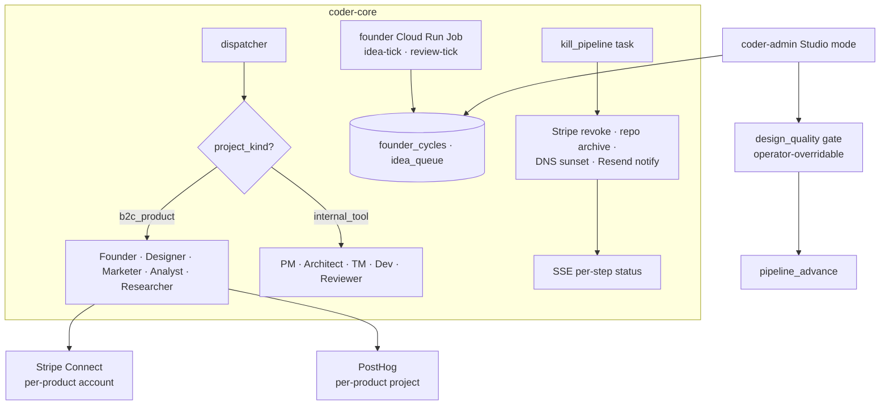

# Studio — B2C product portfolio

## What it is

The engineering layer that turns Coder's existing internal-tool
pipeline into a B2C product portfolio. A single
`project_kind = b2c_product` column on `projects` polymorphs the
dispatcher, the admin panel, and the project-detail render; one new
recurring job (the Founder, ADR 0035) fills an Idea Queue and runs
weekly portfolio reviews; one new task type (`kill_pipeline`) cascades
sunset across Stripe, GitHub, Cloudflare, and Resend; one
operator-overridable gate (`design_quality`) blocks launch on Designer
sign-off. Stripe Connect, PostHog, and the
`coder-product-template` scaffold live in their own designs — this
one is the project-kind seam plus the Founder/kill/gate machinery.

## Architecture

### Parts

- **`project_kind` polymorph.** `projects.project_kind ENUM('internal_tool', 'b2c_product') NOT NULL DEFAULT 'internal_tool'`.
  Existing rows are retroactively `internal_tool`. Worker dispatch
  reads `roles.worker_eligibility[project_kind]` from the roles
  registry; no `if project_kind == ...` branch in the dispatcher.
  Per ADR
  [0033](../../../adrs/0033-polymorphic-project-kind-over-a-separate-product-entity.md).
- **Studio sidebar (`coder-admin`).** When at least one
  `b2c_product` row exists, the sidebar renders Idea Queue,
  Portfolio, and per-product detail under `/studio/*` and
  `/projects/:projectId/studio*`. Behind
  `VITE_STUDIO_ENABLED`. The `b2c_product` project-detail view
  replaces the standard pipeline tab with a Studio-flavoured view:
  Stripe state chip, monthly cost meter with $100 / $300 lines,
  PostHog funnel snapshot, kill-criteria tracker (five charter
  criteria with status and elapsed time when violated). Per ADR
  [0034](../../../adrs/0034-studio-mode-in-coder-admin-over-a-separate-studio-spa.md).
- **Designer launch-gate.** New
  `pipeline_gate_type` enum value `design_quality`. Pipeline halts
  at `blocked` until the Designer emits a passing `design_quality`
  artifact. `gate_fail` returns the pipeline to the responsible
  worker with remediation notes. Operator override at
  `POST /v1/projects/{id}/gates/{gate_id}/override` requires
  `{reason}`; writes an `audit_event` and increments
  `operator_override_count` on the project row (visible on
  Portfolio).
- **`kill_pipeline` cascade task.** Fixed step order: (1) Stripe
  Connect account deactivated (live traffic with no active Stripe
  account is the worst partial state — run first); (2) source
  repos archived; (3) Cloudflare DNS rewritten to
  `{slug}.studio.coder.dev/sunset` (the `/sunset` page from
  [coder-product-template](./knowledge/coder-product-template.md));
  (4) paying customers emailed via Resend with refund details.
  Each step writes a `kill_step_event` row and emits an SSE
  `kill_pipeline:{task_id}:step:{n}`. Steps are idempotent;
  operator resumes from the last failed step via the admin panel.
  GCS `asset_artifact` objects move to a 30-day lifecycle rule
  rather than immediate delete, to preserve assets for
  post-mortem.
- **`asset_artifact` storage.** New artifact type with
  `storage_backend = gcs`, path
  `gs://coder-studio-assets/{project_id}/{artifact_id}`. Workers
  upload via Workload Identity; coder-core stores the GCS URI.
  Admin renders `AssetGallery` via
  `GET /v1/projects/{id}/artifacts?type=asset_artifact` returning
  signed URLs.
- **Idea Queue actions.** `[approve]` emits a PM draft task with
  `repo = studio-{slugified-title}` (placeholder) and writes an
  `idea_approved` audit event correlated by `cycle_id`. `[reject]`
  applies a decay factor and re-ranks. `[ask Founder]` jumps to
  `/drive/{project}/founder` (gated by drive-mode availability).

### Data flow

1. Operator approves an Idea Queue row; coder-core emits a PM draft
   task with `project_kind = b2c_product` and a placeholder
   `repo`. The PM task scaffolds the project from
   [coder-product-template](./knowledge/coder-product-template.md);
   the Cloud Run service is reachable at a Cloudflare-managed
   domain within the same pipeline run.
2. Studio workers (Founder / Designer / Marketer / Analyst /
   Researcher) lease tasks via the standard dispatcher,
   filtered by `worker_eligibility`.
3. The Designer emits a `design_quality` artifact; the gate halts
   the pipeline until pass. Operator can override; override
   increments the per-project counter.
4. On `[flag for sunset]`, the operator confirms in a dialog
   showing which kill criteria are met, revenue-to-date, and the
   cascade. `kill_pipeline` runs the four-step cascade; the
   product moves to "archived" with frozen metrics; teardown
   artifacts commit to the project knowledge repo.

### Invariants

- **`project_kind` filter on every fleet query.** Admin endpoints
  listing projects must include `project_kind` in the index to
  avoid full-table scans as the portfolio grows.
- **Gate before assets.** The `design_quality` gate fires only
  after at least one `asset_artifact` exists; otherwise it returns
  `gate_not_ready` and re-queues with a 10-minute delay.
- **Stripe deactivation runs first on kill.** If Stripe
  deactivation fails, no repos are archived; the operator is
  paged and resumes from step 1.
- **Studio mutations are audit-correlated.** Every
  operator-visible mutation (idea approve/reject, founder
  pause/resume, kill, Stripe/PostHog connect/disconnect) emits an
  `audit_event` with the originating cycle id or operator action.

## Interfaces

- **Admin SPA routes** (behind `VITE_STUDIO_ENABLED`):
  `/studio/ideas`, `/studio/portfolio`,
  `/projects/:projectId/studio`,
  `/projects/:projectId/studio/founder`.
- **Project type badge** on the project list and switcher.
- **Founder on-demand run:**
  `POST /v1/projects/{id}/studio/founder/run?mode=idea_cycle` — see
  [coder-studio-founder](./knowledge/coder-studio-founder.md).
- **Idea Queue actions:** `[approve]` (PM draft task +
  `audit_event`), `[reject]` (decay + `audit_event`),
  `[ask Founder]`.
- **Per-product actions:** `[flag for sunset]` (opens kill
  dialog), `[pause Founder reviews]`, `[view build artifacts]`.
- **Tables (additive migrations):** `projects.project_kind`,
  `asset_artifacts`, `kill_step_events`, `founder_cycles`,
  `idea_queue`, `pipeline_gate_type` enum value `design_quality`,
  `projects.operator_override_count`.
- **Secrets:** `coder/{project_id}/stripe_connect_account_id`
  (full Stripe + PostHog credential surface owned by
  [studio-product-integrations](./knowledge/studio-product-integrations.md)).

## Where in code

- `coder-core/src/coder_core/projects/models.py` — `project_kind`
  enum on the `Project` ORM
- `coder-core/src/coder_core/workers/dispatcher.py` —
  `worker_eligibility` lookup
- `coder-core/src/coder_core/studio/kill_pipeline.py` —
  cascade task runner
- `coder-core/src/coder_core/studio/gates.py` —
  `design_quality` gate
- `coder-admin/src/pages/Studio/` — sidebar (Idea Queue,
  Portfolio), per-product detail replacement
- `coder-admin/src/pages/Studio/KillDialog.tsx` — sunset
  confirmation dialog

## Evolution

- 2026-05-15 — Phase A ship (spec 0075): `b2c_product` project
  kind, Studio sidebar, Founder recurring job (separate design
  [coder-studio-founder](./knowledge/coder-studio-founder.md)),
  kill workflow, Designer gate, scaffold contract (separate
  design
  [coder-product-template](./knowledge/coder-product-template.md)),
  Stripe / PostHog wiring (separate design
  [studio-product-integrations](./knowledge/studio-product-integrations.md)).
  ADRs 0009 / 0032 / 0033 / 0034 / 0035 carry the four
  non-obvious decisions.

## Links

- Specs: [studio-b2c-portfolio](../../product-specs/active/studio-b2c-portfolio.md)
- Index: [studio](./knowledge/studio.md)
- Related: [coder-studio-founder](./knowledge/coder-studio-founder.md),
  [coder-product-template](./knowledge/coder-product-template.md),
  [studio-product-integrations](./knowledge/studio-product-integrations.md),
  [admin-panel](./knowledge/admin-panel.md),
  [worker-roles](./worker-roles.md)
- ADRs: 0009, 0032, 0033, 0034, 0035
- Charter: `system/STUDIO_CHARTER.md`
- Roadmap: `system/STUDIO_ROADMAP.md`
