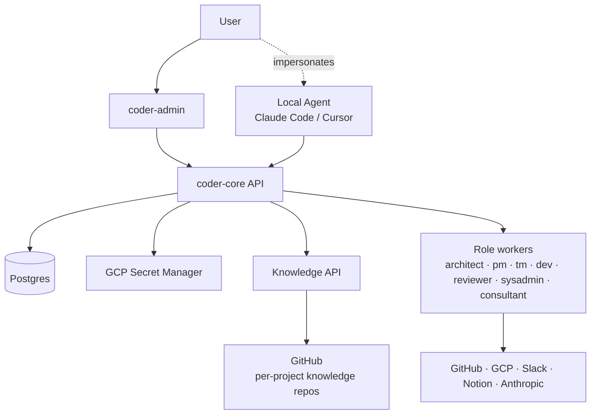

# System Overview

## What it is

Coder is an end-to-end system for building and operating software
products with autonomous agent teams. One Coder system manages many
**projects** in parallel; each project has its own **team** of
**workers** that fill **roles** (Architect, PM, Team Manager, Developer,
Reviewer, System Admin, Consultant, …). Workers act on behalf of their
project against external systems — GitHub, GCP, Slack, Notion,
Anthropic. The user interacts via an Admin Panel for status, debugging,
and override.

Two services implement Coder today: `coder-core` (multi-tenant
orchestrator, Python/FastAPI) and `coder-admin` (React/Vite SPA). Both
run on Cloud Run in `europe-west1` under the `vibedevx` GCP project.
`project_id` is a required dimension on every API call, log line, and
audit row.

## Architecture

### Parts

- **coder-core** — FastAPI orchestrator. Owns project CRUD, task
  dispatch, pipeline state, the Knowledge API, project ACLs, and
  impersonation token issuance.
- **coder-admin** — user-facing SPA. Project switcher, knowledge
  browser, pipeline UI, plan review, metrics dashboard.
- **Worker modules** — in-process role workers inside `coder-core`
  today (developer, reviewer, team-manager, pm, architect,
  system-admin, consultant). Ready to split into `coder-worker-{role}`
  repos when fleet size warrants.
- **Per-project knowledge repos** — every project has its own
  `coder-system`-shaped repo, served via the Knowledge API.
- **Stores** — Postgres for pipeline state and tenant data; GCP Secret
  Manager keyed by `coder/{project}/...`; GitHub for knowledge repos.

### Data flow

A human (or local agent) submits a task via `coder-admin` or the API.
`coder-core` authenticates against the project ACL, persists the task,
and the dispatcher picks it up using `SELECT … FOR UPDATE SKIP LOCKED`
leasing. The assigned role worker reads project knowledge through the
Knowledge API, calls Claude, and writes its result back. The
orchestrator advances task stages (queued → running →
succeeded/failed/timed_out, plus `blocked` for dependencies). SSE
pushes state changes to the admin panel.

### Invariants

- Every API call, log line, and event carries `project_id`.
- Cross-project reads return 403.
- Each role-worker runs under its own GCP service account with the
  minimum permissions for its job; the System Admin worker brokers
  time-bounded access to other workers.
- Workers don't share secrets.
- The user can take over any role via the admin panel (drive mode).

## Interfaces

- REST API at `/v1/projects/{id}/...` (tasks, knowledge, task-plans,
  task messages, metrics, impersonation).
- SSE pipeline events for live admin panel updates.
- `coder` CLI (`coder impersonate <role> --project=X`) for local
  agents.

## Evolution

- `0001-system-overview` — initial multi-tenant, role-worker vision.
- `0001-generalize-coder-from-vibetrade` (aka 0004) — clean rebuild of
  `coder-core` + `coder-admin` from scratch, replacing the
  VibeTrade-coupled `coder-agent` / `coder-agent-admin`. All 8 build-plan
  specs reached 100% AC (51/51); VibeTrade was re-onboarded as project
  #1 on the new system.

## Links

- ADRs: 0001, 0005, 0006, 0007, 0008
- Designs: worker-roles, impersonation, knowledge-repo-model
- Services: `coder-core`, `coder-admin`
