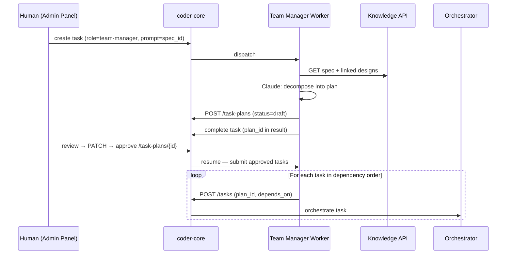

# Team Manager Worker

## What it is

The Team Manager (TM) is the first **planning worker** — a worker that
creates other workers' work. Given a spec ID, it reads the spec and
its linked designs and produces a reviewable **task plan**: an ordered
list of tasks with roles, repos, prompts, complexity, and
dependencies. The human reviews and approves the plan; approved tasks
are submitted to the existing task pipeline in dependency order.

TM sits between the Architect (who produces designs) and the leaf
workers (Developer, Reviewer) that execute tasks. It doesn't touch
code; it converts structured knowledge into a batch of work.

## Architecture

### Parts

**`task_plans` table (migration 0013):**
`id`, `project_id`, `spec_id`, `created_by_task_id`,
`status` (`draft | approved | rejected`), `plan_json` (ordered task
array), `feedback`, `created_at`, `updated_at`.

`plan_json` entries carry `order`, `role`, `repo`, `prompt`,
`depends_on` (list of `order` values, not task IDs), and
`complexity` (S/M/L).

**`tasks` table additions:** `plan_id`, `spec_id`, `plan_order` —
let submitted tasks trace back to their plan and spec.

**New stage `blocked`** on `TaskStage`: blocked tasks sit in the
queue but aren't dispatched. The orchestrator's completion handler
re-evaluates siblings when a blocker hits `accepted`.

**`workers/team_manager.py`** — subprocess pattern. Loads the spec
and its `served_by_designs`, calls Claude to decompose. Output flows
through `workers/_compliance.py::validate_and_retry` against
`workers/schemas/team_manager.json` (ordered tasks, valid role,
S/M/L complexity, acyclic `depends_on`) before the draft plan is
POSTed. Schema failures re-prompt Claude up to
`worker_output_compliance_budget`; on exhaustion the task lands
`failure_kind="schema"` with validator errors in `failure_detail` —
no `task_plans` row written. The claude spawn is also wrapped in
`workers/_transient_retry.py::run_with_transient_retry` (spec 0027)
so transport blips retry inside the worker before reaching the
schema gate. Does **not** block on human approval in the happy
path.

**API endpoints:**

| Method | Path | Description |
|---|---|---|
| `POST` | `/v1/projects/{id}/task-plans` | Create plan (TM worker) |
| `GET` | `/v1/projects/{id}/task-plans` | List (filterable by status) |
| `GET` | `/v1/projects/{id}/task-plans/{plan_id}` | Get plan detail |
| `PATCH` | `/v1/projects/{id}/task-plans/{plan_id}` | Edit plan_json |
| `POST` | `/v1/projects/{id}/task-plans/{plan_id}/approve` | Approve → submit |
| `POST` | `/v1/projects/{id}/task-plans/{plan_id}/reject` | Reject with feedback |

**Admin panel Plan Review view** (`/projects/:id/plans/:planId`) —
ordered task cards, inline edit (prompt, role, repo, complexity,
depends_on multi-select), drag-to-reorder, approve/reject buttons.

### Data flow

1. Human creates a TM task: "Plan spec 0013 for project coder".
2. Worker loads the spec + linked designs, calls Claude, gets a
   5-task plan, POSTs draft, completes its task.
3. SSE pushes a "new plan" event to the admin panel.
4. Human edits task 3's prompt, approves.
5. On approve, Coder Core iterates `plan_json` in order: tasks with
   empty `depends_on` enter `queued`; tasks with deps enter
   `blocked`.
6. When a blocker reaches `accepted`, the orchestrator promotes
   now-unblocked siblings from `blocked` to `queued`.
7. Pipeline runs until all plan tasks are accepted.

### Invariants

- TM never submits tasks autonomously — a human must approve every
  plan.
- `depends_on` references live within a plan (order values), not
  across plans.
- Cyclic dependencies are rejected at plan creation.
- A rejected plan captures human feedback so a follow-up TM task can
  use it.
- Mid-plan human overrides on individual tasks are still possible
  via the existing override API; plan status tracks overall progress
  only.

## Interfaces

- Task API: `role=team-manager`, prompt is the spec ID.
- Task-plans endpoints above.
- SSE: plan lifecycle events.
- `plan_json` schema — contract between TM and admin UI.

## Evolution

- `0006-team-manager-worker` (spec 0013) — introduced the
  `task_plans` table, the `blocked` stage, the TM worker subprocess,
  plan CRUD endpoints, dependency resolution in the orchestrator,
  and the Plan Review admin view. First worker that creates other
  workers' work.
- `0025` — worker output compliance: `team_manager.json` schema owns
  the cycle check and role validation. Schema gate sits in front of
  the `task_plans` write so failures don't produce orphan plan rows.
- `0027` — transient-failure retry wrapping the claude spawn.
  ADR 0013.

## Links

- Specs: [`0013`](../../product-specs/wip/0013-team-manager-worker-v1.md),
  [`0010`](../../product-specs/active/0010-task-orchestration-v1.md),
  [`0012`](../../product-specs/active/0012-admin-auth-and-mutations.md)
- Designs: system-overview, worker-roles, architect-worker, pm-worker
- Services: `coder-core`, `coder-admin`
