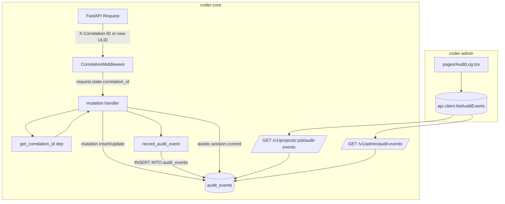

# Audit log

## What it is

The audit log is a single append-only `audit_events` table plus one
writer helper plus one read-endpoint pair plus one admin page. Every
mutation endpoint in `coder-core` calls the helper inside its own
transaction so the audit row is either committed with the mutation or
neither lands. A FastAPI middleware assigns a correlation ID per
request so one inbound call fan-outs to N rows that can be joined on
a single ID. The shape is deliberately narrow: one table, one writer,
one reader pair — anything else that touches audit state is a bug.

## Architecture

### Parts

- **`audit_events` table** (migration 0041). Columns:
  `id` (ULID string PK), `project_id` (nullable), `actor`,
  `actor_method`, `action`, `target_type`, `target_id`, `before`
  (JSONB), `after` (JSONB), `correlation_id`, `created_at`,
  `retention_until`. Indexes on `(project_id, created_at)`,
  `(actor, created_at)`, `(action, created_at)`, `(correlation_id)`.
  No foreign keys — deleting a project must not cascade-shred the
  trail. Downgrade raises by design so a Cloud Run rollback cannot
  drop audit rows.
- **`coder_core.domain.audit_event.AuditEventRow`** — the ORM model;
  ULID PK strings are lexically sortable, so `ORDER BY id DESC` gives
  newest-first without a compound `(created_at, id)` index.
- **`coder_core.audit.record_audit_event(...)`** — ~30 LOC async
  helper. Critical property: it calls `session.add(row)` only. No
  flush, no commit. The caller's outer `get_session` dependency owns
  the commit. Rollback rolls the audit row back with it. Flag-off
  short-circuits (`return None`) before touching the session.
- **`coder_core.audit.Actions`** — namespaced string constants
  (`knowledge.approve`, `task.merge`, `budget.override.grant`, …).
  Kept as a module of constants rather than an Enum so grep for the
  literal in audit rows lands on the source site.
- **`coder_core.middleware.correlation.CorrelationMiddleware`** —
  reads `X-Correlation-ID`, validates the ULID regex (malformed →
  400 `invalid_correlation_id`), mints one if absent, stamps
  `request.state.correlation_id`, echoes on the response. Registered
  before the auth middleware so unauth'd flows also get an ID.
- **`get_correlation_id` dependency** — one-liner that returns
  `request.state.correlation_id`. Every audit-writing handler adds
  `Annotated[str, Depends(get_correlation_id)]` to its signature and
  passes it through.
- **Read endpoints** — `api/audit.py`:
  - `GET /v1/projects/{project_id}/audit-events` (tenant-scoped via
    the existing `require_project_auth` gate).
  - `GET /v1/admin/audit-events` (admin-JWT gate; optional
    `project_id=` filter).
  Both: `actor`, `action`, `target_type`, `since`, `until`,
  `limit` (default 50, max 200), `after=<id>` cursor. Ordering is
  `id DESC`; cursor exploits ULID lexical ordering so keyset
  pagination works without a compound index.
- **Phase-1 mutation wiring** — 15 handlers each grow a
  `record_audit_event(...)` call just before the final return:
  knowledge create/update/checkboxes/approve/reject, task
  retry/override/merge, plan approve/reject, budget
  grant/revoke/monthly-reset, pipeline-run override, projects
  archive/rotate-api-key, impersonate issue-token,
  regression acknowledge, sessions revoke. Each passes
  `correlation_id` via the dependency.
- **Admin surface** — `pages/AuditLog.tsx` (table + filters + expand
  for payload, correlation chip), mounted at
  `/projects/:projectId/audit` and `/admin/audit`.
  `src/api/client.ts` gains `AuditEventRead`, `AuditEventFilters`,
  `listProjectAuditEvents`, `listFleetAuditEvents`.

### Data flow

**Operator approves a knowledge artifact**

1. Admin panel `POST /v1/projects/coder/knowledge/specs/0035/approve`
   (no inbound correlation header).
2. `CorrelationMiddleware` mints `01HAB…`, stamps request state,
   echoes on response.
3. The approve handler writes the status transition to GitHub +
   registry, then calls `record_audit_event(session, caller=caller,
   correlation_id=cid, action="knowledge.approve",
   target_type="knowledge_artifact", target_id="specs/0035",
   before={"status": "wip"}, after={"status": "active",
   "commit_sha": ..., "path": ...})`.
4. `get_session` dependency's context exit commits — approval and
   audit row land atomically, or neither.
5. A subsequent poll of `/audit-events` surfaces the row with the
   correlation chip.

**Worker-initiated mutation**

1. PM worker's `task.merge` path runs under its service-account JWT.
   `caller.actor="role:pm-worker"`, `caller.method=service_account`.
2. There's no inbound correlation header, so the handler passes the
   task's `pipeline_run_id` as `correlation_id`. Every audit row
   from a single pipeline run therefore clusters on the same ID —
   one operator query reconstructs the run's mutation timeline.

**Flag off**

1. Ops sets `CODER_AUDIT_LOG_ENABLED=false` + redeploy.
2. `record_audit_event` short-circuits. Mutations continue; no new
   rows land.
3. Admin page surfaces the "Audit logging disabled" banner above
   historical rows. Flipping back on resumes writes.

### Invariants

- **One table, one writer, one reader pair.** Any other path into
  `audit_events` is a bug. Reviewers enforce at PR time; a test list
  asserts every Phase-1 mutation writes a row on 2xx.
- **Writes share the mutation's transaction.** No second session, no
  fire-and-forget. Drop = caller drop = a test failure.
- **Append-only during the retention window.** No endpoint updates or
  deletes rows. GC is a future spec; rows persist indefinitely until
  it lands.
- **Correlation is request-scoped.** One inbound request → one ID →
  N audit rows. Worker writes reuse `pipeline_run_id`.
- **Flag-off is observable.** The banner makes a log gap a visible
  operator choice, not a silent outage.

## Interfaces

- HTTP — `GET /v1/projects/{id}/audit-events`,
  `GET /v1/admin/audit-events`.
- Header — `X-Correlation-ID` accepted + echoed.
- Python — `coder_core.audit.record_audit_event`,
  `coder_core.audit.Actions.*`, `get_correlation_id` dep.
- Admin SPA — `/projects/:projectId/audit`, `/admin/audit`.
- Env — `CODER_AUDIT_LOG_ENABLED`.

## Evolution

- `0037 — audit log service` (shipped 2026-04-19). Migration 0041
  + writer helper + correlation middleware + two read endpoints +
  admin page + 15 mutation-endpoint wirings in a single cycle.
  Downgrade raises so a Cloud Run rollback never drops audit data.
  Gated on `CODER_AUDIT_LOG_ENABLED` (default on).
- `0041 — escalation actions` (shipped 2026-04-22). Five new action
  strings registered with `Actions`
  (`escalation.{opened,rung_fired,acknowledged,resolved,expired}`);
  new `actor_type='slack_external'` value for Slack-button acks
  whose Slack user doesn't resolve to an internal user. The writer
  helper and correlation middleware are reused unchanged.
- `0042 — self-heal actions` (shipped 2026-04-22). Two new action
  strings: `self_heal.remediated`, `self_heal.failed`. Only
  successful and errored remediations emit audit events;
  `skipped_cap` and `dry_run` are attempt-row only.
- Claude OAuth `project.set_auth_mode` action (shipped 2026-04-22).
  One new action emitted from admin auth-mode toggling; reuses the
  existing before/after JSONB shape.

## Links

- Specs: [audit-log](../../../product-specs/active/audit-log.md)
- Designs: system-overview (middleware slot),
  impersonation (actor chain captured),
  worker-communication (worker-initiated writes reuse
  `pipeline_run_id`),
  observability-and-cost-tracking (sits alongside metrics as an
  operator surface),
  knowledge-write-api (knowledge mutations are the highest-volume
  wire site).
- Services: `coder-core` (table, middleware, helper, 15 wirings,
  two reads), `coder-admin` (page + two client functions).
