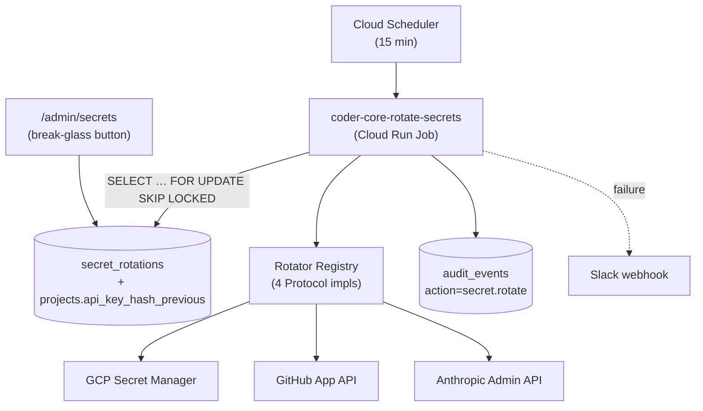

# Automated secret rotation

## What it does today

Rotates four long-lived secrets (project API keys, per-project
Anthropic keys, admin JWT signing key, GitHub App private key) on a
fixed cadence via a Cloud Run Job ticking every 15 min. Each rotation
is atomic with a dual-value window so consuming services don't 401/403
mid-rotation. Every rotation writes an audit event; failures alert
Slack and retry on the next tick. A break-glass endpoint lets
operators force immediate rotation on suspected compromise.

## Architecture

### Parts

- **`secret_rotations` table** — registry row per rotatable secret: `canonical_name` (unique), `cadence_days`, `last_rotated_at`, `next_due_at`, `old_value_expires_at`, `rotation_version`, error fields. Partial index on `next_due_at`.
- **`projects.api_key_hash_previous`** — nullable TEXT carrying the prior hash during the dual-value window; auth middleware OR-guards on it when `old_value_expires_at > now()`.
- **Rotator registry (`src/coder_core/rotation/__init__.py`)** — Protocol-based plugin contract; four impls: `ProjectApiKeyRotator`, `ProjectAnthropicKeyRotator`, `AdminJwtSigningKeyRotator`, `GithubAppPrivateKeyRotator`. Each exposes `rotate()` + `close_window()`.
- **Cloud Run Job (`src/coder_core/rotation/job.py`)** — `tick()`: selects due rows, dispatches to kind rotator, updates registry, closes expired windows. Wraps each rotator call in an audit emit + Slack alert on failure.
- **`JwtVerifier` (`src/coder_core/auth/jwt_verifier.py`)** — caches latest + previous signing keys (60s TTL); tries new first, falls back to old if window open; emits `jwt_verify.fallback` metric.
- **Break-glass endpoint** — `POST /v1/_admin/secrets/{canonical_name}/rotate-now`; sets `next_due_at = now()`, audits `trigger=break_glass`, returns 202 with `expected_by`.
- **Admin UI** — `pages/AdminSecrets.tsx` + `GET /v1/_admin/secrets`; chip per row; "Rotate now" button. Behind `VITE_SECRET_ROTATION_ENABLED`.

### Data flow

Scheduler fires every 15 min. Job selects `next_due_at <= now()` rows
with `FOR UPDATE SKIP LOCKED`. For each: kind rotator generates the
new secret, writes it (Secret Manager / external API / Postgres hash),
keeps the old value in the dual-value field. Registry updated
(`last_rotated_at`, `next_due_at += cadence`, `old_value_expires_at =
now + window`, `rotation_version += 1`); audit row emitted. During the
window, auth paths accept both values. A later tick calls
`close_window` → purges the old value, disables the old Secret Manager
version, audits.

### Invariants

- **At most one in-flight rotation per `canonical_name`** — Postgres advisory lock around the dispatch.
- **Old value is always readable during the window** — middleware OR-guard + `old_value_expires_at` check.
- **Audit log is the source of truth** for rotation history; the registry table is a cache for efficient selection.
- **Failure preserves the old value** — Secret Manager partial-writes are atomic; the DB update is in a transaction. Failure logs an audit row + Slack alert; retry happens on the next tick.
- **Flag-off is observable** — admin page shows a disabled banner, break-glass returns 503, scheduler invocation is a no-op.

## Interfaces

| Surface | Effect |
|---|---|
| `POST /v1/_admin/secrets/{canonical_name}/rotate-now` | Admin-JWT guarded; sets `next_due_at=now()`; returns 202 with `expected_by` |
| `GET /v1/_admin/secrets` | List of rotatable secrets + state (last rotated, next due, error) |
| Cloud Scheduler `secret-rotation-tick-15min` | Invokes the Cloud Run Job |
| `Rotator` Protocol (`rotate()`, `close_window()`) | Returns `RotationResult` with new version + window duration |
| `JwtVerifier.verify(token)` | Dual-key fallback verification; metric on fallback hit |
| `audit_events` rows: `secret.rotate`, `secret.window_closed`, `secret.rotation_failed` | Audit trail |

## Where in code

- `src/coder_core/rotation/__init__.py` — `Rotator` Protocol + registry + `RotationResult` dataclass
- `src/coder_core/rotation/job.py` — `tick`, `_select_due_rows`, `_dispatch`, window-close logic
- `src/coder_core/auth/jwt_verifier.py` — dual-key cache + fallback verification
- `src/coder_core/api/admin_secrets.py` — `/v1/_admin/secrets` + `/rotate-now`
- `migrations/0042-secret_rotations.sql`, `migrations/0043-api_key_hash_previous.sql`
- `infra/terraform/secret-rotation.tf` — Cloud Scheduler resource + IAM bindings

## Evolution

Stage 1 shipped admin JWT rotator (smoke). Stage 2 added project API
key + project Anthropic key + GitHub App key + break-glass endpoint
after manual soak.

## Links

- Spec: [0038-secret-rotation](../../../product-specs/wip/0038-secret-rotation.md)
- Designs: [audit-log](./audit-log.md), [impersonation](./impersonation.md), [system-overview](../system-overview.md), [observability-and-cost-tracking](../pipeline/observability-and-cost-tracking.md)
- Repos: coder-core, coder-admin
