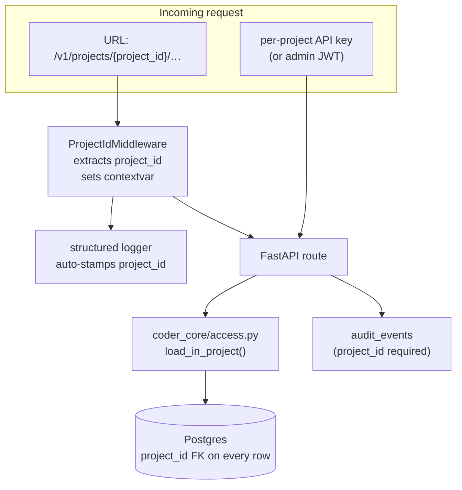

# Multi-tenancy

## What it is

`project_id` is the first-class isolation dimension across `coder-core`.
Every API call, worker run, log line, audit row, SSE event, secret read,
and database row carries a `project_id`; the system assumes nothing is
global. Cross-project reads return `404` (not `403`) so a probe in one
project cannot even confirm a resource exists in another.
ADR [0005](../../adrs/0005-multi-tenant-coder-core.md) decided this
shape.

## Architecture

### Parts

- **`ProjectIdMiddleware` — `coder_core/middleware.py`.** Extracts
  `project_id` from the URL path
  (`/v1/projects/[a-z][a-z0-9-]{1,39}`) and binds it to a
  contextvar via `set_project_id()`. Every structured log emitted
  during the request lifecycle picks up the value automatically.
  Routes that need a `project_id` but receive a request without one
  return `400` rather than silently defaulting.
- **`load_in_project()` — `coder_core/access.py`.** The single
  canonical helper for loading a tenant-scoped row: `(session,
  model, pk, project_id)` → row or 404. The check
  `row.project_id == project_id` is enforced here, indistinguishable
  from "row missing" — cross-tenant probes can't confirm existence.
  This is also the seam called out in
  [coder-core-modular-monolith](../delivery/coder-core-modular-monolith.md)
  acceptance criteria for "project ACL enforcement … through shared
  helpers."
- **`ProjectRow` — `coder_core/domain/project.py`.** Owning row in
  the `projects` table. Columns include `id` (kebab-slug PK),
  `name`, `github_org`, `knowledge_repo`, `gcp_project`, `owner`,
  `api_key_hash` + `api_key_hash_previous` (rotation),
  `gc_enabled`, `worker_concurrency_soft`,
  `prompt_caching_enabled`, escalation policy / SLA fields, budget
  overrides. Schema is wide on purpose: per-project settings land
  here without a migration.
- **`projects` service — `coder_core/projects/service.py`.**
  Application-service layer that owns project create / update /
  archive / rotate-api-key transactions. Routers are thin per
  ADR [0005](../../adrs/0005-multi-tenant-coder-core.md) and the
  modular-monolith design.
- **Per-project API keys.** Hashed in `api_key_hash`; rotation
  preserves the previous value in `api_key_hash_previous` for a
  grace window so workers in flight don't 401. The broker
  ([impersonation](./impersonation.md)) mints role-and-project-
  scoped JWTs from the API key; the JWT's `project_id` claim is
  what downstream endpoints check.
- **`project_id` is required on every tenant-scoped table.** Tasks,
  pipeline runs, audit events, escalations, on-call schedules,
  task messages, task logs, task plans, knowledge writes — all
  carry it as a NOT NULL FK. Indexes are built `(project_id, …)`
  so single-tenant queries are local.
- **Isolation harness — [tenant-isolation](../delivery/tenant-isolation.md).**
  CI-blocking test suite that hits every project-aware endpoint
  with a wrong-project token and asserts `404`. Drift between the
  endpoint inventory and the manifest is also CI-blocking.

### Data flow

1. Request arrives at `/v1/projects/{project_id}/…` (or with
   `project_id` in body for the few endpoints not URL-keyed).
2. `ProjectIdMiddleware` parses the path, sets the contextvar,
   logger picks it up.
3. Auth middleware verifies the per-project API key (or admin JWT
   carrying cross-project scope).
4. The route handler delegates to a service method, which uses
   `load_in_project()` for every row read.
5. Mutations write `project_id` onto every new row and an
   `audit_events` row in the same transaction (see
   [audit-log](./audit-log.md)).
6. SSE / metrics / logs emitted during the request all carry
   `project_id` as a structured field.

### Invariants

- **No silent defaults.** A missing `project_id` is a `400`, never
  "the first project" or "the caller's project." Required
  explicitly at the boundary.
- **Cross-project reads are 404, not 403.** A wrong-project token
  cannot distinguish "you can't see this" from "this doesn't
  exist."
- **Project access is enforced by construction, not convention.**
  `load_in_project()` is the only canonical way to fetch a
  tenant-scoped row; the modular-monolith refactor's
  import-linter contracts forbid alternate paths.
- **Archive is reversible; delete is not provided.** Archived
  projects are hidden from default listings but their rows
  (audit, knowledge, tasks) remain queryable for compliance.

## Interfaces

- **HTTP:** `POST /v1/projects` (create), `GET /v1/projects` (list,
  caller-scoped), `GET/PATCH /v1/projects/{id}`,
  `POST /v1/projects/{id}:archive`,
  `POST /v1/projects/{id}/rotate-api-key`.
- **DB:** `projects` table; every tenant-scoped table FK's it.
- **Auth:** per-project API key; broker-minted JWT with
  `project_id` claim; admin JWT for cross-project endpoints.
- **Logs:** structured `project_id` on every line (via the
  middleware contextvar).

## Evolution

- ADR [0005](../../adrs/0005-multi-tenant-coder-core.md) — single
  multi-tenant `coder-core`, not a service-per-project fleet.
- 0007 — `projects` table, per-project API keys, project-aware
  CRUD.
- 0019 — tenant-isolation harness; CI gate.
- coder-core-modular-monolith — `load_in_project()` promoted to
  the canonical row-scope check; import-linter forbids alternate
  paths.
- escalations / on-call / metrics — every later subsystem inherits
  multi-tenancy by construction (NOT NULL `project_id` columns,
  middleware-stamped logs).

## Links

- Specs: [multi-tenancy](../../product-specs/active/multi-tenancy.md),
  [tenant-isolation](../../product-specs/active/tenant-isolation.md),
  [tenancy-and-access](../../product-specs/active/tenancy-and-access.md)
- Designs: [tenancy-and-access](../tenancy-and-access.md),
  [impersonation](./impersonation.md),
  [tenant-isolation](../delivery/tenant-isolation.md),
  [audit-log](./audit-log.md),
  [coder-core-modular-monolith](../delivery/coder-core-modular-monolith.md)
- ADRs: [0005](../../adrs/0005-multi-tenant-coder-core.md)
- Services: `coder-core`
