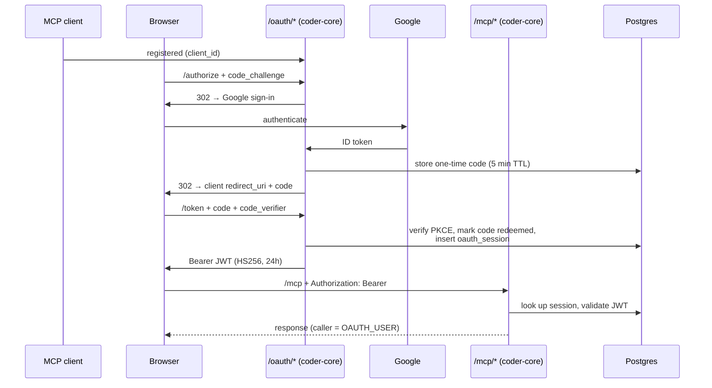

# OAuth 2.1 for MCP clients

## What it does today

coder-core acts as an OAuth 2.1 authorization + resource server for MCP
clients (e.g. claude.ai web). Admins out-of-band register a client
(`POST /v1/admin/oauth/clients`); the auth-code + PKCE flow uses Google
as the upstream IdP. On code redemption, coder-core issues a 24h HS256
Bearer token that `/mcp/*` accepts as admin-equivalent. Reuses the
existing JWT infra, signing keys, and admin allowlist.

## Architecture

### Parts

- **Tables (4)**: `oauth_clients` (registered client metadata + revocation), `oauth_codes` (one-time codes, 5 min TTL, `redeemed_at`), `oauth_sessions` (issued tokens by `jti`, revokable), plus in-memory `oauth_pending` dict for state threading mid-flow.
- **Seven HTTP routes**: metadata discovery (`/.well-known/oauth-authorization-server`); admin register / list / revoke; the three-leg flow (`/authorize`, `/google-callback`, `/token`).
- **`resolve_caller` branch** in `coder_core/mcp/auth.py` — adds `AuthMethod.OAUTH_USER`; `_try_oauth_token()` validates JWT, looks up session, returns `MCPCaller(method=OAUTH_USER, actor=oauth:email, …)`.
- **Audit actions**: `oauth.client_registered`, `oauth.code_issued`, `oauth.token_issued` (chained by correlation_id).
- **GC job**: daily cleanup of expired `oauth_codes` rows.

### Data flow

Admin pre-registers the client once. Browser hits `/oauth/authorize`
with `client_id` + PKCE challenge → coder-core redirects to Google →
captures ID token, stores a one-time code, redirects back. Client
exchanges code + verifier at `/oauth/token` → coder-core validates
PKCE, marks code redeemed, inserts an `oauth_sessions` row, returns
HS256 JWT. MCP calls present the JWT; `resolve_caller` validates
signature, looks up the session, rejects if revoked → yields a
`MCPCaller(method=OAUTH_USER)`.

### Invariants

- **Single-use codes** — `redeemed_at` marker prevents replay.
- **PKCE strict** — `SHA256(code_verifier)` must match stored `code_challenge`; mismatch → 400 `invalid_grant`.
- **5-min code TTL** — codes expire at `issued_at + 5min` (OAuth 2 spec).
- **Exact `redirect_uri` match** — byte-for-byte against stored URIs; no pattern matching.
- **Admin-only registration** — no public DCR endpoint; admin JWT required.
- **Revocation cascades** — revoking a `client_id` invalidates every active session for that client; revoked `oauth_sessions` reject at lookup.

## Interfaces

| Surface | Effect |
|---|---|
| `GET /.well-known/oauth-authorization-server` | RFC 8414 metadata; signals PKCE, S256, no DCR endpoint |
| `POST /v1/admin/oauth/clients` | Register a client (admin); returns `client_id` |
| `GET /v1/admin/oauth/clients` | List active + revoked clients + session metadata |
| `POST /v1/admin/oauth/clients/{id}/revoke` | Revoke client; cascades to sessions |
| `POST /v1/admin/oauth/sessions/{jti}/revoke` | Revoke a single session |
| `GET /oauth/authorize` | `client_id`, `redirect_uri`, `code_challenge` → 302 to Google |
| `GET /oauth/google-callback` | Google → issue one-time code → 302 to client |
| `POST /oauth/token` | `code` + `code_verifier` → Bearer JWT |

## Where in code

- `src/coder_core/oauth/routes.py` — the seven `/oauth/*` handlers
- `src/coder_core/oauth/admin.py` — admin registration / list / revoke
- `src/coder_core/mcp/auth.py` — `resolve_caller` + `_try_oauth_token` + `AuthMethod.OAUTH_USER`
- `src/coder_core/oauth/gc.py` — daily expired-code cleanup
- `src/coder_core/audit.py` — `OAUTH_CLIENT_REGISTERED`, `OAUTH_CODE_ISSUED`, `OAUTH_TOKEN_ISSUED`
- `migrations/00NN_oauth_tables.sql` — `oauth_clients`, `oauth_codes`, `oauth_sessions`

## Evolution

Implements spec 0050. Reuses existing JWT signing keys + admin
allowlist; no new crypto.

## Links

- Spec: [0050-oauth-for-mcp-clients](../../../product-specs/wip/0050-oauth-for-mcp-clients.md)
- Designs: [impersonation](./impersonation.md), [audit-log](./audit-log.md), [mcp-agent-interface-design](../knowledge/mcp-agent-interface-design.md)
- Standards: RFC 6749 (OAuth 2.0), RFC 7636 (PKCE), RFC 8414 (AS metadata)
- Repos: coder-core, coder-system
